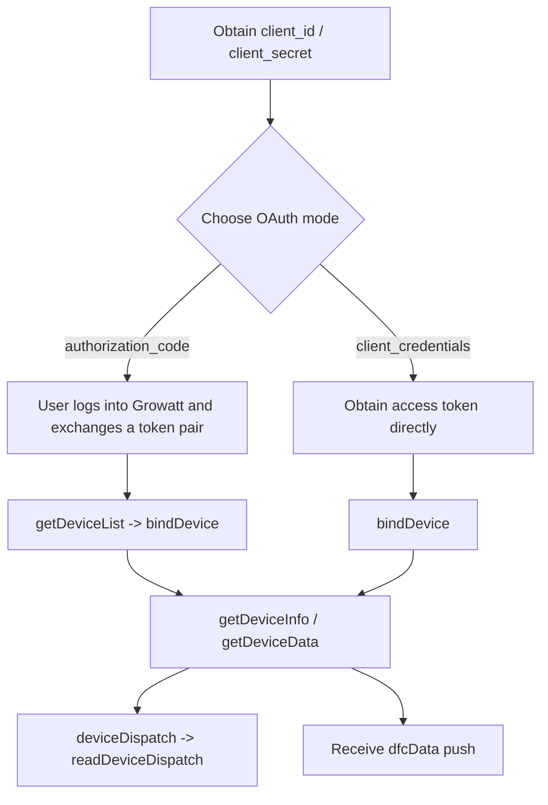

# Growatt Open API Professional Integration Guide

This is an entry guide. Endpoint parameters, examples, and response codes are maintained in `Growatt API/OPENAPI/*.md`. Environment-specific findings are kept in dedicated observation sections as implementation references.

## 1 Document Layers

- Chinese split publication docs: `Growatt API/OPENAPI.zh-CN/*.md`
- English split publication docs: `Growatt API/OPENAPI/*.md`
- Appendix B Glossary: [/growatt-openapi/appendix-terminology](/growatt-openapi/appendix-terminology)
- Integration observations: environment reports under `test/`

## 2 Supported Integration Paths

### Integration Flow

### `authorization_code`

Observed global flow on 2026-03-27:

1. Open the frontend login page `GET /#/login?...`
2. Submit credentials through `POST /prod-api/login`
3. Obtain the authorization code through `GET /prod-api/auth`
4. Exchange the code through `POST /oauth2/token`
5. Call `POST /oauth2/getDeviceList`
6. Call `POST /oauth2/bindDevice`
7. Continue with device query, dispatch, and read-back APIs

### `client_credentials`

1. Call `POST /oauth2/token`
2. Call `POST /oauth2/bindDevice` directly
3. Call `POST /oauth2/getDeviceListAuthed`
4. Continue with device query, dispatch, and read-back APIs

## 3 API Matrix

| Capability | Endpoint | Required Inputs |
| :--- | :--- | :--- |
| Get token | `/oauth2/token` | `grant_type`, `client_id`, `client_secret`, `redirect_uri` |
| Refresh token | `/oauth2/refresh` | `refresh_token`, client credentials |
| Get candidate devices | `/oauth2/getDeviceList` | Bearer token, `authorization_code` only |
| Bind devices | `/oauth2/bindDevice` | `deviceSnList`; `pinCode` required in client mode |
| Get authorized devices | `/oauth2/getDeviceListAuthed` | Bearer token |
| Unbind devices | `/oauth2/unbindDevice` | `deviceSnList` |
| Device information | `/oauth2/getDeviceInfo` | `deviceSn` |
| Device telemetry | `/oauth2/getDeviceData` | `deviceSn` |
| Device dispatch | `/oauth2/deviceDispatch` | `deviceSn`, `setType`, `value`, `requestId` |
| Dispatch read-back | `/oauth2/readDeviceDispatch` | `deviceSn`, `setType`, `requestId` |

## 4 Items That Need Extra Attention

- Both published examples for `POST /oauth2/token` include `redirect_uri`.
- The parameter table for `POST /oauth2/readDeviceDispatch` requires `requestId`, while the published request sample omits it.
- The parameter table for `POST /oauth2/deviceDispatch` labels `value` as `string`, while the same page publishes an object-valued example.
- The local header table for `POST /oauth2/getDeviceData` uses `token`, while the global section uses `Authorization: Bearer xxxxxxx`.

## 5 Integration Observations

The following findings come from environment reports under `test/` and are kept for implementation reference only:

- The latest global authorization-code run on 2026-03-27 used `GET /#/login?...`, `POST /prod-api/login`, and `GET /prod-api/auth` before `POST /oauth2/token`.
- Multiple reports use JSON bodies for device-level APIs.
- The latest global candidate-device report returned `deviceSn=WCK6584462` and `datalogSn=ZGQ0E820UH`; device-level APIs used `deviceSn`.
- The latest global `bindDevice` run succeeded with `{"deviceSnList":[{"deviceSn":"WCK6584462"}]}` and returned `data: 1`.
- In that same authorization-code run, the tested global device did not require `pinCode`; this does not change the published client-mode requirement.
- The latest global token run returned `expires_in=604733` and `refresh_expires_in=2585309`; the subsequent refresh returned `expires_in=604800` and `refresh_expires_in=2592000`.
- After a successful `POST /oauth2/refresh`, the previous access token immediately returned `TOKEN_IS_INVALID`; follow-up reads and unbinds had to switch to the fresh token.
- Some reports observe `WRONG_GRANT_TYPE` when `client_credentials` calls `getDeviceList`.
- Some reports observe object-shaped `readDeviceDispatch.data` values for certain `setType` values.

These findings should not replace the endpoint-level API descriptions.

## 6 Integration Checklist

- [ ] Separated the capability boundary between `authorization_code` and `client_credentials`
- [ ] Kept `redirect_uri` in both token request examples
- [ ] Treated `bindDevice.pinCode` as required in client mode
- [ ] Treated `readDeviceDispatch.requestId` as required
- [ ] For global authorization-code integrations, handled `/#/login`, `/prod-api/login`, and `/prod-api/auth`
- [ ] Read `expires_in` and `refresh_expires_in` from runtime responses instead of hard-coding sample values
- [ ] Replaced the old access token immediately after a successful `refresh`
- [ ] Implemented the three `setType` entries published in `10_global_params.md`
- [ ] Aligned public ESS terminology to [/growatt-openapi/appendix-terminology](/growatt-openapi/appendix-terminology)
- [ ] Kept integration observations in the compatibility layer instead of promoting them into endpoint descriptions
