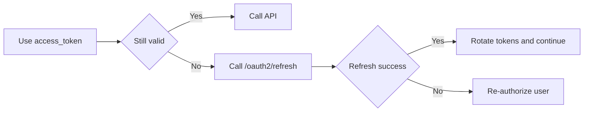
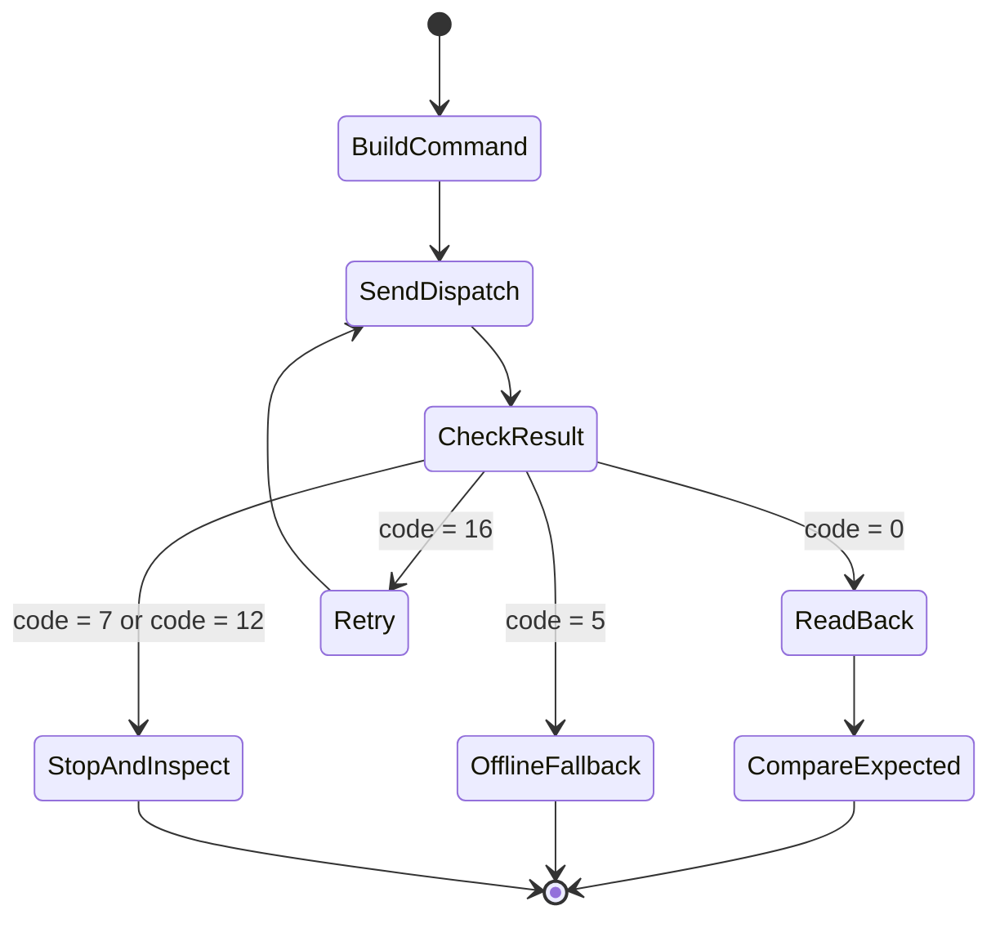

**Growatt Open API Quick Guide (SSOT Aligned)**
**Version 1.1 (Aligned to OPENAPI V1.0, Release Date: March 4, 2026)**  
**Target Audience**: Solution Architects, Backend Developers, Integration Engineers  

---

### 1. Scope and SSOT Rule

This quick guide is an integration accelerator. The single source of truth (SSOT) is:
- `Growatt API/OPENAPI/*.md`

If this guide conflicts with endpoint-level docs, always follow OPENAPI docs first.

Core references:
- [Authentication Guide](./OPENAPI/01_authentication.md)
- [Get access_token API](./OPENAPI/02_api_access_token.md)
- [OAuth2-refresh API](./OPENAPI/03_api_refresh.md)
- [Device Authorization API](./OPENAPI/04_api_device_auth.md)
- [Device Dispatch API](./OPENAPI/05_api_device_dispatch.md)
- [Read Device Dispatch Parameters API](./OPENAPI/06_api_read_dispatch.md)
- [Device Information Query API](./OPENAPI/07_api_device_info.md)
- [Device Data Query API](./OPENAPI/08_api_device_data.md)
- [Device Data Push API](./OPENAPI/09_api_device_push.md)
- [Global Parameter Description](./OPENAPI/10_global_params.md)

---

### 2. End-to-End Integration Flow

```mermaid
flowchart TD
    A[Apply client_id and client_secret] --> B[Choose OAuth mode]
    B --> C[POST /oauth2/token]
    C --> D[Store access_token and refresh_token]
    D --> E[POST /oauth2/getApiDeviceList]
    E --> F[POST /oauth2/bindDevice]
    F --> G[Call business APIs]
    G --> H[/oauth2/getDeviceInfo]
    G --> I[/auth2/getDeviceData]
    G --> J[/auth2/deviceDispatch]
    J --> K[/auth2/readDdeviceDispatch]
    G --> L[Receive push from Growatt webhook]
    G --> M{Token expired}
    M -->|Yes| N[POST /oauth2/refresh]
    N --> G
    M -->|No| O[Continue]
```

---

### 3. Authentication and Token Lifecycle

**Token endpoint**: `POST /oauth2/token`  
Supported `grant_type`:
- `authorization_code`
- `client_credentials`

**Refresh endpoint**: `POST /oauth2/refresh`  
Required:
- `grant_type=refresh_token`
- `refresh_token`
- `client_id`
- `client_secret`

Token validity (from SSOT):
- `access_token`: 7200 seconds
- `refresh_token`: 2592000 seconds



Header convention:
- Most APIs require `Authorization: Bearer {access_token}`.
- For `/auth2/getDeviceData`, follow SSOT doc header definition (`token`).

---

### 4. Device Authorization Lifecycle

Use these endpoints in order:
1. `POST /oauth2/getApiDeviceList` (candidate devices)
2. `POST /oauth2/bindDevice` (authorize devices)
3. `POST /oauth2/getApiDeviceListAuthed` (check authorized set)
4. `POST /oauth2/unbindDevice` (revoke)

Notes:
- In `client_credentials` mode, `bindDevice` may require `pinCode`.
- Only authorized devices can be operated by downstream APIs.

---

### 5. Operational API Matrix (SSOT Endpoints)

| Capability | Endpoint | Method | Key Input |
| :--- | :--- | :--- | :--- |
| Get token | `/oauth2/token` | POST | `grant_type`, client credentials |
| Refresh token | `/oauth2/refresh` | POST | `refresh_token` |
| Device list (candidate) | `/oauth2/getApiDeviceList` | POST | Bearer token |
| Bind device | `/oauth2/bindDevice` | POST | `deviceSnList` |
| Authorized device list | `/oauth2/getApiDeviceListAuthed` | POST | Bearer token |
| Unbind device | `/oauth2/unbindDevice` | POST | `deviceSnList` |
| Device information | `/oauth2/getDeviceInfo` | POST | `deviceSn` |
| Device telemetry query | `/auth2/getDeviceData` | POST | `deviceSn` |
| Device dispatch | `/auth2/deviceDispatch` | POST | `deviceSn`, `setType`, `value`, `requestId` |
| Read dispatch parameter | `/auth2/readDdeviceDispatch` | POST | `deviceSn`, `setType`, `requestId` |

Push integration:
- Growatt pushes high-frequency payloads to your webhook URL (see [09_api_device_push.md](./OPENAPI/09_api_device_push.md)).
- Payload shape is aligned with device data query fields (`dfcData`).

---

### 6. Dispatch and Read-Back Safety Loop

Dispatch rate limit (SSOT):
- Max **1 command per 5 seconds per device**.

Recommended control loop:



Key response codes to handle:
- `0`: success
- `2`: `TOKEN_IS_INVALID`
- `5`: `DEVICE_OFFLINE`
- `7`: `WRONG_DEVICE_TYPE`
- `12`: `DEVICE_SN_DOES_NOT_HAVE_PERMISSION`
- `16`: `PARAMETER_SETTING_RESPONSE_TIMEOUT`

---

### 7. Parameter Usage Quick Picks

Use `setType` values from SSOT [10_global_params.md](./OPENAPI/10_global_params.md). Commonly used examples:
- `enable_control`
- `power_on_off_command`
- `time_slot_charge_discharge`
- `active_power_derating_percentage`
- `reactive_power_mode`
- `remote_power_control_enable`
- `remote_charge_discharge_power`
- `ac_charge_enable`

Guidance:
- Validate parameter ranges before sending dispatch.
- Always perform read-back using `/auth2/readDdeviceDispatch` for critical controls.

---

### 8. Integration Checklist

- [ ] Obtained `client_id` and `client_secret`
- [ ] Implemented `/oauth2/token` + `/oauth2/refresh`
- [ ] Implemented token storage and rotation
- [ ] Implemented device authorization lifecycle (`getApiDeviceList` / `bindDevice` / `getApiDeviceListAuthed` / `unbindDevice`)
- [ ] Implemented telemetry pull (`/auth2/getDeviceData`)
- [ ] Implemented webhook receiver for push payloads
- [ ] Implemented dispatch + read-back loop (`/auth2/deviceDispatch` + `/auth2/readDdeviceDispatch`)
- [ ] Added handling for codes `2/5/7/12/16`
- [ ] Validated parameter values against `10_global_params.md`

---

**Change note**: This quick guide has been corrected to match OPENAPI SSOT endpoints and naming.

**Growatt Open API Team**  
March 2026
