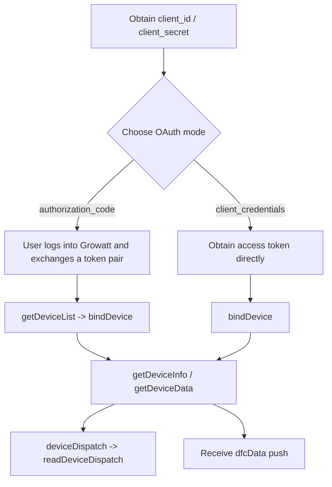

# Growatt Open API Professional Integration Guide (SSOT Aligned)

Version: 1.2 | Alignment Baseline: OPENAPI V1.0 | Date: March 23, 2026

This guide is an entry document for solution architects, backend engineers, and integration teams. The endpoint-level SSOT is `Growatt API/OPENAPI/*.md`. If this guide conflicts with an endpoint document, follow the endpoint document.

---

## 1 SSOT and Document Layering

Primary specification:

- [Authentication Guide](./OPENAPI/01_authentication.md)
- [Get access_token API](./OPENAPI/02_api_access_token.md)
- [OAuth2-refresh API](./OPENAPI/03_api_refresh.md)
- [Device Authorization API](./OPENAPI/04_api_device_auth.md)
- [Device Dispatch API](./OPENAPI/05_api_device_dispatch.md)
- [Read Device Dispatch Parameters API](./OPENAPI/06_api_read_dispatch.md)
- [Device Information Query API](./OPENAPI/07_api_device_info.md)
- [Device Data Query API](./OPENAPI/08_api_device_data.md)
- [Device Data Push API](./OPENAPI/09_api_device_push.md)
- [Global Parameter Description](./OPENAPI/10_global_params.md)

Supplemental references:

- [Troubleshooting FAQ](./OPENAPI/11_api_troubleshooting.md)
- Environment-specific integration reports under `test/`

---

## 2 OAuth Mode Boundary

### `authorization_code`

- Intended for end-user login and consent inside the third-party platform.
- `POST /oauth2/token` returns a `refresh_token`.
- `POST /oauth2/getDeviceList` is supported only in this mode.
- Use the `deviceSn` returned by `getDeviceList` as the bind target, and send `deviceSnList` as object entries. Add `pinCode` when required by the environment or target device.

### `client_credentials`

- Intended for direct platform-to-platform integrations.
- A `refresh_token` must not be assumed; rely on the actual response.
- Device onboarding typically starts from `POST /oauth2/bindDevice`; send `deviceSnList` as object entries, and add `pinCode` when required.
- `POST /oauth2/getDeviceList` is not the standard discovery interface for this mode.

---

## 3 Recommended Integration Path

---

## 4 API Matrix

| Capability | Endpoint | Key Input |
| :--- | :--- | :--- |
| Get token | `/oauth2/token` | `grant_type`, client credentials |
| Refresh token | `/oauth2/refresh` | `refresh_token` |
| Candidate device list | `/oauth2/getDeviceList` | Bearer token, `authorization_code` only |
| Bind device | `/oauth2/bindDevice` | `deviceSnList` object entries using the returned `deviceSn`; add `pinCode` when required |
| Authorized device list | `/oauth2/getDeviceListAuthed` | Bearer token |
| Unbind device | `/oauth2/unbindDevice` | `deviceSnList` |
| Device information | `/oauth2/getDeviceInfo` | `deviceSn` |
| Device telemetry | `/oauth2/getDeviceData` | `deviceSn` |
| Device dispatch | `/oauth2/deviceDispatch` | `deviceSn`, `setType`, `value`, `requestId` |
| Dispatch read-back | `/oauth2/readDeviceDispatch` | `deviceSn`, `setType` |

---

## 5 Dispatch and Telemetry Conventions

- The normative `deviceDispatch` request body is JSON and `requestId` is required.
- The normative `readDeviceDispatch` interface requires only `deviceSn` and `setType`; `data` may be either an object or an array depending on `setType`.
- The primary telemetry model is centered on `meterPower`, `reactivePower`, `serialNum`, and `batteryList[].soh`.
- Historical materials that use `activePower`, `reverActivePower`, or top-level `soc` should be handled as compatibility fields only.

---

## 6 Integration Notes

The following integration notes are confirmed by existing tests and should be applied together with the primary specification:

- `/oauth2/getDeviceList` returns `WRONG_GRANT_TYPE` under `client_credentials`
- `bindDevice`, `getDeviceInfo`, `getDeviceData`, `deviceDispatch`, `readDeviceDispatch`, and `unbindDevice` use JSON bodies
- Use raw `deviceSn` values for device-level APIs; do not substitute `datalogSn` or prefixed labels such as `SPH:` / `SPM:`
- Use object entries in `deviceSnList` for `bindDevice`; add `pinCode` when required
- `getDeviceData` and push payloads may still expose historical compatibility fields

---

## 7 Integration Checklist

- [ ] Separated `authorization_code` and `client_credentials` capability boundaries
- [ ] Implemented `/oauth2/token`
- [ ] Implemented `/oauth2/refresh` when `refresh_token` exists
- [ ] Switched to the new endpoint names: `getDeviceList` / `getDeviceListAuthed` / `readDeviceDispatch`
- [ ] Verified the `bindDevice` object-entry payload and whether `pinCode` is required
- [ ] Made `requestId` mandatory in `deviceDispatch`
- [ ] Parse `readDeviceDispatch.data` according to `setType`
- [ ] Consume telemetry using the primary field model
- [ ] Keep compatibility handling isolated to the compatibility layer
