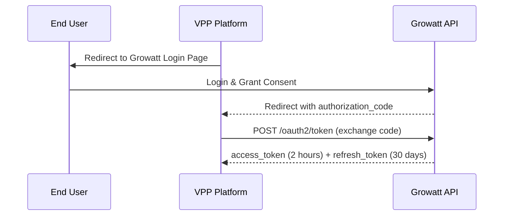
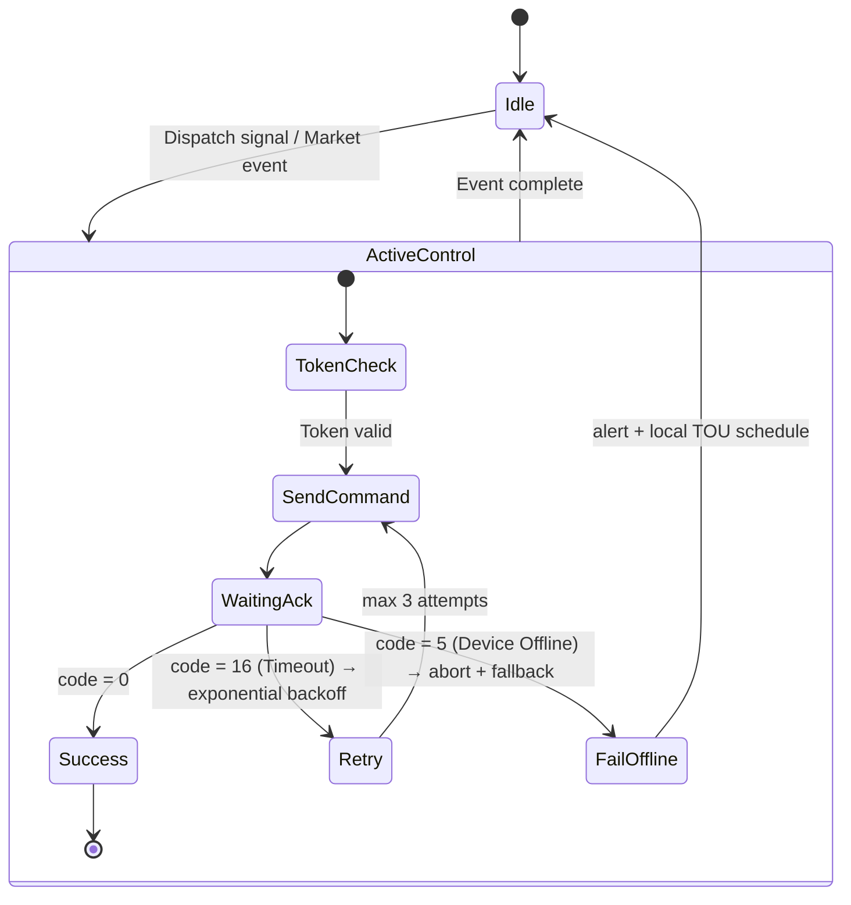

**For Virtual Power Plant (VPP) Aggregators**  
**Version 1.0** 
**Target Audience**: Solution Architects, Backend Developers, Grid Compliance Engineers  

---

### 1. Overview

The Growatt Open API is a secure, cloud-to-cloud HTTPS/JSON interface that allows third-party platforms (such as VPP aggregators) to access authorized Growatt user accounts and devices. Your VPP platform communicates exclusively with the Growatt API Gateway — no direct connection to on-site inverters or batteries is required.

Key capabilities for VPP:
- OAuth 2.0 user consent and device authorization
- High-frequency telemetry via `queryDfcData` and real-time data push (Webhooks)
- VPP parameter control via `setVppParameterNew` (scheduling, power limits, reactive support, etc.)
- Read current VPP parameters and device status

All operations require valid tokens and explicit device authorization.

---

### 2. Preparation

1. Contact Growatt staff to obtain `client_id` and `client_secret`.
2. Provide Growatt with:
   - Your OAuth 2.0 redirect URI.
   - A server URL to receive real-time device data pushes (specify expected push interval in minutes).
3. Growatt supplies a customizable embeddable HTML5 login page for seamless integration into your VPP portal.

---

### 3. OAuth 2.0 Authorization Flow

**Token Exchange** (`POST /oauth2/token` — `application/x-www-form-urlencoded`):  
Required parameters: `grant_type=authorization_code`, `code`, `client_id`, `client_secret`, `redirect_uri`.

**Token Refresh** (`POST /oauth2/refresh`):  
Use `grant_type=refresh_token` + `refresh_token`. Returns new tokens (old refresh_token is invalidated).  

If refresh_token expires, the user must re-authorize.

**Every API call** must include:  
`Authorization: Bearer {access_token}`

---

### 4. Device Authorization

After OAuth, users must explicitly authorize devices for your VPP platform.

**Endpoints** (all POST, Bearer token required):
- `apiAuth/getApiDeviceList` — List all devices available for authorization
- `apiAuth/getApiDeviceListAuth` — List already authorized devices
- `apiAuth/bindDevice` — Authorize devices (`deviceSnList` array)
- `apiAuth/unbindDevice` — Revoke authorization

Only authorized devices can receive commands and push data.

---

### 5. Core VPP Workflows: Telemetry & Dispatch

**High-Frequency Telemetry**  
**Endpoint**: `POST /v4/new-api/queryDfcData` (`application/x-www-form-urlencoded`)  
Parameters: `deviceSn`  
Returns detailed real-time data (example keys):  
- `soc`, `batteryList[]` (chargePower, dischargePower, ibat, vbat, soc per battery)  
- `activePower`, `batPower`, `pac`, `ppv`, `reverActivePower`, `payLoadPower`  
- Status codes (full definitions in Section 8)

**Real-time Data Push (Webhook)**:  
Growatt pushes `dfcData` to your registered URL at the configured interval. Same data structure as `queryDfcData`.

**VPP Dispatch / Parameter Control**  
**Endpoint**: `POST /v4/new-api/setVppParameterNew` (`application/x-www-form-urlencoded`)  
Rate limit: **once every 5 seconds per device**.  

Required parameters:
- `deviceSn`
- `setType` (see VPP parameters table below)
- `value`
- `requestId` (unique identifier)

**Read Current Parameters**  
**Endpoint**: `POST /v4/new-api/readVppParameterNew` — same structure, returns current values.

**VPP Use-Case Parameter Mapping** (directly from Growatt VPP parameter table):

| VPP Scenario                  | setType                              | Value Example / Range                  | Notes |
|-------------------------------|--------------------------------------|----------------------------------------|-------|
| Wholesale Arbitrage / Time-of-Use | `time_slot_charge_discharge`        | JSON array of {percentage, startTime, endTime} (0-1440 min) | Full-day schedule |
| Real-time On/Off              | `power_on_off_command`              | 0=Off, 1=On                            | Requires enable_control |
| Dynamic Export Limits         | `active_power_derating_percentage`  | 0–100 (default 100)                    | Percentage derating |
| Voltage / Reactive Support    | `reactive_power_mode`               | 0=PF=1, 1=PF value, 4=lag VAR (+), 5=lead VAR (-) | Power factor & VAR control |
| AC Charging Enable            | `ac_charge_enable`                  | 0/1                                    | Grid charging |
| Remote Power Control          | `remote_power_control_enable`       | 0/1                                    | + `remote_charge_discharge_power` |

Full list of 30+ parameters (including SOC limits, anti-backfeed, EPS, etc.) is available in the official documentation.

---

### 6. Recommended Fault-Tolerant Dispatch Logic

**Critical Error Codes** (from API responses):
- **code 5** — DEVICE_OFFLINE: Set local fallback schedule on inverter.
- **code 16** — PARAMETER_SETTING_RESPONSE_TIMEOUT: Exponential backoff.
- **code 7** — WRONG_DEVICE_TYPE
- **code 12** — DEVICE_SN_DOES_NOT_HAVE_PERMISSION
- **code 2** — TOKEN_IS_INVALID

**Always verify**: After `setVppParameterNew`, immediately call `queryDfcData` to confirm actual `chargePower`/`dischargePower` / `soc` matches the setpoint.

---

### 7. Production Best Practices for VPP

1. **Rate Limiting**: 1 command per deviceSn every 5 seconds max → implement queuing (e.g. Kafka/RabbitMQ).
2. **Token Management**: Dedicated background service for refresh + re-authorization.
3. **Offline Handling**: Pre-configure safe default TOU schedule on every device.
4. **Idempotency & Verification**: Use unique `requestId`; always poll telemetry after dispatch.
5. **Security**: Encrypt tokens, HTTPS only, least-privilege device authorization.
6. **Monitoring**: Track success rate, latency, offline events, token expiry.

---

### 8. Status Code Reference (from PDF)

**Device Status (status)**: 0=Standby, 1=Self-check, 3=Fault, 5=PV online + battery offline + on-grid, 6=PV offline/online + battery online + on-grid, etc.  
**Battery Status (batteryStatus)**: 0=Standby, 2=Charging, 3=Discharging, 4=Fault.  
**Priority (priority)**: 0=Load, 1=Battery, 2=Grid.

---

### 9. Quick-Start Checklist

- [ ] Obtained `client_id` / `client_secret` + registered redirect & push URLs
- [ ] Implemented full OAuth 2.0 + token refresh daemon
- [ ] Integrated device list + bind/unbind
- [ ] Built `queryDfcData` polling + Webhook handler
- [ ] Implemented `setVppParameterNew` with state machine & verification
- [ ] Configured queues, monitoring, and offline fallback
- [ ] Tested end-to-end with real devices

---

**For the complete OpenAPI specification, Postman collection, or domain-specific endpoint URLs**, contact Growatt API technical support with your `client_id`.

We are committed to enabling fast, secure, and reliable VPP integration for every aggregator.

**Growatt Open API Team**  
March 2026

---
