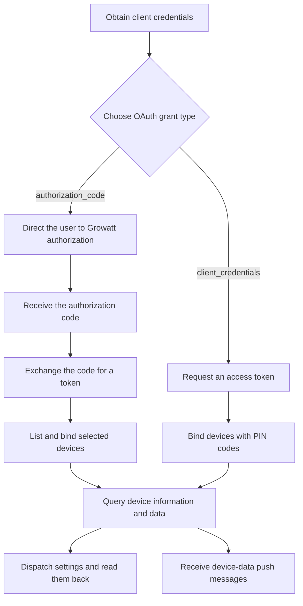

# Growatt Open API Professional Integration Guide

This guide helps platform customers, aggregators, and VPP partners plan a reliable Growatt Open API integration. Follow the linked endpoint pages for the complete request parameters, response fields, and examples.

## 1 Choose an Authorization Model

| Model | Use it when | Device authorization path |
| :--- | :--- | :--- |
| `authorization_code` | A Growatt end user grants your application access to devices | Obtain an authorization code, exchange it for a token, call `getDeviceList`, and bind selected devices |
| `client_credentials` | Your server-to-server integration uses credentials issued for the platform | Obtain a token and call `bindDevice` with each device SN and PIN code |

Keep `client_secret`, access tokens, and refresh tokens on a trusted backend. Do not expose them in browser code, mobile applications, logs, or URLs.

## 2 Integration Flow

```mermaid
flowchart TD
    A["Obtain client credentials"] --> B{"Choose OAuth grant type"}
    B -->|"authorization_code"| C["Direct the user to Growatt authorization"]
    C --> D["Receive the authorization code"]
    D --> E["Exchange the code for a token"]
    E --> F["List and bind selected devices"]
    B -->|"client_credentials"| G["Request an access token"]
    G --> H["Bind devices with PIN codes"]
    F --> I["Query device information and data"]
    H --> I
    I --> J["Dispatch settings and read them back"]
    I --> K["Receive device-data push messages"]
```

### `authorization_code`

1. Direct the user to the Growatt authorization entry provided for your application.
2. Receive the authorization code at the registered `redirect_uri`.
3. Exchange the code through `POST /oauth2/token`.
4. Call `POST /oauth2/getDeviceList` and let the user select devices.
5. Call `POST /oauth2/bindDevice`.
6. Continue with device query, dispatch, read-back, and push integration.

### `client_credentials`

1. Call `POST /oauth2/token` with the credentials issued to your platform.
2. Call `POST /oauth2/bindDevice` with `deviceSn` and `pinCode` for each device.
3. Call `POST /oauth2/getDeviceListAuthed` to confirm the authorized device set.
4. Continue with device query, dispatch, read-back, and push integration.

## 3 API Matrix

| Capability | Endpoint | Required inputs or prerequisite |
| :--- | :--- | :--- |
| Get token | `/oauth2/token` | `grant_type`, `client_id`, `client_secret`, `redirect_uri`; `code` for authorization-code mode |
| Refresh token | `/oauth2/refresh` | A previously issued `refresh_token` plus client credentials |
| Get candidate devices | `/oauth2/getDeviceList` | Bearer token from `authorization_code` mode |
| Bind devices | `/oauth2/bindDevice` | `deviceSnList`; `pinCode` is required in client-credentials mode |
| Get authorized devices | `/oauth2/getDeviceListAuthed` | Bearer token |
| Unbind devices | `/oauth2/unbindDevice` | `deviceSnList` |
| Device information | `/oauth2/getDeviceInfo` | `deviceSn` |
| Device telemetry | `/oauth2/getDeviceData` | `deviceSn` |
| Device dispatch | `/oauth2/deviceDispatch` | `deviceSn`, `setType`, `value`, `requestId` |
| Dispatch read-back | `/oauth2/readDeviceDispatch` | `deviceSn`, `setType`, `requestId` |

## 4 Request and Response Rules

- Send protected requests with `Authorization: Bearer <access_token>`.
- Send JSON request bodies where the endpoint page specifies `Content-Type: application/json`.
- Use `deviceSn`, not `datalogSn`, for device-level API requests.
- Generate a unique 32-character `requestId` for each dispatch or read-back request.
- Implement only the documented `setType` values and use the corresponding `value` shape: array, object, or scalar number.
- Treat `code=0` as success. Do not assume that every successful response has the same `data` shape.
- Read `expires_in` and `refresh_expires_in` from each token response; example TTL values are illustrative.
- When refresh succeeds, atomically store the new token response before making further protected calls.

## 5 Reliability and Error Handling

| Condition | Customer action |
| :--- | :--- |
| `TOKEN_IS_INVALID` | Refresh the token if a refresh token is available; otherwise obtain a new access token |
| `DEVICE_SN_DOES_NOT_HAVE_PERMISSION` | Confirm that the device is bound to the current authorization |
| `WRONG_GRANT_TYPE` | Verify that the endpoint supports the selected OAuth grant type |
| `DEVICE_OFFLINE` | Retry after the device reconnects; avoid immediate repeated dispatch attempts |
| `TOO_MANY_REQUEST` | Apply per-device rate limiting and exponential backoff |
| Dispatch timeout or no response | Reconcile with `readDeviceDispatch` before deciding whether to retry |

## 6 Integration Checklist

- [ ] Selected the correct OAuth grant type for the customer journey
- [ ] Registered and supplied the exact `redirect_uri`
- [ ] Stored credentials and tokens only on a trusted backend
- [ ] Implemented token expiry handling from response TTL values
- [ ] Used `Authorization: Bearer <access_token>` on protected endpoints
- [ ] Used `deviceSn` for device-level calls
- [ ] Included `pinCode` for client-credentials device binding
- [ ] Generated a unique `requestId` for every dispatch and read-back call
- [ ] Implemented the documented `setType` value shapes
- [ ] Applied per-device rate limits and retry backoff
- [ ] Treated additive response fields as backward-compatible and tolerated unknown fields
- [ ] Validated webhook request handling and returned a timely success response

For detailed field definitions, continue with [Authentication](./OPENAPI/01_authentication.md), [Device Authorization](./OPENAPI/04_api_device_auth.md), [Global Parameters](./OPENAPI/10_global_params.md), the [Troubleshooting FAQ](./OPENAPI/11_api_troubleshooting.md), and the [ESS Terminology Glossary](./OPENAPI/12_ess_terminology.md).
