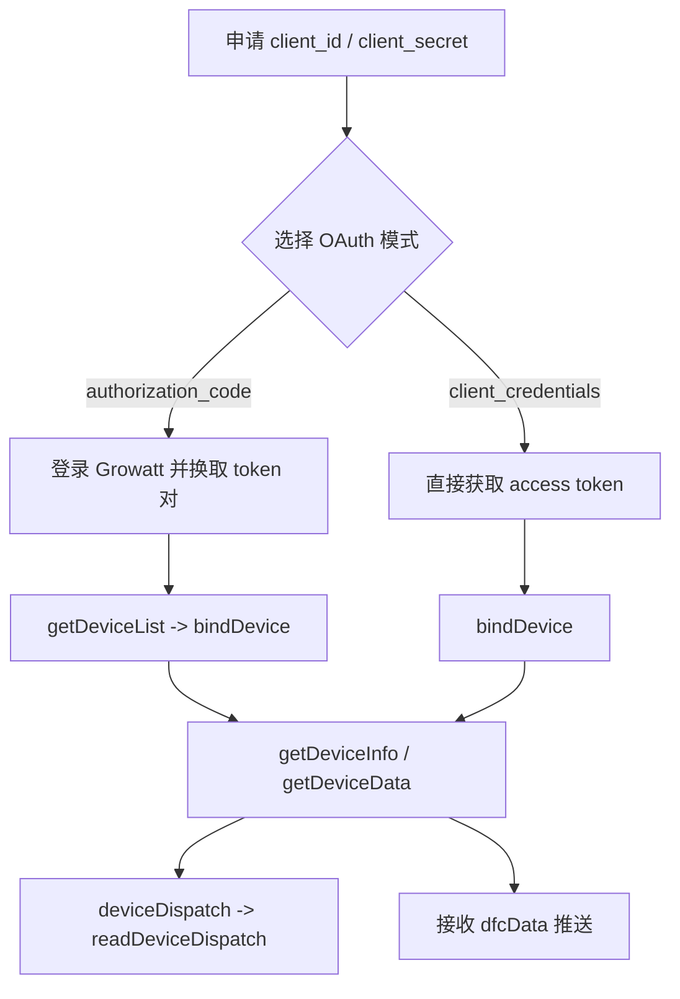

# Growatt Open API 专业集成指南

本文档是入口型说明。端点参数、示例和返回码统一维护在 `Growatt API/OPENAPI.zh-CN/*.md`；环境联调记录则单独放在观察部分，便于实现时参考。

## 1 文档分层

- 中文拆分发布文档：`Growatt API/OPENAPI.zh-CN/*.md`
- 英文拆分发布文档：`Growatt API/OPENAPI/*.md`
- 附录B 术语表：[/growatt-openapi/appendix-terminology](/growatt-openapi/appendix-terminology)
- 联调观察来源：仓库 `test/` 目录中的环境记录

## 2 支持的集成路径

### 集成流程

### `authorization_code`

1. 调用 `POST /oauth2/token`
2. 调用 `POST /oauth2/getDeviceList`
3. 调用 `POST /oauth2/bindDevice`
4. 调用设备查询、调度和回读接口

### `client_credentials`

1. 调用 `POST /oauth2/token`
2. 直接调用 `POST /oauth2/bindDevice`
3. 调用 `POST /oauth2/getDeviceListAuthed`
4. 调用设备查询、调度和回读接口

## 3 API 矩阵

| 能力 | Endpoint | 关键输入 |
| :--- | :--- | :--- |
| 获取 token | `/oauth2/token` | `grant_type`、`client_id`、`client_secret`、`redirect_uri` |
| 刷新 token | `/oauth2/refresh` | `refresh_token`、客户端凭证 |
| 获取可授权设备列表 | `/oauth2/getDeviceList` | Bearer token，仅 `authorization_code` |
| 绑定设备 | `/oauth2/bindDevice` | `deviceSnList`；客户端模式下 `pinCode` 必填 |
| 获取已授权设备列表 | `/oauth2/getDeviceListAuthed` | Bearer token |
| 解除授权 | `/oauth2/unbindDevice` | `deviceSnList` |
| 设备信息 | `/oauth2/getDeviceInfo` | `deviceSn` |
| 设备遥测 | `/oauth2/getDeviceData` | `deviceSn` |
| 设备调度 | `/oauth2/deviceDispatch` | `deviceSn`、`setType`、`value`、`requestId` |
| 调度回读 | `/oauth2/readDeviceDispatch` | `deviceSn`、`setType`、`requestId` |

## 4 需要特别注意的事项

- `POST /oauth2/token` 的两个公开示例都包含 `redirect_uri`。
- `POST /oauth2/readDeviceDispatch` 的参数表要求 `requestId`，但公开请求示例正文漏写了它。
- `POST /oauth2/deviceDispatch` 的参数表把 `value` 写成 `string`，但同页示例传入了对象。
- `POST /oauth2/getDeviceData` 的局部头部表写作 `token`，而全局章节统一写作 `Authorization: Bearer xxxxxxx`。

## 5 联调观察

以下内容来自仓库 `test/` 目录中的环境记录，仅供实现参考：

- 多份记录使用 JSON body 调用设备级接口。
- 多份记录建议传纯 `deviceSn`，不要混用 `datalogSn` 或展示前缀。
- 个别记录观察到 `client_credentials` 调 `getDeviceList` 返回 `WRONG_GRANT_TYPE`。
- 个别记录观察到 `readDeviceDispatch.data` 会随 `setType` 返回对象结构。

这些现象不应替代端点文档中的 API 说明。

## 6 集成检查清单

- [ ] 已区分 `authorization_code` 与 `client_credentials` 的能力边界
- [ ] 已在两个 token 模式示例中保留 `redirect_uri`
- [ ] 已将 `bindDevice.pinCode` 视为客户端模式必填
- [ ] 已将 `readDeviceDispatch.requestId` 视为必填
- [ ] 已按 `10_global_params.md` 中的 3 个 `setType` 实现基础映射
- [ ] 已对照 [/growatt-openapi/appendix-terminology](/growatt-openapi/appendix-terminology) 理解公开储能术语
- [ ] 已将联调经验留在兼容层，而不是提升为端点规范
