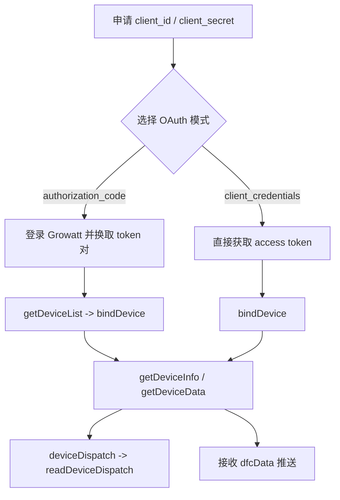

# Growatt Open API 专业集成指南（与 SSOT 对齐）

版本：1.2 | 对齐基线：OPENAPI V1.0 | 日期：2026 年 3 月 23 日

本文档是面向方案架构师、后端开发者与集成工程师的入口型指南。端点级 SSOT 以 `Growatt API/OPENAPI.zh-CN/*.md` 为准；如本指南与端点文档冲突，以端点文档为准。

---

## 1 SSOT 与资料分层

主规范：

- [身份认证说明](./OPENAPI.zh-CN/01_authentication.md)
- [获取 access_token 接口](./OPENAPI.zh-CN/02_api_access_token.md)
- [OAuth2-refresh 接口](./OPENAPI.zh-CN/03_api_refresh.md)
- [设备授权 API](./OPENAPI.zh-CN/04_api_device_auth.md)
- [设备下发 API](./OPENAPI.zh-CN/05_api_device_dispatch.md)
- [读取设备下发参数 API](./OPENAPI.zh-CN/06_api_read_dispatch.md)
- [设备信息查询 API](./OPENAPI.zh-CN/07_api_device_info.md)
- [设备数据查询 API](./OPENAPI.zh-CN/08_api_device_data.md)
- [设备数据推送 API](./OPENAPI.zh-CN/09_api_device_push.md)
- [全局参数说明](./OPENAPI.zh-CN/10_global_params.md)

补充资料：

- [常见问题与排查 FAQ](./OPENAPI.zh-CN/11_api_troubleshooting.md)
- `test/` 目录中的环境联调报告

---

## 2 OAuth 模式边界

### `authorization_code`

- 面向 Growatt 终端用户在第三方平台内完成登录授权的场景。
- `POST /oauth2/token` 响应包含 `refresh_token`。
- `POST /oauth2/getDeviceList` 仅在该模式下支持。
- 绑定时应使用 `getDeviceList` 返回的 `deviceSn`，并以对象项形式传入 `deviceSnList`；如环境或目标设备要求，再补 `pinCode`。

### `client_credentials`

- 面向平台直连场景。
- 不默认承诺返回 `refresh_token`，必须以实际响应为准。
- 设备接入通常从 `POST /oauth2/bindDevice` 开始；`deviceSnList` 使用对象项，如环境要求，再补 `pinCode`。
- `POST /oauth2/getDeviceList` 不作为该模式的标准设备发现接口。

---

## 3 推荐集成路径

---

## 4 API 矩阵

| 能力 | Endpoint | 关键输入 |
| :--- | :--- | :--- |
| 获取 token | `/oauth2/token` | `grant_type`、客户端凭证 |
| 刷新 token | `/oauth2/refresh` | `refresh_token` |
| 候选设备列表 | `/oauth2/getDeviceList` | Bearer token，且仅 `authorization_code` |
| 绑定设备 | `/oauth2/bindDevice` | `deviceSnList` 对象项，使用返回的 `deviceSn`；如环境要求，再补 `pinCode` |
| 已授权设备列表 | `/oauth2/getDeviceListAuthed` | Bearer token |
| 解除授权 | `/oauth2/unbindDevice` | `deviceSnList` |
| 设备信息 | `/oauth2/getDeviceInfo` | `deviceSn` |
| 设备遥测 | `/oauth2/getDeviceData` | `deviceSn` |
| 设备下发 | `/oauth2/deviceDispatch` | `deviceSn`、`setType`、`value`、`requestId` |
| 下发回读 | `/oauth2/readDeviceDispatch` | `deviceSn`、`setType` |

---

## 5 调度与遥测约定

- `deviceDispatch` 的规范请求体为 JSON，且 `requestId` 必填。
- `readDeviceDispatch` 主规范只要求 `deviceSn` 与 `setType`；返回 `data` 可因 `setType` 不同而为 object 或 array。
- 遥测主模型以 `meterPower`、`reactivePower`、`serialNum`、`batteryList[].soh` 为核心。
- 历史材料中的 `activePower`、`reverActivePower`、外层 `soc` 仅作为兼容字段处理。

---

## 6 集成要点

以下集成要点已被既有测试确认，应与主规范一并理解：

- `client_credentials` 调 `/oauth2/getDeviceList` 返回 `WRONG_GRANT_TYPE`
- `bindDevice`、`getDeviceInfo`、`getDeviceData`、`deviceDispatch`、`readDeviceDispatch`、`unbindDevice` 使用 JSON body
- 设备级接口必须使用纯 `deviceSn`，不要误用 `datalogSn`，也不要传 `SPH:` / `SPM:` 这类展示值
- `bindDevice` 的 `deviceSnList` 统一使用对象项；如环境要求，再补 `pinCode`
- `getDeviceData` / push 仍可能出现历史兼容字段

---

## 7 集成检查清单

- [ ] 已区分 `authorization_code` 与 `client_credentials` 的能力边界
- [ ] 已实现 `/oauth2/token`
- [ ] 已按需实现 `/oauth2/refresh`
- [ ] 已使用新的 endpoint 名称：`getDeviceList` / `getDeviceListAuthed` / `readDeviceDispatch`
- [ ] 已确认 `bindDevice` 的对象项请求体以及是否需要 `pinCode`
- [ ] 已将 `deviceDispatch` 的 `requestId` 设为必填
- [ ] 已按 `setType` 解析 `readDeviceDispatch.data`
- [ ] 已按主规范字段消费遥测
- [ ] 已将兼容处理限制在兼容层
