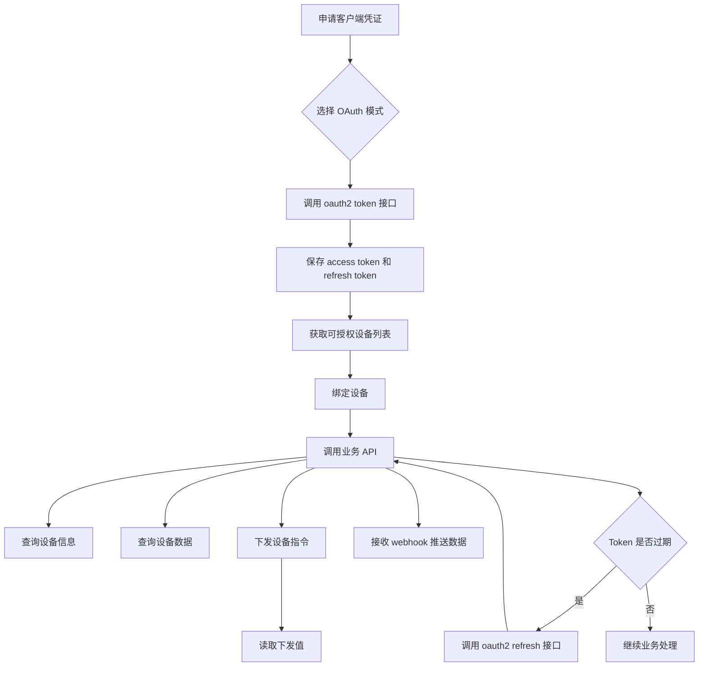
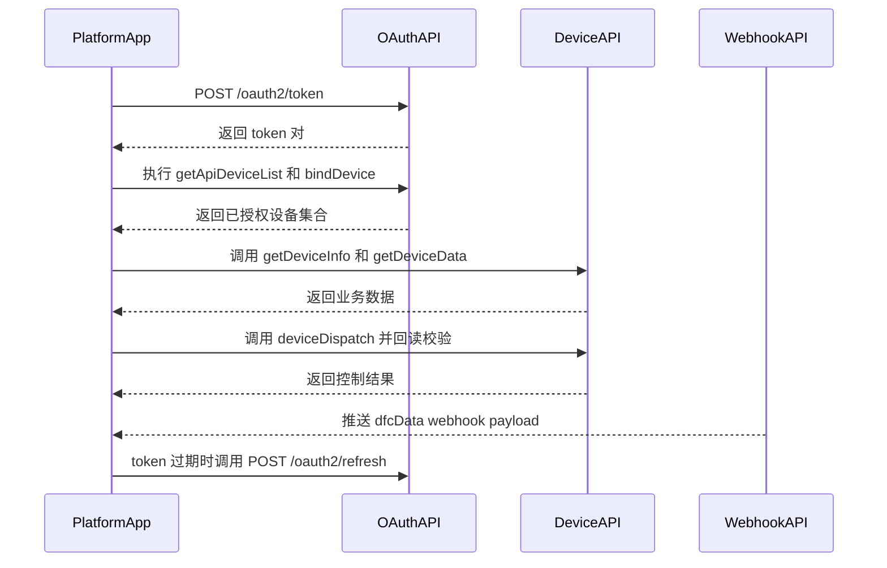
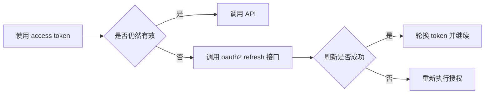
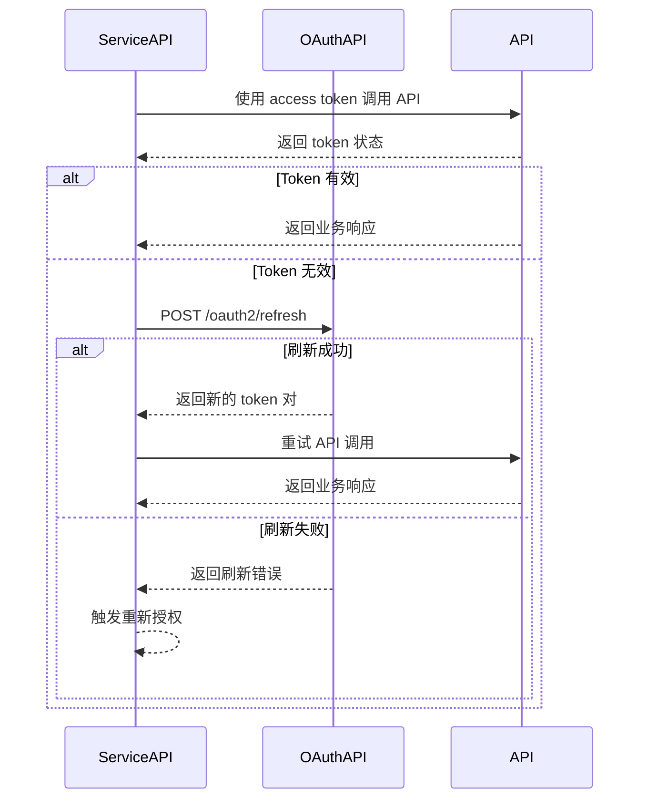
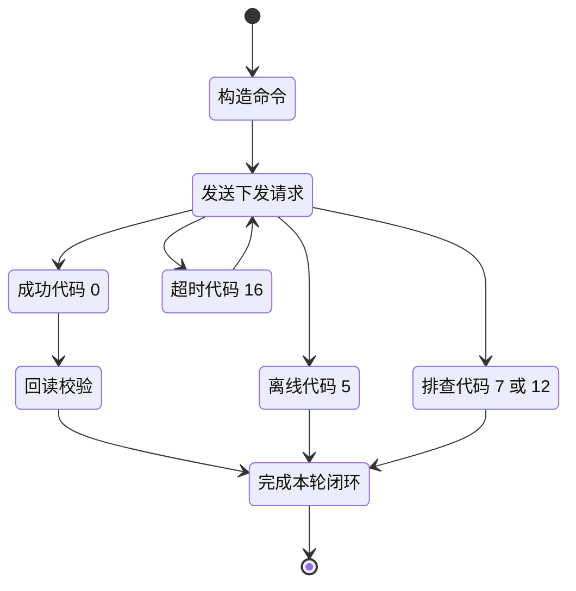

**Growatt Open API 快速指南（与 SSOT 对齐）**
**版本 1.1（与 OPENAPI V1.0 对齐，发布日期：2026 年 3 月 4 日）**  
**目标读者**：解决方案架构师、后端开发人员、集成工程师

---

### 1. 范围与 SSOT 规则

本快速指南用于加快集成。单一事实来源（SSOT）为：
- `Growatt API/OPENAPI/*.md`

若本指南与端点级文档存在冲突，请始终以 OPENAPI 文档为准。

核心参考：
- [身份认证说明](./OPENAPI/01_authentication.md)
- [获取 access_token 接口](./OPENAPI/02_api_access_token.md)
- [OAuth2-refresh 接口](./OPENAPI/03_api_refresh.md)
- [设备授权 API](./OPENAPI/04_api_device_auth.md)
- [设备下发 API](./OPENAPI/05_api_device_dispatch.md)
- [读取设备下发参数 API](./OPENAPI/06_api_read_dispatch.md)
- [设备信息查询 API](./OPENAPI/07_api_device_info.md)
- [设备数据查询 API](./OPENAPI/08_api_device_data.md)
- [设备数据推送 API](./OPENAPI/09_api_device_push.md)
- [全局参数说明](./OPENAPI/10_global_params.md)
- [常见问题与排查 FAQ](./OPENAPI/11_api_troubleshooting.md)

---

### 2. 9290 测试环境已验证流程

已在 `https://api-test.growatt.com:9290` 的 `client_credentials` 模式下验证通过：

1. `POST /oauth2/token`
2. `POST /oauth2/bindDevice`
3. `POST /oauth2/getDeviceInfo`
4. `POST /oauth2/getDeviceData`

说明：
- 测试设备标签可能显示为 `SPH:xxxx` / `SPM:xxxx`，但请求体中应传纯 SN。
- 该测试环境下，`bindDevice` 的已验证通过请求组合为：
  - `Authorization: Bearer {access_token}`
  - `Content-Type: application/json`
  - JSON body 中传纯 SN 和 `pinCode`
- 该测试环境下，`getDeviceInfo` 与 `getDeviceData` 的已验证通过请求组合为：
  - `Authorization: Bearer {access_token}`
  - `Content-Type: application/json`
  - JSON body：`{"deviceSn":"RAW_DEVICE_SN"}`
- 正确：`RAW_DEVICE_SN`
- 错误：`SPH:RAW_DEVICE_SN`

#### 最小可复制示例

```json
// bindDevice
{
    "deviceSnList": [
        {
            "deviceSn": "RAW_DEVICE_SN",
            "pinCode": "TEST_PIN_CODE"
        }
    ]
}

// getDeviceInfo / getDeviceData
{
    "deviceSn": "RAW_DEVICE_SN"
}
```

---

### 3. 端到端集成流程

#### 3.1 概念图



#### 3.2 操作顺序



---

### 4. 身份认证与 Token 生命周期

**Token 接口**：`POST /oauth2/token`  
支持的 `grant_type`：
- `authorization_code`
- `client_credentials`

**刷新接口**：`POST /oauth2/refresh`  
必填参数：
- `grant_type=refresh_token`
- `refresh_token`
- `client_id`
- `client_secret`

Token 有效期（来自 SSOT）：
- `access_token`：7200 秒
- `refresh_token`：2592000 秒





请求头约定：
- 大多数接口要求 `Authorization: Bearer {access_token}`。
- 对于 `/oauth2/getDeviceData`，需遵循 SSOT 文档中的请求头定义（`token`）。
- 但在 `api-test.growatt.com:9290` 的已验证测试环境中，`getDeviceInfo` 与 `getDeviceData` 使用 `Authorization: Bearer {access_token}` + JSON body 已实测成功。

---

### 5. 设备授权生命周期

按顺序使用这些端点：
1. `POST /oauth2/getApiDeviceList`（候选设备列表）
2. `POST /oauth2/bindDevice`（授权设备）
3. `POST /oauth2/getApiDeviceListAuthed`（检查已授权设备集合）
4. `POST /oauth2/unbindDevice`（撤销授权）

注：
- 在 `client_credentials` 模式下，`bindDevice` 可能需要 `pinCode`。
- 只有已授权设备才能被后续业务接口操作。
- 在 `api-test.growatt.com:9290` 的已验证测试环境中，测试设备标签可能带 `SPH:` / `SPM:` 前缀，但接口请求应仅传纯 SN。

---

### 6. 业务 API 矩阵（SSOT 端点）

| 能力 | Endpoint | Method | 关键输入 |
| :--- | :--- | :--- | :--- |
| 获取 token | `/oauth2/token` | POST | `grant_type`、客户端凭证 |
| 刷新 token | `/oauth2/refresh` | POST | `refresh_token` |
| 候选设备列表 | `/oauth2/getApiDeviceList` | POST | Bearer token |
| 绑定设备 | `/oauth2/bindDevice` | POST | `deviceSnList` |
| 已授权设备列表 | `/oauth2/getApiDeviceListAuthed` | POST | Bearer token |
| 解绑设备 | `/oauth2/unbindDevice` | POST | `deviceSnList` |
| 设备信息 | `/oauth2/getDeviceInfo` | POST | `deviceSn` |
| 设备遥测查询 | `/oauth2/getDeviceData` | POST | `deviceSn` |
| 设备下发 | `/oauth2/deviceDispatch` | POST | `deviceSn`、`setType`、`value`、`requestId` |
| 读取下发参数 | `/oauth2/readDdeviceDispatch` | POST | `deviceSn`、`setType`、`requestId` |

推送集成：
- Growatt 会向你的 webhook URL 推送高频 payload（参见 [09_api_device_push.md](./OPENAPI/09_api_device_push.md)）。
- Payload 字段结构与设备数据查询中的 `dfcData` 保持一致。

---

### 7. 下发与回读安全循环

下发频率限制（SSOT）：
- 单设备 **每 5 秒最多 1 条指令**。

推荐的控制循环：



需要处理的关键响应码：
- `0`：成功
- `2`：`TOKEN_IS_INVALID`
- `5`：`DEVICE_OFFLINE`
- `7`：`WRONG_DEVICE_TYPE`
- `12`：`DEVICE_SN_DOES_NOT_HAVE_PERMISSION`
- `16`：`PARAMETER_SETTING_RESPONSE_TIMEOUT`

---

### 8. 参数使用快速索引

使用 SSOT [10_global_params.md](./OPENAPI/10_global_params.md) 中的 `setType` 值。常用示例：
- `enable_control`
- `power_on_off_command`
- `time_slot_charge_discharge`
- `active_power_derating_percentage`
- `reactive_power_mode`
- `remote_power_control_enable`
- `remote_charge_discharge_power`
- `ac_charge_enable`

指导：
- 发送下发前校验参数范围。
- 对关键控制始终使用 `/oauth2/readDdeviceDispatch` 进行回读。

---

### 8. 集成检查清单

- [ ] 已获取 `client_id` 和 `client_secret`
- [ ] 已实现 `/oauth2/token` 与 `/oauth2/refresh`
- [ ] 已实现 token 存储与轮换
- [ ] 已实现设备授权生命周期（`getApiDeviceList` / `bindDevice` / `getApiDeviceListAuthed` / `unbindDevice`）
- [ ] 已实现遥测拉取（`/oauth2/getDeviceData`）
- [ ] 已实现推送 webhook 接收端
- [ ] 已实现下发 + 回读闭环（`/oauth2/deviceDispatch` + `/oauth2/readDdeviceDispatch`）
- [ ] 已处理返回码 `2/5/7/12/16`
- [ ] 已按照 `10_global_params.md` 校验参数值

---

**变更说明**：本快速指南已修正为与 OPENAPI SSOT 的端点和命名保持一致。

**Growatt Open API Team**  
2026 年 3 月
