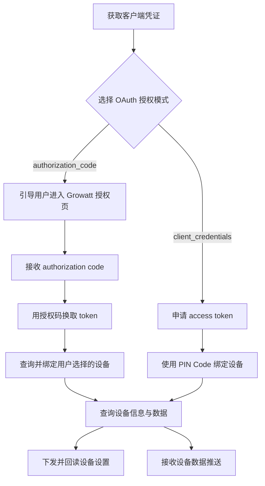

# Growatt Open API 专业集成指南

本指南面向平台客户、聚合商与 VPP 合作方，帮助您规划稳定的 Growatt Open API 接入。完整的请求参数、返回字段和示例请以对应接口页面为准。

## 1 选择授权模式

| 模式 | 适用场景 | 设备授权路径 |
| :--- | :--- | :--- |
| `authorization_code` | Growatt 终端用户主动授权您的应用访问设备 | 获取授权码、换取 token、调用 `getDeviceList`，再绑定用户选择的设备 |
| `client_credentials` | 您的平台使用已签发的凭证进行服务端到服务端接入 | 获取 token，并使用设备 SN 与 PIN Code 调用 `bindDevice` |

`client_secret`、access token 和 refresh token 必须保存在可信后端，不得暴露在浏览器代码、移动应用、日志或 URL 中。

## 2 集成流程

```mermaid
flowchart TD
    A["获取客户端凭证"] --> B{"选择 OAuth 授权模式"}
    B -->|"authorization_code"| C["引导用户进入 Growatt 授权页"]
    C --> D["接收 authorization code"]
    D --> E["用授权码换取 token"]
    E --> F["查询并绑定用户选择的设备"]
    B -->|"client_credentials"| G["申请 access token"]
    G --> H["使用 PIN Code 绑定设备"]
    F --> I["查询设备信息与数据"]
    H --> I
    I --> J["下发并回读设备设置"]
    I --> K["接收设备数据推送"]
```

### `authorization_code`

1. 将用户引导至为您的应用提供的 Growatt 授权入口。
2. 在已登记的 `redirect_uri` 接收授权码。
3. 通过 `POST /oauth2/token` 用授权码换取 token。
4. 调用 `POST /oauth2/getDeviceList`，由用户选择需要授权的设备。
5. 调用 `POST /oauth2/bindDevice`。
6. 继续完成设备查询、调度、回读和推送接入。

### `client_credentials`

1. 使用平台获发的凭证调用 `POST /oauth2/token`。
2. 调用 `POST /oauth2/bindDevice`，为每台设备提供 `deviceSn` 与 `pinCode`。
3. 调用 `POST /oauth2/getDeviceListAuthed` 确认已授权设备集合。
4. 继续完成设备查询、调度、回读和推送接入。

## 3 API 矩阵

| 能力 | 接口 | 必填输入或前置条件 |
| :--- | :--- | :--- |
| 获取 token | `/oauth2/token` | `grant_type`、`client_id`、`client_secret`、`redirect_uri`；授权码模式还需 `code` |
| 刷新 token | `/oauth2/refresh` | 之前签发的 `refresh_token` 与客户端凭证 |
| 获取可授权设备 | `/oauth2/getDeviceList` | `authorization_code` 模式签发的 Bearer token |
| 绑定设备 | `/oauth2/bindDevice` | `deviceSnList`；客户端凭证模式下 `pinCode` 必填 |
| 获取已授权设备 | `/oauth2/getDeviceListAuthed` | Bearer token |
| 解除设备授权 | `/oauth2/unbindDevice` | `deviceSnList` |
| 查询设备信息 | `/oauth2/getDeviceInfo` | `deviceSn` |
| 查询设备遥测 | `/oauth2/getDeviceData` | `deviceSn` |
| 下发设备设置 | `/oauth2/deviceDispatch` | `deviceSn`、`setType`、`value`、`requestId` |
| 回读设备设置 | `/oauth2/readDeviceDispatch` | `deviceSn`、`setType`、`requestId` |

## 4 请求与响应规则

- 受保护接口统一使用 `Authorization: Bearer <access_token>`。
- 接口页指定 `Content-Type: application/json` 时，请发送 JSON 请求体。
- 设备级 API 使用 `deviceSn`，不要使用 `datalogSn`。
- 每次调度下发或回读都生成唯一的 32 位 `requestId`。
- 仅使用文档列出的 `setType`，并按对应要求发送数组、对象或数值型 `value`。
- 以 `code=0` 判断成功，不要假设所有成功响应的 `data` 结构相同。
- 每次从 token 响应读取 `expires_in` 和 `refresh_expires_in`，示例中的有效期数值仅用于说明格式。
- 刷新成功后，应先原子化保存新的 token 响应，再继续调用受保护接口。

## 5 稳定性与错误处理

| 情况 | 客户侧处理建议 |
| :--- | :--- |
| `TOKEN_IS_INVALID` | 有 refresh token 时刷新；否则重新获取 access token |
| `DEVICE_SN_DOES_NOT_HAVE_PERMISSION` | 确认设备已绑定至当前授权 |
| `WRONG_GRANT_TYPE` | 确认当前接口支持所选 OAuth 模式 |
| `DEVICE_OFFLINE` | 等待设备恢复在线，避免立即连续重试调度 |
| `TOO_MANY_REQUEST` | 按设备限流，并使用指数退避 |
| 调度超时或设备未响应 | 重试前先通过 `readDeviceDispatch` 核对设备当前设置 |

## 6 集成检查清单

- [ ] 已根据客户授权流程选择正确的 OAuth 模式
- [ ] 已登记并传入完全一致的 `redirect_uri`
- [ ] 凭证与 token 仅保存在可信后端
- [ ] 已根据响应中的有效期实现 token 到期处理
- [ ] 受保护接口均使用 `Authorization: Bearer <access_token>`
- [ ] 设备级调用使用 `deviceSn`
- [ ] 客户端凭证模式绑定设备时已提供 `pinCode`
- [ ] 每次调度和回读均生成唯一 `requestId`
- [ ] 已按文档实现各 `setType` 的值结构
- [ ] 已实现按设备限流与重试退避
- [ ] 响应解析允许新增字段，保证向后兼容
- [ ] 已验证 Webhook 请求处理并及时返回成功响应

详细字段定义请继续阅读[身份认证](./OPENAPI.zh-CN/01_authentication.md)、[设备授权](./OPENAPI.zh-CN/04_api_device_auth.md)、[全局参数](./OPENAPI.zh-CN/10_global_params.md)、[常见问题与排查](./OPENAPI.zh-CN/11_api_troubleshooting.md)和[ESS 术语表](./OPENAPI.zh-CN/12_ess_terminology.md)。
