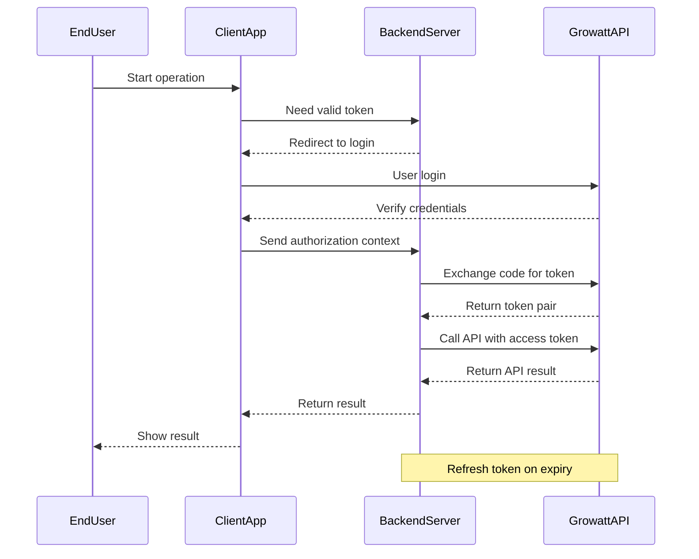

# Growatt Open API (English Version)

Version: V1.0
Release Date: March 4, 2026

## 1 OAuth2.0 Authorization Mode Description

*   **Third-party platforms** should contact Growatt staff to apply for a `clientId`/`clientSecret`, which is used to connect to the Growatt OAuth2 server.
*   **URL for receiving real-time device data pushed by Growatt**: The third-party platform needs to develop this independently and provide the URL with corresponding functionality to Growatt.

### Authorization Code Mode

This mode is for scenarios where Growatt users have personal accounts.

1.  Growatt provides a customized embedded login page (HTML5). The third-party platform integrates this login page into its own application.
2.  The third-party platform develops client-side features related to the OAuth2.0 flow.
3.  With the help of the embedded Growatt login page, the Growatt end-user completes the OAuth2.0 flow. Thus, the third-party platform obtains the authorization information of the Growatt end-user, which is used for subsequent API calls.
4.  One OAuth2.0 authorization record corresponds to one Growatt end-user and one third-party platform they have specifically authorized. The authorization information has a limited validity period and will expire after a certain time.
5.  After obtaining the OAuth2.0 authorization information of the Growatt end-user, the third-party platform needs to develop the following features:
    *   *Establish the mapping relationship between the Growatt end-user account and the third-party platform account.*
    *   *Self-maintain the validity period of the authorization information and refresh it after it expires.*
    *   *If the refresh token also expires, the Growatt end-user will need to go through the OAuth2.0 steps again to re-authorize.*
6.  The third-party platform develops features corresponding to the API provided in this document. In the third-party platform application, when the user of the third-party platform operates the authorized devices under their corresponding Growatt end-user account, the relevant functions are realized by calling the Growatt API.

### Client Credentials Mode

This mode is for scenarios where the third-party platform directly connects to the Growatt platform.

1.  Growatt provides an interface to obtain tokens based on the standard Client Credentials flow.
2.  The third-party platform develops client-side features related to the OAuth2.0 flow.
3.  The third-party platform calls the authorization interface to obtain an `access_token` (which has a limited validity period and will expire after a certain time).
4.  After obtaining the OAuth2.0 authorization information of the Growatt end-user, the third-party platform needs to develop the following features:
    *   *Self-maintain the validity period of the authorization information and refresh it after it expires.*
    *   *If the refresh token also expires, the Growatt end-user will need to go through the OAuth2.0 steps again to re-authorize.*
5.  The third-party platform develops features corresponding to the API provided in this document to achieve operations such as device authorization, device dispatching, and device data querying.

---

## 2 OAuth2.0 Authorization Flow Overview

### Authorization Code Mode

*   **[Initial Authorization / Re-authorization after token expiration]** When a Growatt end-user needs to authorize their personal account, the third-party platform opens the Growatt login page, and the user logs into their Growatt personal account.
*   After the end-user successfully logs in and confirms authorization, an OAuth2.0 authorization code is generated and carried along as the page redirects from Growatt to the redirect URL specified by the third-party platform.
*   After receiving the OAuth2.0 authorization code via the redirect URL, the third-party platform exchanges the authorization code for the Growatt end-user's authorization information:
    `access_token` (access credential), `refresh_token` (refresh credential), `expire_time` (validity period of the access credential, in seconds), `refresh_expires_in` (validity period of the refresh credential, in seconds).
*   Example:
    
```json
    {
        "access_token": "lyoAlLQaRr9y5pMFsEmh7gyUAaVuBCQo1V7FlwNeA22o7vAH2DJSVqEKkGh4",
        "refresh_token": "wx71QkaF7vceFg9UwjUtum498XeYhXZiCu7iQvAeXQ1AMslXXe2SELJ8cd3a",
        "refresh_expires_in": 2592000,
        "token_type": "Bearer",
        "expires_in": 7200
    }
    
```
*   The third-party platform independently develops features to save and maintain the OAuth2.0 authorization information of the Growatt end-user. It establishes a mapping between the third-party platform user and the Growatt end-user's authorization information.
*   When calling this API, the third-party platform includes the Growatt end-user's authorization information in the request header. If the authorization information is correct and within its validity period, the call will be successful.
*   The Growatt end-user's authorization information has a limited validity period and will expire after a certain time. The third-party platform needs to self-maintain the validity period of the authorization information.
    *   *After the `access_token` expires, you can use the `refresh_token` to request the `OAuth2.0--refresh` interface to refresh the `access_token`.*
    *   *When the `refresh_token` also expires and the `access_token` cannot be refreshed, the Growatt end-user needs to go through the OAuth2.0 steps again to re-authorize.*
    *   *The `access_token` is valid for 2 hours (7200 seconds), and the `refresh_token` is valid for 30 days.*
*   For device-related operations, the [Device Authorization] related interfaces need to be called to allow the Growatt end-user to manage their authorized subordinate devices.
*   Only authorized devices can be operated via the API and have their data pushed to the URL specified by the third-party platform.

### Client Credentials Mode Flowchart



### Client Credentials Mode

*   The third-party platform calls the authorization interface using `client_id` and `client_secret` to obtain the `access_token`. The server returns the following:
    `access_token` (access credential), `refresh_token` (refresh credential), `expire_time` (validity period of the access credential, in seconds), `refresh_expires_in` (validity period of the refresh credential, in seconds).
*   Example:
    
```json
    {
        "access_token": "lyoAlLQaRr9y5pMFsEmh7gyUAaVuBCQo1V7FlwNeA22o7vAH2DJSVqEKkGh4",
        "refresh_token": "wx71QkaF7vceFg9UwjUtum498XeYhXZiCu7iQvAeXQ1AMslXXe2SELJ8cd3a",
        "refresh_expires_in": 2592000,
        "token_type": "Bearer",
        "expires_in": 7200
    }
    
```
*   When calling the API, the third-party platform includes the authorization information in the request header. If the authorization information is correct and within its validity period, the call will be successful.
*   The Growatt end-user's authorization information has a limited validity period and will expire after a certain time. The third-party platform needs to self-maintain the validity period of the authorization information.
    *   *After the `access_token` expires, you can use the `refresh_token` to request the `OAuth2.0--refresh` interface to refresh the `access_token`.*
    *   *When the `refresh_token` also expires and the `access_token` cannot be refreshed, the Growatt end-user needs to go through the OAuth2.0 steps again to re-authorize.*
    *   *The `access_token` is valid for 2 hours (7200 seconds), and the `refresh_token` is valid for 30 days.*
*   For device-related operations, the [Device Authorization] related interfaces need to be called to manage authorized subordinate devices.
*   Only authorized devices can be operated via the API and have their data pushed to the URL specified by the third-party platform.

---

## 3 API List

### 3.1 Get access_token

**Brief Description**
*   OAuth2, token
*   In Authorization Code mode, the Client backend uses the authorization code to exchange for an `access_token`.
*   In Client Credentials mode, the Client backend uses `client_id` and `client_secret` to exchange for an `access_token`.

**Request URL**
*   `/oauth2/token`

**Request Method**
*   `POST`
*   In the request header, `ContentType` must be `application/x-www-form-urlencoded;`

**Request Parameter Description**

| Parameter Name | Parameter Description | Required | Parameter Value Description |
| :--- | :--- | :--- | :--- |
| `grant_type` | Authorization Type | Yes | `authorization_code` or `client_credentials` |
| `code` | Authorization Code | No | Temporary authorization code issued by the authorization server (Required only in `authorization_code` mode) |
| `client_id` | Client ID | Yes | `client_id` applied for by the third-party platform |
| `client_secret` | Client Secret | Yes | `client_secret` applied for by the third-party platform |
| `redirect_uri` | Redirect URI | Yes | Callback URL to redirect to after successful authorization |

**Request Example**

```json
## authorization_code mode
{
    "grant_type": "authorization_code",
    "code": "by1c6oH8lLpllkczRFxuKnMWTEQPO8GmpqkcnDhOcRjLFF4BU5hBvt6whdmd",
    "client_id": "client123",
    "client_secret": "secret123",
    "redirect_uri": "http://localhost:9290/hello"
}

## client_credentials mode
{
    "grant_type": "client_credentials",
    "client_id": "client123",
    "client_secret": "secret123",
    "redirect_uri": "http://localhost:9290/hello"
}
```

**Return Parameter Description**

| Parameter Name | Parameter Description | Parameter Value Description |
| :--- | :--- | :--- |
| `access_token` | Access Token | Token used to access protected resources |
| `refresh_token` | Refresh Token | Token used to refresh the `access_token` |
| `refresh_expires_in` | Refresh Token Validity Period | Unit: seconds |
| `token_type` | Token Type | Fixed as `Bearer` |
| `expires_in` | Access Token Validity Period | Unit: seconds |

**Return Example**

```json
// Authorization successful, HTTP status code 200
{
    "access_token": "avYDaEcmPfaphbE8oDmraKM6FOzq7nYI42iz4KTLClpvWegyREQnyiYUG2VA",
    "refresh_token": "BG6DGTZYpZPq0PHei3N4Rvb2yjM4YMZEFrvrf1A8LxI1xKbH2aEOHG3zfNy9",
    "refresh_expires_in": 2592000,
    "token_type": "Bearer",
    "expires_in": 7200
}
```

---

### 3.2 OAuth2-refresh

**Brief Description**
*   OAuth2, refresh
*   The Client backend uses `refresh_token` to refresh the `access_token`.

**Request URL**
*   `/oauth2/refresh`

**Request Method**
*   `POST`
*   In the request header, `ContentType` must be `application/x-www-form-urlencoded;`

**Request Parameter Description**

| Parameter Name | Parameter Description | Required | Parameter Value Description |
| :--- | :--- | :--- | :--- |
| `grant_type` | Authorization Type | Yes | Must be `refresh_token` |
| `refresh_token` | Refresh Token | Yes | The old `refresh_token`, used to exchange for a new access token |
| `client_id` | Client ID | Yes | `client_id` applied for by the third-party platform |
| `client_secret` | Client Secret | Yes | `client_secret` applied for by the third-party platform |

**Request Example**

```json
{
    "grant_type": "refresh_token", // string, not null, must be refresh_token as required by OAuth2
    "refresh_token": "bkabsDaCYRWVPHMPqYij1O2rEWPNc34dH97FmQsDzuaopf1RxdDofp63HL4x",
    "client_id": "client123", // string, not null, client_id applied from Growatt by the third party, must be passed correctly
    "client_secret": "secret123" // string, not null, client_secret applied from Growatt by the third party, must be passed correctly
}
```

**Return Parameter Description**

| Parameter Name | Parameter Description | Parameter Value Description |
| :--- | :--- | :--- |
| `access_token` | Access Token | The newly issued access token |
| `refresh_token` | Refresh Token | The newly issued refresh token (the old token will become invalid) |
| `refresh_expires_in` | New Refresh Token Validity Period | Unit: seconds |
| `token_type` | Token Type | Fixed as `Bearer` |
| `expires_in` | New Access Token Validity Period | Unit: seconds |

**Return Example**

```json
// Authorization successful, HTTP status code 200
{
    "access_token": "avYDaEcmPfaphbE8oDmraKM6FOzq7nYI42iz4KTLClpvWegyREQnyiYUG2VA",
    "refresh_token": "BG6DGTZYpZPq0PHei3N4Rvb2yjM4YMZEFrvrf1A8LxI1xKbH2aEOHG3zfNy9",
    "refresh_expires_in": 2592000, // validity duration of refresh_token, unit: seconds
    "token_type": "Bearer", // token type
    "expires_in": 7200 // validity duration of access_token, unit: seconds
}
```

---

### 3.3 Device Authorization

#### 3.3.1 Get authorizable device list

**Brief Description**
*   Get the list of authorizable devices under the Growatt end-user's personal account.
*   Prerequisite: The end-user has registered a Growatt account and has configured/added devices under this account.

**Request URL**
*   `/oauth2/getApiDeviceList`

**Request Method**
*   `POST`
*   The request header must carry a valid `access_token` placed in the `Authorization` parameter, and it must include the prefix `Bearer `.

**Request Example**

```json
// No parameters
```

**Return Parameter Description**

| Parameter Name | Type | Description |
| :--- | :--- | :--- |
| `code` | int | Interface return status code. 0 - Success, Others - Failure |
| `data` | string | Returned data |
| `message` | string | Return description |

**Return Example**

```json
// Success, code=0
{
    "code": 0,
    "data": [
        {
            "deviceSn": "LPL1234567", // Device serial number
            "deviceTypeName": "min", // Device major category name
            "model": "MIN 7600TL-XH-US", // Device model
            "nominalPower": 7600, // Inverter nominal power, unit: W
            "datalogSn": "VC51030122122538", // Datalogger serial number
            "datalogDeviceTypeName": "Shine4G-WiFi-FD", // Datalogger type name
            "dtc": 5300, // dtc numeric code
            "communicationVersion": "ZACA-0013", // Firmware communication version
            "existBattery": false, // Whether there is a battery
            "batterySn": null,
            "batteryModel": null,
            "batteryCapacity": null,
            "batteryNominalPower": null,
            "authFlag": false, // Whether it is authorized
            "batteryList": []
        },
        {
            "deviceSn": "EGM1234567",
            "deviceTypeName": "min",
            "model": "SPH 3600TL BL-UP",
            "nominalPower": 10000,
            "datalogSn": "XGDTEST001",
            "datalogDeviceTypeName": "ShineWiFi-X",
            "dtc": 5400,
            "communicationVersion": "ZBDC-0010",
            "existBattery": true, // Whether there is a battery
            "batterySn": "CXMAATTBDC123456", // Battery serial number
            "batteryModel": "APX 98034-C2", // Battery model
            "batteryCapacity": 5000, // Battery nominal capacity, unit: Wh
            "batteryNominalPower": 2500, // Battery nominal power, unit: W
            "authFlag": true, // Whether it is authorized
            "batteryList": [
                {
                    "batterySn": "CXMAATTBDC123456",
                    "batteryModel": "APX 98034-C2",
                    "batteryCapacity": 5000,
                    "batteryNominalPower": 2500
                }
            ]
        },
        {
            "deviceSn": "USQ1234567",
            "deviceTypeName": "min",
            "model": "BDCBAT",
            "nominalPower": 6000,
            "datalogSn": "XGD6E3P029",
            "datalogDeviceTypeName": "ShineWiFi-X",
            "dtc": 5100,
            "communicationVersion": "ZABA-0021",
            "existBattery": true,
            "batterySn": "0YXH123456789632",
            "batteryModel": "ARK 5.12-25.6XH-A1",
            "batteryCapacity": 5000,
            "batteryNominalPower": 2500,
            "authFlag": true,
            "batteryList": [
                {
                    "batterySn": "0YXH123456789632",
                    "batteryModel": "ARK 5.12-25.6XH-A1",
                    "batteryCapacity": 5000,
                    "batteryNominalPower": 2500
                }
            ]
        }
    ],
    "message": "SUCCESSFUL_OPERATION"
}

// Failure, code non-zero
{
    "code": 2,
    "message": "TOKEN_IS_INVALID"
}
```

**data Parameter Description**

| Parameter Name | Parameter Description | Parameter Value Description |
| :--- | :--- | :--- |
| `deviceSn` | Device serial number | Device unique identifier |
| `deviceTypeName` | Device major category name | Main category classification of the device |
| `model` | Device model | Specific model of the device |
| `nominalPower` | Inverter nominal power | Unit: W |
| `datalogSn` | Datalogger serial number | Serial number of the data collection device |
| `datalogDeviceTypeName` | Datalogger type name | Type of the data collection device |
| `dtc` | dtc numeric code | Numeric code of the device type |
| `communicationVersion` | Firmware communication version | Device communication protocol version |
| `existBattery` | Has battery | Boolean value, indicates whether the device is equipped with a battery |
| `batterySn` | Battery serial number | Unique identifier of the battery |
| `batteryModel` | Battery model | Specific model of the battery |
| `batteryCapacity` | Battery nominal capacity | Unit: Wh |
| `batteryNominalPower` | Battery nominal power | Unit: W |
| `authFlag` | Is authorized | Boolean value, indicates whether the device has been authorized |
| `batteryList` | Battery list | Array containing battery information |

---

#### 3.3.2 Authorize device

**Brief Description**
*   Authorize the devices under the Growatt end-user to a third party.

**Request URL**
*   `/oauth2/bindDevice`

**Request Method**
*   `POST`
*   The `ContentType` of the request must be `application/json;`
*   The request header must carry a valid `access_token` placed in the `Authorization` parameter, and it must include the prefix `Bearer `.

**Request Parameter Description**

| Parameter Name | Type | Required | Description |
| :--- | :--- | :--- | :--- |
| `deviceSnList` | List | Yes | Not empty, device serial number and PINCode (PINCode is only needed under Client Credentials mode) |
| `deviceSnList[].deviceSn` | string | Yes | |
| `deviceSnList[].pinCode` | string | Required under Client Credentials mode | Device PINCode |

**Request Example**

```json
## Under Authorization Code mode
{
    "deviceSnList": [
        {
            "deviceSn": "LXG1234567"
        },
        {
            "deviceSn": "EGM1234567"
        },
        {
            "deviceSn": "WAQ1234567"
        },
        {
            "deviceSn": "LPL1234567"
        }
    ]
}

## Under Client Credentials mode
{
    "deviceSnList": [
        {
            "deviceSn": "LXG1234567",
            "pinCode": "123"
        },
        {
            "deviceSn": "EGM1234567",
            "pinCode": "456"
        },
        {
            "deviceSn": "WAQ1234567",
            "pinCode": "789"
        },
        {
            "deviceSn": "LPL1234567",
            "pinCode": "ABC"
        }
    ]
}
```

**Return Parameter Description**

| Parameter Name | Type | Description |
| :--- | :--- | :--- |
| `code` | int | Interface return status code. 0 - Success, Others - Failure |
| `data` | string | Returned data |
| `message` | string | Return description |

**Return Example**

```json
// Success, code=0
{
    "code": 0,
    "data": null,
    "message": "SUCCESSFUL_OPERATION"
}

// Failure, code non-zero
{
    "code": 2,
    "message": "TOKEN_IS_INVALID"
}

{
    "code": 12,
    "data": [
        "WAQ1234567"
    ],
    "message": "DEVICE_SN_DOES_NOT_HAVE_PERMISSION"
}
```

---

#### 3.3.3 Get authorized device list

**Brief Description**
*   Get the list of devices that have already been authorized under the Growatt end-user's personal account.
*   Prerequisite: The end-user has registered a Growatt account and has configured/added devices under this account.

**Request URL**
*   `/oauth2/getApiDeviceListAuthed`

**Request Method**
*   `POST`
*   The request header must carry a valid `access_token` placed in the `Authorization` parameter, and it must include the prefix `Bearer `.

**Request Example**

```json
// No parameters
```

**Return Parameter Description**

| Parameter Name | Type | Description |
| :--- | :--- | :--- |
| `code` | int | Interface return status code. 0 - Success, Others - Failure |
| `data` | string | Returned data |
| `message` | string | Return description |

**Return Example**

```json
// Success, code=0
{
    "code": 0,
    "data": [
        {
            "deviceSn": "LPL1234567", // Device serial number
            "deviceTypeName": "min", // Device major category name
            "model": "MIN 7600TL-XH-US", // Device model
            "nominalPower": 7600, // Inverter nominal power, unit: W
            "datalogSn": "VC51030122122538", // Datalogger serial number
            "datalogDeviceTypeName": "Shine4G-WiFi-FD", // Datalogger type name
            "dtc": 5300, // dtc numeric code
            "communicationVersion": "ZACA-0013", // Firmware communication version
            "existBattery": false, // Whether there is a battery
            "batterySn": null,
            "batteryModel": null,
            "batteryCapacity": null,
            "batteryNominalPower": null,
            "authFlag": true, // Whether it is authorized
            "batteryList": []
        },
        {
            "deviceSn": "EGM1234567",
            "deviceTypeName": "min",
            "model": "SPH 3600TL BL-UP",
            "nominalPower": 10000,
            "datalogSn": "XGDTEST001",
            "datalogDeviceTypeName": "ShineWiFi-X",
            "dtc": 5400,
            "communicationVersion": "ZBDC-0010",
            "existBattery": true, // Whether there is a battery
            "batterySn": "CXMAATTBDC123456", // Battery serial number
            "batteryModel": "APX 98034-C2", // Battery model
            "batteryCapacity": 5000, // Battery nominal capacity, unit: Wh
            "batteryNominalPower": 2500, // Battery nominal power, unit: W
            "authFlag": true, // Whether it is authorized
            "batteryList": [
                {
                    "batterySn": "CXMAATTBDC123456",
                    "batteryModel": "APX 98034-C2",
                    "batteryCapacity": 5000,
                    "batteryNominalPower": 2500
                }
            ]
        }
    ],
    "message": "SUCCESSFUL_OPERATION"
}

// Failure, code non-zero
{
    "code": 2,
    "message": "TOKEN_IS_INVALID"
}
```

*(Note: The `data` return parameters description table is identical to section 3.3.1).*

---

#### 3.3.4 Unauthorize device

**Brief Description**
*   Remove the authorization of subordinate devices that the Growatt end-user has granted to a third party.

**Request URL**
*   `/oauth2/unbindDevice`

**Request Method**
*   `POST`
*   The `ContentType` of the request: `application/json;`
*   The request header must carry a valid `access_token` placed in the `Authorization` parameter, and it must include the prefix `Bearer `.

**Request Parameter Description**

| Parameter Name | Type | Required | Description |
| :--- | :--- | :--- | :--- |
| `deviceSnList` | List | Yes | `//Array(string)`, not empty, serial numbers of subordinate devices under the Growatt end-user |

**Request Example**

```json
{
    "deviceSnList": [
        "LXG1234567",
        "LPL1234567"
    ]
}
```

**Return Parameter Description**

| Parameter Name | Type | Description |
| :--- | :--- | :--- |
| `code` | int | Interface return status code. 0 - Success, Others - Failure |
| `data` | string | Returned data |
| `message` | string | Return description |

**Return Example**

```json
// Success, code=0
{
    "code": 0,
    "data": null,
    "message": "SUCCESSFUL_OPERATION"
}

// Failure, code non-zero
{
    "code": 2,
    "message": "TOKEN_IS_INVALID"
}
```

---

### 3.4 Device Dispatch

**Brief Description**
*   Set relevant parameters of the device based on the device's SN. The interface will only return setting results for devices that the secret token has permission to access. Devices without permission will not be set, and no results will be returned.
*   Current interface frequency limit: once every 5 seconds per device.

**Request URL**
*   `/oauth2/deviceDispatch`

**Request Method**
*   `POST`
*   The `ContentType` of the request must be `application/x-www-form-urlencoded;`
*   The request header must carry a valid `access_token` placed in the `Authorization` parameter, and it must include the prefix `Bearer `.

**Http body parameters and description:**

| Parameter Name | Required | Type | Description |
| :--- | :--- | :--- | :--- |
| `deviceSn` | Yes | string | Device SN, example: xxxxxxx |
| `setType` | Yes | string | Setting parameter enum, example: `enable_control` |
| `value` | Yes | string | Setting parameter value. See "Global Parameter Description" |
| `requestId` | Yes | String | Unique identifier for this request (32-character string: current time + random number, e.g., yyyyMMddHHmmssSSSxxxxxxxxxxxxxxx) |

**Interface return parameters and description:**

| Parameter Name | Type | Description |
| :--- | :--- | :--- |
| `code` | int | Interface return status code. 0 - Success, Others - Failure |
| `data` | string | Returned data |
| `message` | string | Return description |

**Request Example**

```json
{
    "deviceSn": "FDCJQ00003",
    "setType": "enable_control",
    "value": "0",
    "requestId": "32-character string (yyyyMMddHHmmssSSSxxxxxxxxxxxxxxx)"
}
```

**Return Example**

**Setting Successful**
```json
{
    "code": 0,
    "data": null,
    "message": "PARAMETER_SETTING_SUCCESSFUL"
}
```

**Device Offline**
```json
{
    "code": 5,
    "data": null,
    "message": "DEVICE_OFFLINE"
}
```

**Parameter Setting Response Timeout**
```json
{
    "code": 16,
    "data": null,
    "message": "PARAMETER_SETTING_RESPONSE_TIMEOUT"
}
```

**Wrong Device Type**
```json
{
    "code": 7,
    "data": null,
    "message": "WRONG_DEVICE_TYPE"
}
```

---

### 3.5 Read device dispatch parameters

**Brief Description**
*   Read relevant parameters of the device based on the device's SN. The interface will only return reading results for devices that the secret token has permission to access. Devices without permission will not be read, and no results will be returned.
*   Current interface frequency limit: once every 5 seconds per device.

**Request URL**
*   `/oauth2/readDdeviceDispatch`

**Request Method**
*   `POST`
*   The `ContentType` of the request must be `application/x-www-form-urlencoded;`

**HTTP Header parameters and description:**

| Parameter Name | Required | Type | Description |
| :--- | :--- | :--- | :--- |
| `Authorization` | Yes | String | Bearer your_access_token |

**Http body parameters and description:**

| Parameter Name | Required | Type | Description |
| :--- | :--- | :--- | :--- |
| `deviceSn` | Yes | string | Device SN, example: xxxxxxx |
| `setType` | Yes | string | Setting parameter enum, example: `time_slot_charge_discharge` |
| `requestId` | Yes | string | Unique identifier for this request |

**Interface return parameters and description:**

| Parameter Name | Type | Description |
| :--- | :--- | :--- |
| `code` | int | Interface return status code. 0 - Success, Others - Failure |
| `data` | string | Returned data |
| `message` | string | Return description |

**Request Example**

```json
{
    "deviceSn": "FDCJQ00003",
    "setType": "time_slot_charge_discharge"
}
```

**Return Example**

**Setting Successful**
```json
{
    "code": 0,
    "data": [
        {
            "startTime": 60,
            "endTime": 420,
            "percentage": 80
        },
        {
            "startTime": 840,
            "endTime": 1020,
            "percentage": 80
        },
        {
            "startTime": 0,
            "endTime": 0,
            "percentage": 0
        }
    ],
    "message": "success"
}
```

**Device Offline**
```json
{
    "code": 5,
    "data": null,
    "message": "DEVICE_OFFLINE"
}
```

**Parameter Setting Response Timeout**
```json
{
    "code": 16,
    "data": null,
    "message": "PARAMETER_SETTING_RESPONSE_TIMEOUT"
}
```

**Wrong Device Type**
```json
{
    "code": 7,
    "data": null,
    "message": "WRONG_DEVICE_TYPE"
}
```

---

### 3.6 Device Information Query

**Brief Description**
*   Get the information of authorized devices on the Growatt platform.

**Request URL**
*   `/oauth2/getDeviceInfo`

**Request Method**
*   `POST`
*   `Content-Type`: `application/x-www-form-urlencoded`
*   The request header must carry a valid `access_token`.
*   Placed in the `Authorization` parameter of the request header, and must include the prefix `Bearer `.

**HTTP Header parameters and description:**

| Parameter Name | Required | Type | Description |
| :--- | :--- | :--- | :--- |
| `Authorization` | Yes | String | Secret token |

**HTTP Body parameters and description:**

| Parameter Name | Required | Type | Description |
| :--- | :--- | :--- | :--- |
| `deviceSn` | Yes | String | Device unique serial number (SN) |

**Interface return parameters and description:**

| Parameter Name | Type | Description |
| :--- | :--- | :--- |
| `code` | int | Interface return status code. 0 - Success, Others - Failure |
| `data` | obj | Returned data |
| `message` | string | Return description |

**Return Example**

```json
// Success, code=0
{
    "code": 0,
    "data": {
        "deviceSn": "USQ1234567",
        "deviceTypeName": "min",
        "model": "BDCBAT",
        "nominalPower": 6000,
        "datalogSn": "XGD6E3P029",
        "datalogDeviceTypeName": "ShineWiFi-X",
        "dtc": 5100,
        "communicationVersion": "ZABA-0021",
        "existBattery": true,
        "batterySn": "0YXH123456789632",
        "batteryModel": "ARK 5.12-25.6XH-A1",
        "batteryCapacity": 5000,
        "batteryNominalPower": 2500,
        "authFlag": true,
        "batteryList": [
            {
                "batterySn": "0YXH123456789632",
                "batteryModel": "ARK 5.12-25.6XH-A1",
                "batteryCapacity": 5000,
                "batteryNominalPower": 2500
            }
        ]
    },
    "message": "SUCCESSFUL_OPERATION"
}

// Failure, code non-zero
{
    "code": 2,
    "message": "TOKEN_IS_INVALID"
}
```

*(Note: The `data` parameter description table is identical to section 3.3.1).*

---

### 3.7 Device Data Query

**Brief Description**
*   Query high-frequency data of a specified device based on the device serial number. This interface only returns device data that the secret token has permission to access. Devices without access permission will not be returned.

**Request URL**
*   `/oauth2/getDeviceData`

**Request Method**
*   `POST`
*   `Content-Type`: `application/x-www-form-urlencoded`

**HTTP Header parameters and description:**

| Parameter Name | Required | Type | Description |
| :--- | :--- | :--- | :--- |
| `token` | Yes | String | Secret token |

**HTTP Body parameters and description:**

| Parameter Name | Required | Type | Description |
| :--- | :--- | :--- | :--- |
| `deviceSn` | Yes | String | Device unique serial number (SN) |

**Interface return parameters and description:**

| Parameter Name | Type | Description |
| :--- | :--- | :--- |
| `code` | int | Interface return status code. 0 - Success, Others - Failure |
| `data` | string | Returned data |

**Request Example**

```json
{
    "deviceSn": "FDCJQ00003"
}
```

**Return Example**

```json
{
    "code": 0,
    "data": {
        "activePower": 0.00,
        "batPower": -4816.00,
        "batteryList": [
            {
                "chargePower": 0.00,
                "dischargePower": 2511.00,
                "ibat": -6.40,
                "index": 1,
                "soc": 100,
                "vbat": 376.50
            },
            {
                "chargePower": 0.00,
                "dischargePower": 2305.00,
                "ibat": -6.10,
                "index": 2,
                "soc": 100,
                "vbat": 375.80
            }
        ],
        "batteryStatus": 3,
        "pac": 4562.80,
        "payLoadPower": 365.90,
        "ppv": 0.00,
        "priority": 2,
        "reverActivePower": 4450.10,
        "deviceSn": "TEST123456",
        "soc": 100,
        "status": 6,
        "utcTime": "2026-02-25 00:10:01",
        "vac1": 234.64,
        "vac2": 235.04,
        "vac3": 234.17
    }
}
```

**Return Parameter Description**

| Parameter Name | Type | Example | Description |
| :--- | :--- | :--- | :--- |
| `dataType` | string | dfcData | Fixed value: dfcData |
| `data` | object | - | Main data object |
| `data.activePower` | double | 0 | Power drawn from grid (positive value), unit: W |
| `data.pac` | double | 2871.4 | AC output power, unit: W |
| `data.ppv` | double | 3045.3 | PV generation power, unit: W |
| `data.payLoadPower` | double | 258.4 | Total load power (calculated value), unit: W |
| `data.reverActivePower` | double | 2781.9 | Power fed into grid, unit: W |
| `data.batteryStatus` | int | 3 | Overall battery status |
| `data.batPower` | double | 200.5 | Total battery charge/discharge power (positive=charging, negative=discharging, 0=idle), unit: W |
| `data.priority` | int | 2 | Work priority |
| `data.deviceSn` | string | TEST123456 | Device serial number |
| `data.status` | int | 6 | Device operation status code |
| `data.utcTime` | string | 2026/2/25 0:10 | UTC timestamp (offset +00:00), format is yyyy-MM-dd HH:mm:ss |
| `data.vac1` | double | 234 | Phase voltage 1, unit: V |
| `data.vac2` | double | 233 | Phase voltage 2, unit: V |
| `data.vac3` | double | 234.5 | Phase voltage 3, unit: V |
| `data.soc` | int | 3 | Average battery state of charge (SOC) |
| `data.batteryList` | array | [...] | Battery information list |
| `data.batteryList[].index` | int | 1 | Battery index (starting from 1) |
| `data.batteryList[].soc` | int | 22 | Battery state of charge (percentage) |
| `data.batteryList[].chargePower` | double | 5 | Battery charge power, unit: W |
| `data.batteryList[].dischargePower` | double | 0 | Battery discharge power, unit: W |
| `data.batteryList[].ibat` | double | 0 | Battery current (low voltage side), unit: A |
| `data.batteryList[].vbat` | double | 370.6 | Battery voltage (low voltage side), unit: V |

**Note: Status Value Definitions**

**Device operation status (`status`)**
*   0: Standby
*   1: Self-test
*   3: Fault
*   4: Upgrade
*   5: PV online & Battery offline & Grid-tied
*   6: PV offline (or online) & Battery online & Grid-tied
*   7: PV online & Battery online & Off-grid
*   8: PV offline & Battery online & Off-grid
*   9: Bypass mode

**Overall battery status (`batteryStatus`)**
*   0: Battery standby
*   1: Battery disconnected
*   2: Battery charging
*   3: Battery discharging
*   4: Fault
*   5: Upgrade

**Work priority (`priority`)**
*   0: Load priority
*   1: Battery priority
*   2: Grid priority

---

### 3.8 Device Data Push

**Brief Description**
*   The third-party platform needs to independently develop a functional interface to receive data and provide the corresponding URL to Growatt.
*   Devices belonging to the third-party platform will periodically push specified high-frequency update data to the URL provided to Growatt.

**Push Example**

```json
{
    "data": {
        "activePower": 0.00,
        "batPower": -4816.00,
        "batteryList": [
            {
                "chargePower": 0.00,
                "dischargePower": 2511.00,
                "ibat": -6.40,
                "index": 1,
                "soc": 100,
                "vbat": 376.50
            },
            {
                "chargePower": 0.00,
                "dischargePower": 2305.00,
                "ibat": -6.10,
                "index": 2,
                "soc": 100,
                "vbat": 375.80
            }
        ],
        "batteryStatus": 3,
        "pac": 4562.80,
        "payLoadPower": 365.90,
        "ppv": 0.00,
        "priority": 2,
        "reverActivePower": 4450.10,
        "deviceSn": "TEST123456",
        "soc": 100,
        "status": 6,
        "utcTime": "2026-02-25 00:10:01",
        "vac1": 234.64,
        "vac2": 235.04,
        "vac3": 234.17
    },
    "dataType": "dfcData"
}
```

*(Note: The Parameter Description and Status Value Definitions are identical to section 3.7).*

---

## 4 Global Parameter Description

### Domains

**Production Environment:**
*   `https://opencloud.growatt.com`
*   `https://opencloud-au.growatt.com`

**Test Environment:**
*   `https://opencloud-test.growatt.com`

### Permission Parameters Description

**Device not authorized**
```json
{
    "code": 12,
    "data": [
        "WAQ1234567"
    ],
    "message": "DEVICE_SN_DOES_NOT_HAVE_PERMISSION"
}
```

**access_token expired**
```json
{
    "code": 2,
    "message": "TOKEN_IS_INVALID"
}
```

### Device Parameters Description

**Brief Description:**
*   Parameter enumeration, parameter description, and parameter value description for each setting parameter.

| Parameter Name | Parameter Description | Parameter Value Description |
| :--- | :--- | :--- |
| `enable_control` | Control permission | 0: Disable<br>1: Enable<br>Default: Disable |
| `power_on_off_command` | Power on/off command | 0: Power off<br>1: Power on<br>Default: Power on<br>Not stored<br>Using this protocol to control the inverter requires enabling this register |
| `system_time_setting` | System time setting | Example: 2024-10-10 13:14:14 |
| `syn_enable` | SYN enable | Off-grid box enable<br>0: Disable<br>1: Enable<br>Default: 0 |
| `active_power_derating_percentage` | Active power derating percentage | Derating percentage: [0, 100]<br>Default value: 100 |
| `active_power_percentage` | Active power percentage | Derating percentage: [0, 100]<br>Default value: 100<br>The smaller value between active power percentage and active power derating percentage (1%) is taken as the actual value.<br>Not stored |
| `eps_enable` | EPS off-grid enable | 0: Disable<br>1: Enable<br>Default: 0 |
| `eps_frequency` | EPS off-grid frequency | 0: 50Hz<br>1: 60Hz<br>Default: 0 |
| `eps_voltage` | EPS off-grid voltage | 0: 230V<br>1: 208V<br>2: 240V<br>3: 220V<br>4: 127V<br>5: 277V<br>6: 254V<br>Default: 0 |
| `reactive_power_percentage` | Reactive power percentage | Derating percentage: [0, 60]<br>Default value: 60 |
| `reactive_power_mode` | Reactive power mode | 0: PF=1<br>1: PF value setting<br>2: Default PF curve (Reserved)<br>3: User-defined PF curve (Reserved)<br>4: Lagging reactive power (+)<br>5: Leading reactive power (-)<br>Default value: 0<br>When discharging, + represents lagging (inductive), - represents leading (capacitive); when charging, + represents leading (capacitive), - represents lagging (inductive) |
| `power_factor` | Power factor | [0, 20000]<br>Actual power factor = (10000 - Setting value) * 0.0001<br>Default value: 10000 |
| `anti_backfeed_enable` | Anti-backfeed enable | 0: Disable<br>1: Single unit anti-backfeed enable<br>Default value: 0 |
| `anti_backfeed_power_percentage` | Anti-backfeed power percentage | [-100, 100]<br>Default value: 0<br>Positive value indicates forward current control, negative value indicates reverse current control |
| `anti_backfeed_limit_invalid_value` | Anti-backfeed limit invalid value | [0, 100]<br>Default value: 0<br>When the actual reverse current to the grid exceeds the set anti-backfeed power, this register limits the reverse current power, can only do reverse current control, ≥0 |
| `anti_backfeed_invalid_duration` | Anti-backfeed invalid duration / EMS communication failure duration | [1, 300]<br>Default value: 30 |
| `ems_comm_failure_enable` | EMS communication failure function enable | 0: Disable<br>1: Enable<br>Default value: 0 |
| `over_backfeed_enable` | Over-backfeed enable | 0: Disable<br>1: Enable<br>Default value: 0 |
| `anti_backfeed_power_change_rate` | Anti-backfeed feed-in power change rate | [1, 20000]<br>Default value: 27 |
| `single_phase_anti_backfeed_enable` | Single-phase anti-backfeed control enable | 0: Disable<br>1: Enable<br>Default value: 0 |
| `anti_backfeed_protection_mode` | Anti-backfeed protection mode | 0: Default mode<br>1: Soft, hardware control mode<br>2: Software control mode<br>3: Hardware control mode<br>Default value: 0 |
| `charge_cutoff_soc` | Charge cutoff SOC | [70, 100]<br>Default value: 100 |
| `grid_discharge_cutoff_soc` | Grid-tied discharge cutoff SOC | [10, 30]<br>Default value: 10 |
| `load_priority_discharge_cutoff_soc` | Load priority discharge cutoff SOC | [10, 20]<br>Default value: 10 |
| `remote_power_control_enable` | Remote power control enable | 0: Disable<br>1: Enable<br>Default: 0<br>Not stored |
| `remote_power_control_charge_duration` | Remote power control charge duration | 0: Unlimited time<br>1~1440min: Control power duration according to set time<br>Default: 0<br>Not stored |
| `remote_charge_discharge_power` | Remote charge/discharge power | [-100, 100]<br>Positive: Charge<br>Negative: Discharge<br>Default: 0<br>Not stored |
| `ac_charge_enable` | AC charge enable | 0: Disable<br>1: Enable<br>Default: 0 |
| `time_slot_charge_discharge` | Time-slot charge/discharge | Set time slots (json format: `[{percentage: power, startTime: start time, endTime: end time}]`, time range: 0-1440, eg:<br>`[{ "percentage" :95," startTime" :0," endTime" :300}, { "percentage" :-60," startTime" :301," endTime" :720}]` |
| `off_grid_discharge_cutoff_soc` | Off-grid discharge cutoff SOC | [10, 30]<br>Default value: 10 |
| `battery_charge_cutoff_voltage` | Battery charge cutoff voltage | Used for lead-acid batteries<br>[0, 15000]<br>Default values divided by voltage level:<br>Voltage level 127V: 6500;<br>227V: 10000<br>Other voltage levels default value: 8000 |
| `battery_discharge_cutoff_voltage` | Battery discharge cutoff voltage | Used for lead-acid batteries<br>[0, 15000]<br>Default values divided by voltage level:<br>Voltage level 127V: 3800;<br>Voltage level 227V: 7500;<br>Other voltage levels default value: 6500 |
| `battery_max_charge_current` | Battery max charge current | Used for lead-acid batteries<br>[0, 2000]<br>Default value: 1500 |
| `battery_max_discharge_current` | Battery max discharge current | Used for lead-acid batteries<br>[0, 2000]<br>Default value: 1500 |
