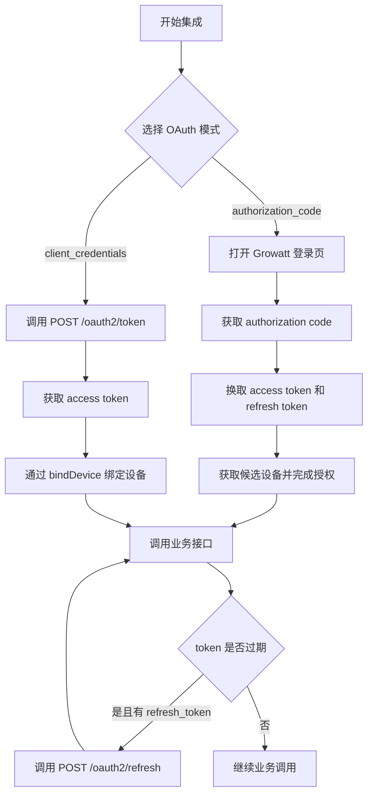
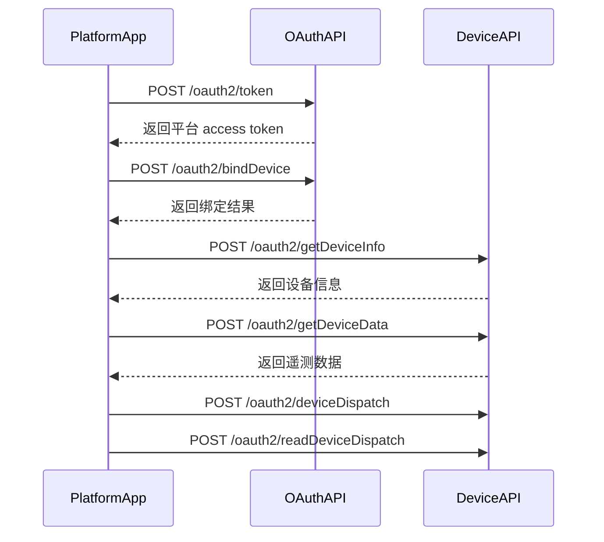

# Growatt Open API - 身份认证说明

版本：V1.0 | 发布日期：2026 年 3 月 4 日

本文档说明 Growatt Open API 当前文档集支持的两种 OAuth2.0 集成模式，以及不同模式下允许访问的接口范围。

## 推荐集成流程



---

## 1 OAuth2.0 授权模式说明

> **前置条件**
> - 第三方平台需向 Growatt 申请 `client_id` 与 `client_secret`。
> - 如需接收设备推送数据，第三方平台需自行提供可用的 webhook URL。

### 1.1 `authorization_code` 模式

适用于 Growatt 终端用户通过个人账号在第三方平台内完成登录与授权的场景。

该模式的典型特点：

- 由终端用户完成 Growatt 账号登录与授权确认。
- 第三方平台通过 `code` 换取用户维度的 `access_token`。
- 响应中包含 `refresh_token`，用于后续刷新 `access_token`。
- 候选设备发现接口 `POST /oauth2/getDeviceList` 仅在该模式下支持。

### 1.2 `client_credentials` 模式

适用于第三方平台直接以平台身份接入 Growatt Open API 的场景。

该模式的典型特点：

- 第三方平台直接使用 `client_id` 与 `client_secret` 调用 `POST /oauth2/token`。
- 令牌响应以实际返回体为准，不应默认假定一定包含 `refresh_token`。
- 设备接入通常从已知 `deviceSn` 的 `bindDevice` 开始；统一使用包含 `deviceSn` 的对象项，如环境或目标设备要求 `pinCode`，则需一并传入。
- `POST /oauth2/getDeviceList` 不属于该模式的标准设备发现能力。

### 1.3 能力边界

| 能力 | `authorization_code` | `client_credentials` |
| :--- | :--- | :--- |
| 获取 access token | 支持 | 支持 |
| 获取 refresh token | 支持 | 以实际响应为准，不默认承诺 |
| 刷新 access token | 支持 | 仅在实际返回 `refresh_token` 时支持 |
| 获取可授权设备列表 `getDeviceList` | 支持 | 不支持 |
| 绑定设备 `bindDevice` | 支持；应使用 `getDeviceList` 返回的 `deviceSn`，并传包含 `deviceSn` 的对象项；如环境要求，再补 `pinCode` | 支持；传包含 `deviceSn` 的对象项；如环境要求，再补 `pinCode` |
| 获取已授权设备列表 `getDeviceListAuthed` | 支持 | 支持 |
| 查询设备信息 / 数据 | 支持 | 支持 |
| 下发 / 回读调度参数 | 支持 | 支持 |

---

## 2 OAuth2.0 授权流程总览

### 2.1 `authorization_code` 模式

1. 第三方平台打开 Growatt 登录页。
2. Growatt 终端用户登录并确认授权。
3. Growatt 将 `authorization_code` 带回第三方平台配置的 `redirect_uri`。
4. 第三方平台调用 `POST /oauth2/token` 换取 token 对。
5. 第三方平台保存用户维度的 `access_token` / `refresh_token`，并建立平台用户与 Growatt 用户的映射关系。
6. 第三方平台调用 `POST /oauth2/getDeviceList`、`POST /oauth2/bindDevice` 等接口完成设备授权与后续业务调用。
7. 当 `access_token` 过期后，使用 `POST /oauth2/refresh` 刷新 token；当 `refresh_token` 也失效后，重新引导用户授权。

授权码模式的 token 示例：

```json
{
    "access_token": "<masked_access_token>",
    "refresh_token": "<masked_refresh_token>",
    "refresh_expires_in": 2592000,
    "token_type": "Bearer",
    "expires_in": 7200
}
```

> 上述 `expires_in` / `refresh_expires_in` 仅为示例值。实际环境中的 token 生命周期应始终以接口实时返回为准。

### 2.2 `client_credentials` 模式

1. 第三方平台调用 `POST /oauth2/token` 获取平台维度 `access_token`。
2. 使用已知 `deviceSn` 调用 `POST /oauth2/bindDevice` 绑定设备；如设备要求 `pinCode`，一并传入。
3. 调用 `POST /oauth2/getDeviceListAuthed`、`POST /oauth2/getDeviceInfo`、`POST /oauth2/getDeviceData` 等业务接口。
4. 如需控制设备，再调用 `POST /oauth2/deviceDispatch` 与 `POST /oauth2/readDeviceDispatch` 形成闭环。
5. token 生命周期以接口实际返回为准；如响应中未返回 `refresh_token`，则到期后重新获取 token。



### 2.3 实施说明

- `client_credentials` 的 token 响应可能只包含 `access_token`、`token_type`、`expires_in`。
- 两种授权模式下的 `expires_in` / `refresh_expires_in` 都可能随部署与时点变化，不应将示例值视为固定常量。
- `POST /oauth2/getDeviceList` 不属于 `client_credentials` 的支持边界，应直接从已知纯 SN 的 `bindDevice` 开始。
- 受保护业务接口统一使用 `Authorization: Bearer <access_token>`。

---

## 相关文档

- [获取 access_token 接口](./02_api_access_token.md)
- [OAuth2-refresh 接口](./03_api_refresh.md)
- [设备授权 API](./04_api_device_auth.md)
