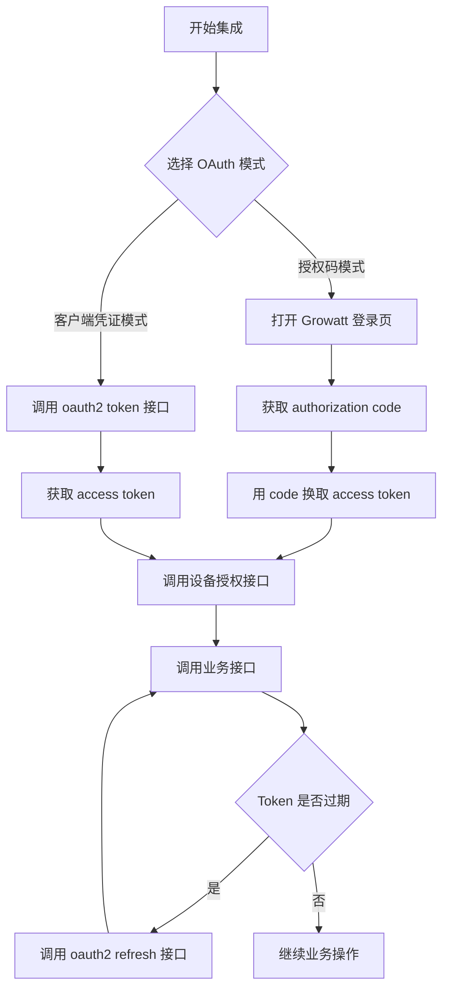
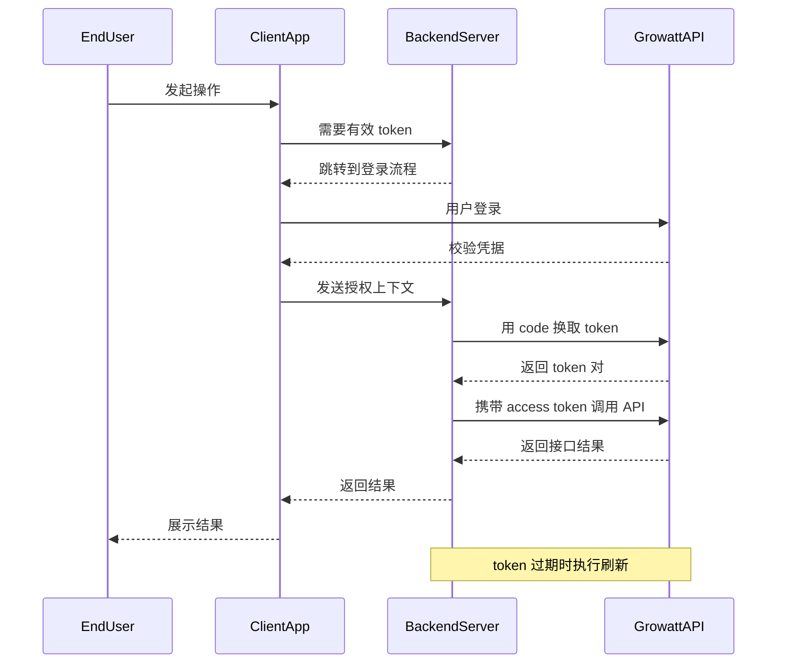

# Growatt Open API - 身份认证说明

本页整理 Growatt Open API 支持的认证模式与能力边界；若后续环境联调出现差异，应视为环境观察，不应替代本页的端点说明。

## 推荐集成流程

## 支持的授权模式

| `grant_type` | 说明 | 能力边界 |
| :--- | :--- | :--- |
| `authorization_code` | 终端用户授权码换取 `access_token` | 支持 `POST /oauth2/getDeviceList` |
| `client_credentials` | 平台通过 `client_id` / `client_secret` 获取 `access_token` | `POST /oauth2/bindDevice` 时客户端模式需要 `pinCode` |

## Token 相关规则

- 两种模式都通过 `POST /oauth2/token` 获取 `access_token`。
- 两个 token 请求示例都携带了 `redirect_uri`。
- `POST /oauth2/refresh` 的前提是持有 `refresh_token`；文档未再按 `grant_type` 对刷新能力做进一步拆分。
- token 返回字段表统一列出了 `access_token`、`refresh_token`、`refresh_expires_in`、`token_type`、`expires_in`。

## 能力矩阵

| 能力 | `authorization_code` | `client_credentials` |
| :--- | :--- | :--- |
| 获取 access token | 支持 | 支持 |
| 刷新 access token | 通过 `POST /oauth2/refresh` 提供 | 文档对两种模式未再额外拆分差异 |
| 获取可授权设备列表 `getDeviceList` | 支持 | 不支持 |
| 授权设备 `bindDevice` | 支持 | 支持，且 `pinCode` 为客户端模式必填 |
| 获取已授权设备列表 `getDeviceListAuthed` | 支持 | 支持 |

## OAuth2.0 授权流程总览

## 实施提示

- 如果只需要端点参数与示例，请继续阅读 [获取 access_token 接口](./02_api_access_token.md) 与 [设备授权 API](./04_api_device_auth.md)。
- 如果需要环境联调经验，请阅读 [常见问题与排查 FAQ](./11_api_troubleshooting.md) 中的“联调观察”部分。
