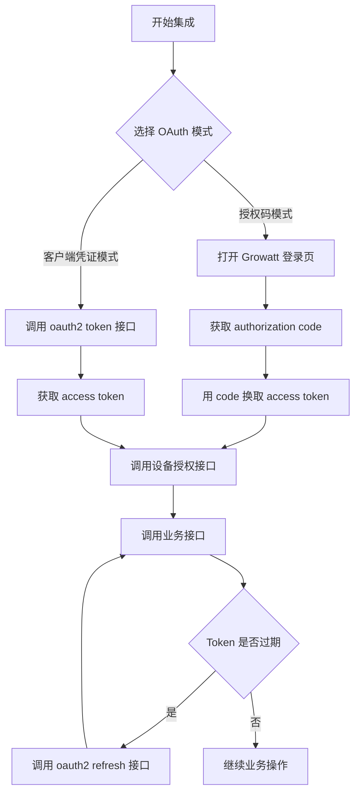
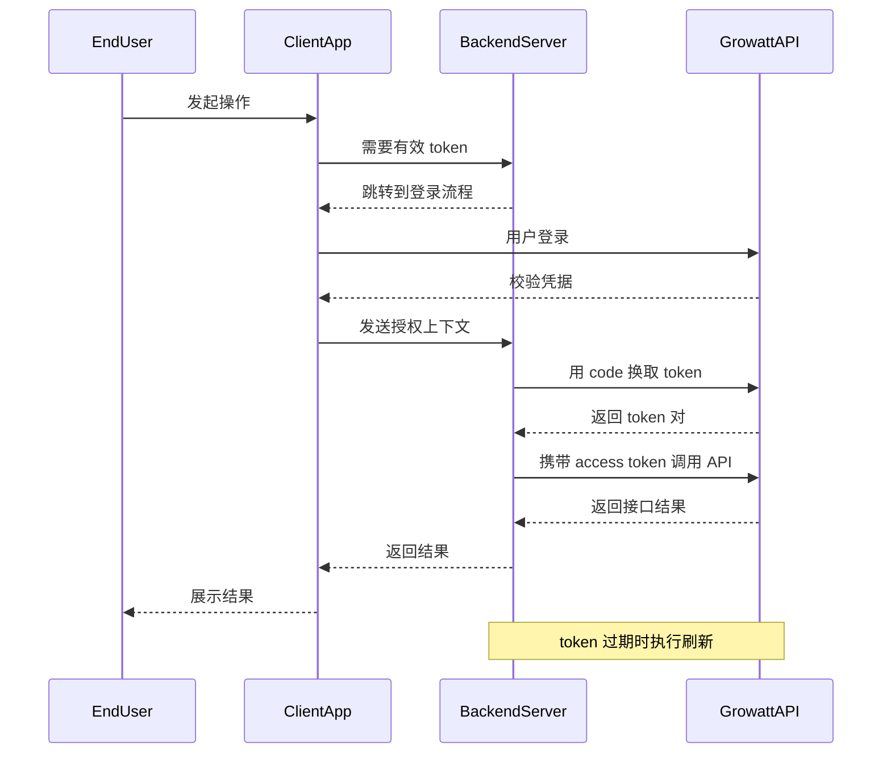

# Growatt Open API - 身份认证说明

版本：V1.0 | 发布日期：2026 年 3 月 4 日

## 推荐集成流程



---

## 1 OAuth2.0 授权模式说明

> **前置条件：**
> - **第三方平台** 需联系 Growatt 申请 `clientId` / `clientSecret`，用于接入 Growatt OAuth2 服务端。
> - **用于接收 Growatt 实时设备推送数据的 URL** 需要由第三方平台自行开发，并将具备相应能力的 URL 提供给 Growatt。

### 授权码模式

适用于 Growatt 用户拥有个人账号的场景。

1. Growatt 提供定制化嵌入式登录页（HTML5）。第三方平台将该登录页集成到自身应用中。
2. 第三方平台实现 OAuth2.0 流程相关的客户端能力。
3. 借助嵌入式 Growatt 登录页，Growatt 终端用户完成 OAuth2.0 授权流程。因此，第三方平台获得 Growatt 终端用户的授权信息，用于后续 API 调用。
4. 一条 OAuth2.0 授权记录对应一个 Growatt 终端用户，以及其明确授权的一个第三方平台。授权信息有有效期，并会在一段时间后过期。
5. 在获取 Growatt 终端用户授权信息后，第三方平台需要实现以下能力：
   - *建立 Growatt 终端用户账号与第三方平台账号之间的映射关系。*
   - *自行维护授权信息有效期，并在过期后完成刷新。*
   - *如果 refresh token 也已过期，则需要引导 Growatt 终端用户重新执行 OAuth2.0 授权。*
6. 第三方平台根据本文档提供的 API 完成业务功能开发，在其应用中，当平台用户操作其对应 Growatt 终端用户名下的已授权设备时，通过调用 Growatt API 实现相关功能。

### 客户端凭证模式

适用于第三方平台直接连接 Growatt 平台的场景。

1. Growatt 按标准 Client Credentials 流程提供获取 token 的接口。
2. 第三方平台实现 OAuth2.0 流程相关的客户端能力。
3. 第三方平台调用授权接口获取 `access_token`，该令牌有有效期，到期后失效。
4. 在获得 Growatt 终端用户相关 OAuth2.0 授权信息后，第三方平台需要实现以下能力：
   - *自行维护授权信息有效期，并在过期后完成刷新。*
   - *如果 refresh token 也已过期，则需要重新执行 OAuth2.0 授权。*
5. 第三方平台根据本文档提供的 API，实现设备授权、设备下发、设备数据查询等能力。

---

## 2 OAuth2.0 授权流程总览

### 授权码模式

- **[首次授权 / token 过期后的重新授权]** 当 Growatt 终端用户需要授权其个人账号时，第三方平台打开 Growatt 登录页，由用户登录其 Growatt 账号。
- 当终端用户登录成功并确认授权后，系统会生成 OAuth2.0 授权码，并在页面从 Growatt 跳转到第三方平台配置的 redirect URL 时一并带回。
- 第三方平台通过 redirect URL 接收到 OAuth2.0 授权码后，将该授权码换取 Growatt 终端用户的授权信息：
  `access_token`（访问凭证）、`refresh_token`（刷新凭证）、`expire_time`（访问凭证有效期，单位秒）、`refresh_expires_in`（刷新凭证有效期，单位秒）。
- 示例：

```json
{
    "access_token": "lyoAlLQaRr9y5pMFsEmh7gyUAaVuBCQo1V7FlwNeA22o7vAH2DJSVqEKkGh4",
    "refresh_token": "wx71QkaF7vceFg9UwjUtum498XeYhXZiCu7iQvAeXQ1AMslXXe2SELJ8cd3a",
    "refresh_expires_in": 2592000,
    "token_type": "Bearer",
    "expires_in": 7200
}
```

- 第三方平台需要自行保存和维护 Growatt 终端用户的 OAuth2.0 授权信息，并建立第三方平台用户与 Growatt 终端用户授权信息之间的映射关系。
- 调用业务 API 时，第三方平台需要将 Growatt 终端用户的授权信息放入请求头。若授权信息正确且处于有效期内，则接口可成功调用。
- Growatt 终端用户授权信息有有效期，第三方平台需自行维护：
  - *`access_token` 过期后，可使用 `refresh_token` 调用 `OAuth2.0--refresh` 接口刷新 `access_token`。*
  - *若 `refresh_token` 也过期且无法刷新 `access_token`，则需要重新执行 OAuth2.0 授权。*
  - *`access_token` 有效期为 2 小时（7200 秒），`refresh_token` 有效期为 30 天。*
- 对于设备相关操作，需要调用 [设备授权接口](../04_api_device_auth.md)，以便 Growatt 终端用户管理其授权的下级设备。
- 只有已授权设备才能通过 API 操作，其数据也才会被推送到第三方平台指定的 URL。

### 客户端凭证模式流程图



### 客户端凭证模式

- 第三方平台通过 `client_id` 和 `client_secret` 调用授权接口获取 `access_token`。服务端返回：
  `access_token`（访问凭证）、`refresh_token`（刷新凭证）、`expire_time`（访问凭证有效期，单位秒）、`refresh_expires_in`（刷新凭证有效期，单位秒）。
- 示例：

```json
{
    "access_token": "lyoAlLQaRr9y5pMFsEmh7gyUAaVuBCQo1V7FlwNeA22o7vAH2DJSVqEKkGh4",
    "refresh_token": "wx71QkaF7vceFg9UwjUtum498XeYhXZiCu7iQvAeXQ1AMslXXe2SELJ8cd3a",
    "refresh_expires_in": 2592000,
    "token_type": "Bearer",
    "expires_in": 7200
}
```

- 调用业务 API 时，第三方平台需要在请求头中携带授权信息。若授权信息正确且在有效期内，则接口可成功调用。
- Growatt 终端用户授权信息有有效期，第三方平台需自行维护：
  - *`access_token` 过期后，可使用 `refresh_token` 调用 `OAuth2.0--refresh` 接口刷新 `access_token`。*
  - *若 `refresh_token` 也过期且无法刷新 `access_token`，则需要重新执行 OAuth2.0 授权。*
  - *`access_token` 有效期为 2 小时（7200 秒），`refresh_token` 有效期为 30 天。*
- 对于设备相关操作，需要调用 [设备授权接口](../04_api_device_auth.md) 管理已授权设备。
- 只有已授权设备才能通过 API 操作，其数据也才会被推送到第三方平台指定的 URL。

---

## 相关文档

- [接口列表 - 获取 access_token](../02_api_access_token.md)
- [接口列表 - OAuth2-refresh](../03_api_refresh.md)
- [设备授权 API](../04_api_device_auth.md)
