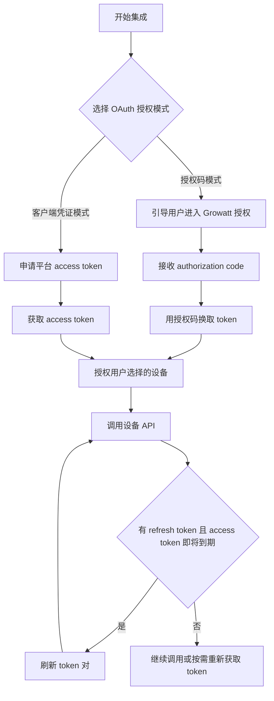
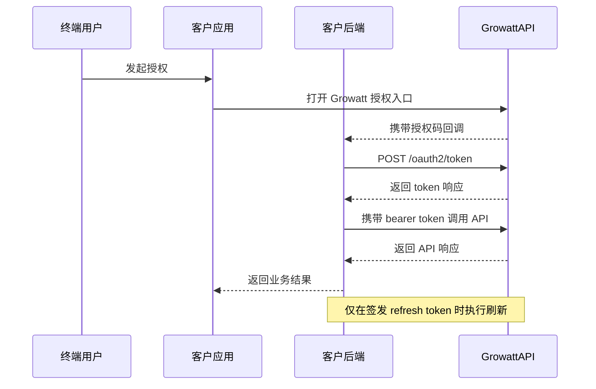

# Growatt Open API - 身份认证说明

Growatt Open API 支持 OAuth 2.0 授权码模式与客户端凭证模式。请选择与客户设备授权方式匹配的授权模式。

## 推荐集成流程

```mermaid
flowchart TD
    A["开始集成"] --> B{"选择 OAuth 授权模式"}
    B -->|"授权码模式"| C["引导用户进入 Growatt 授权"]
    B -->|"客户端凭证模式"| D["申请平台 access token"]
    C --> E["接收 authorization code"]
    E --> F["用授权码换取 token"]
    D --> G["获取 access token"]
    F --> H["授权用户选择的设备"]
    G --> H
    H --> I["调用设备 API"]
    I --> J{"有 refresh token 且 access token 即将到期"}
    J -->|"是"| K["刷新 token 对"]
    K --> I
    J -->|"否"| L["继续调用或按需重新获取 token"]
```

## 支持的授权模式

| `grant_type` | 适用场景 | 能力边界 |
| :--- | :--- | :--- |
| `authorization_code` | Growatt 终端用户授权您的应用访问设备 | 支持 `POST /oauth2/getDeviceList` |
| `client_credentials` | 平台后端使用获发的 `client_id` 与 `client_secret` 认证 | 绑定设备时必须提供 `pinCode` |

## Token 规则

- 两种模式都通过 `POST /oauth2/token` 获取 token。
- 必须传入与客户端登记信息完全一致的 `redirect_uri`。
- 授权码模式还需传入回调收到的 authorization `code`。
- 按实际响应保存 token 字段；仅在响应返回 `refresh_token` 时保存并使用它。
- 只有上一次 token 响应包含 `refresh_token` 时，才调用 `POST /oauth2/refresh`。
- 每次从响应读取 `expires_in` 和 `refresh_expires_in`，不要固化示例值。

## 能力矩阵

| 能力 | `authorization_code` | `client_credentials` |
| :--- | :--- | :--- |
| 获取 access token | 支持 | 支持 |
| 刷新 access token | 签发 `refresh_token` 时支持 | 仅在 token 响应包含 `refresh_token` 时使用 |
| 通过 `getDeviceList` 获取可授权设备 | 支持 | 不支持 |
| 通过 `bindDevice` 绑定设备 | 支持 | 支持，且 `pinCode` 必填 |
| 通过 `getDeviceListAuthed` 获取已授权设备 | 支持 | 支持 |

## OAuth 2.0 时序

```mermaid
sequenceDiagram
    participant User as 终端用户
    participant App as 客户应用
    participant Backend as 客户后端
    participant Growatt as GrowattAPI

    User->>App: 发起授权
    App->>Growatt: 打开 Growatt 授权入口
    Growatt-->>Backend: 携带授权码回调
    Backend->>Growatt: POST /oauth2/token
    Growatt-->>Backend: 返回 token 响应
    Backend->>Growatt: 携带 bearer token 调用 API
    Growatt-->>Backend: 返回 API 响应
    Backend-->>App: 返回业务结果

    Note over Backend,Growatt: 仅在签发 refresh token 时执行刷新
```

## 安全要求

- `client_secret`、access token 与 refresh token 只能保存在可信后端。
- 不得在 URL、客户端代码、截图或应用日志中记录凭证与 token。
- 校验 OAuth `state`，并将其与发起授权的用户会话绑定。
- 正式接入仅允许使用预先登记的 HTTPS 回调地址。

## 后续步骤

- [获取 access_token 接口](./02_api_access_token.md)
- [设备授权 API](./04_api_device_auth.md)
- [常见问题与排查](./11_api_troubleshooting.md)
