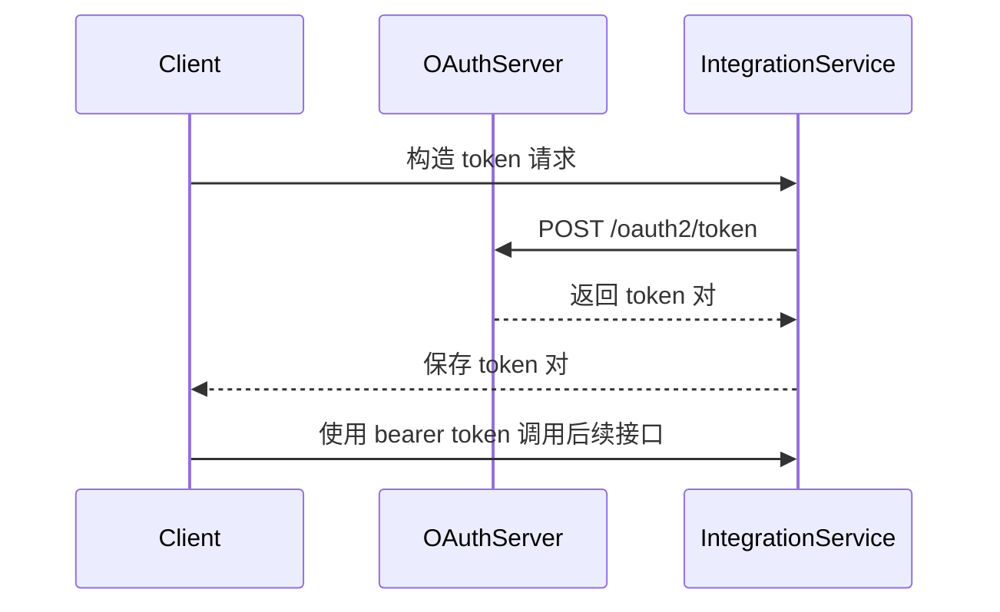

# 获取 access_token 接口

## 简要描述

- 使用 `POST /oauth2/token` 获取访问 Growatt Open API 所需的 `access_token`。
- 公开文档支持 `authorization_code` 与 `client_credentials` 两种 `grant_type`。
- 两种模式共用同一套返回字段表与返回示例，没有再拆分模式差异。

## 请求 URL

- `/oauth2/token`

## 请求方式

- `POST`
- `Content-Type: application/x-www-form-urlencoded`

## Token 交换时序



## 请求参数说明

| 参数名 | 是否必传 | 说明 |
| :--- | :--- | :--- |
| `grant_type` | 是 | `authorization_code` 或 `client_credentials` |
| `code` | 授权码模式必传 | 由授权服务器颁发的临时授权码 |
| `client_id` | 是 | 第三方在平台申请的 `client_id` |
| `client_secret` | 是 | 第三方在平台申请的 `client_secret` |
| `redirect_uri` | 是 | 授权成功后跳转的回调 URL |

## 请求示例

### `authorization_code` 模式

```json
{
    "grant_type": "authorization_code",
    "code": "<masked_authorization_code>",
    "client_id": "<example_client_id>",
    "client_secret": "<masked_client_secret>",
    "redirect_uri": "https://third-party.example.com/oauth/callback"
}
```

### `client_credentials` 模式

```json
{
    "grant_type": "client_credentials",
    "client_id": "<example_client_id>",
    "client_secret": "<masked_client_secret>",
    "redirect_uri": "https://third-party.example.com/oauth/callback"
}
```

## 返回参数说明

| 参数名 | 说明 |
| :--- | :--- |
| `access_token` | 访问令牌，用于访问受保护资源 |
| `refresh_token` | 刷新令牌，用于刷新 `access_token` |
| `refresh_expires_in` | 刷新令牌有效期，单位：秒 |
| `token_type` | 固定为 `Bearer` |
| `expires_in` | 访问令牌有效期，单位：秒 |

## 返回示例

```json
{
    "access_token": "<masked_access_token>",
    "refresh_token": "<masked_refresh_token>",
    "refresh_expires_in": 2585309,
    "token_type": "Bearer",
    "expires_in": 604733
}
```

## 实现说明

- 本接口未按 `grant_type` 将返回字段拆成两套规则。
- 因此本页不把 `client_credentials` 扩写成“最小返回结构”或“默认不返回 `refresh_token`”。
- 2026-03-27 最新全球授权码实测中，`expires_in=604733`、`refresh_expires_in=2585309`。
- 实现时应以实时响应返回的 TTL 为准，不应把示例数值写死到代码里。

## 相关文档

- [身份认证说明](./01_authentication.md)
- [OAuth2-refresh 接口](./03_api_refresh.md)
