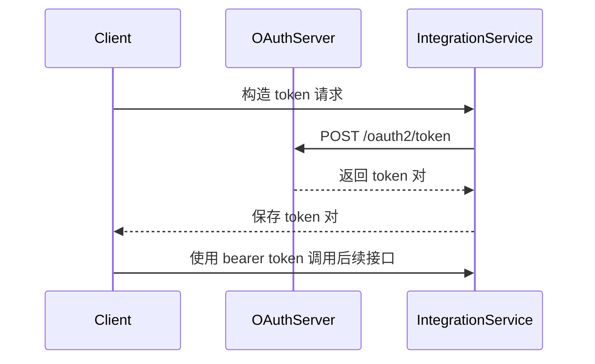

# 获取 access_token 接口

**简要说明**
- OAuth2，token
- 在授权码模式下，Client 后端使用授权码换取 `access_token`。
- 在客户端凭证模式下，Client 后端使用 `client_id` 和 `client_secret` 换取 `access_token`。

**请求 URL**
- `/oauth2/token`

**请求方式**
- `POST`
- 请求头中的 `ContentType` 必须为 `application/x-www-form-urlencoded;`

## Token 交换时序（Mermaid）



---

## 请求参数说明

| 参数名 | 参数说明 | 必填 | 参数值说明 |
| :--- | :--- | :--- | :--- |
| `grant_type` | 授权类型 | 是 | `authorization_code` 或 `client_credentials` |
| `code` | 授权码 | 否 | 授权服务器发放的临时授权码（仅 `authorization_code` 模式需要） |
| `client_id` | 客户端 ID | 是 | 第三方平台申请的 `client_id` |
| `client_secret` | 客户端密钥 | 是 | 第三方平台申请的 `client_secret` |
| `redirect_uri` | 回调地址 | 是 | 授权成功后跳转的回调 URL |

---

## 请求示例

### `authorization_code` 模式

```json
{
    "grant_type": "authorization_code",
    "code": "by1c6oH8lLpllkczRFxuKnMWTEQPO8GmpqkcnDhOcRjLFF4BU5hBvt6whdmd",
    "client_id": "client123",
    "client_secret": "secret123",
    "redirect_uri": "http://localhost:9290/hello"
}
```

### `client_credentials` 模式

```json
{
    "grant_type": "client_credentials",
    "client_id": "client123",
    "client_secret": "secret123",
    "redirect_uri": "http://localhost:9290/hello"
}
```

---

## 返回参数说明

| 参数名 | 参数说明 | 参数值说明 |
| :--- | :--- | :--- |
| `access_token` | 访问令牌 | 用于访问受保护资源的 token |
| `refresh_token` | 刷新令牌 | 用于刷新 `access_token` 的 token |
| `refresh_expires_in` | 刷新令牌有效期 | 单位：秒 |
| `token_type` | Token 类型 | 固定为 `Bearer` |
| `expires_in` | 访问令牌有效期 | 单位：秒 |

---

## 返回示例

```json
// 授权成功，HTTP 状态码 200
{
    "access_token": "avYDaEcmPfaphbE8oDmraKM6FOzq7nYI42iz4KTLClpvWegyREQnyiYUG2VA",
    "refresh_token": "BG6DGTZYpZPq0PHei3N4Rvb2yjM4YMZEFrvrf1A8LxI1xKbH2aEOHG3zfNy9",
    "refresh_expires_in": 2592000,
    "token_type": "Bearer",
    "expires_in": 7200
}
```

---

## 相关文档

- [身份认证说明](../01_authentication.md)
- [OAuth2-refresh 接口](../03_api_refresh.md)
