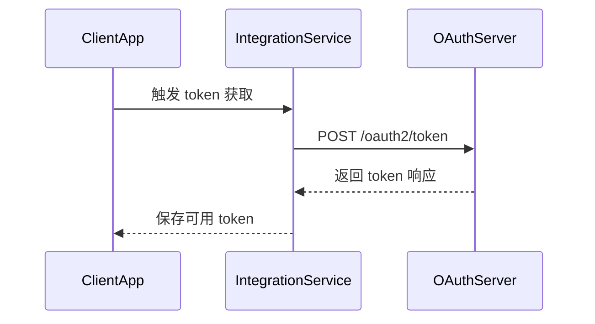

# 获取 access_token 接口

**简要说明**

- 使用 `POST /oauth2/token` 获取访问 Growatt Open API 所需的 `access_token`。
- 支持 `authorization_code` 与 `client_credentials` 两种 `grant_type`。
- 不同模式返回字段存在差异，客户端必须以实际响应体为准。

**请求 URL**

- `/oauth2/token`

**请求方式**

- `POST`
- `Content-Type: application/x-www-form-urlencoded`

## Token 交换时序



---

## 请求参数说明

| 参数名 | 必填 | 适用模式 | 说明 |
| :--- | :--- | :--- | :--- |
| `grant_type` | 是 | 全部 | `authorization_code` 或 `client_credentials` |
| `code` | 授权码模式必填 | `authorization_code` | Growatt 返回的授权码 |
| `client_id` | 是 | 全部 | 第三方平台申请的客户端 ID |
| `client_secret` | 是 | 全部 | 第三方平台申请的客户端密钥 |
| `redirect_uri` | 授权码模式必填 | `authorization_code` | 授权成功后回跳的地址 |

---

## 请求示例

### `authorization_code` 模式

```json
{
    "grant_type": "authorization_code",
    "code": "<masked_authorization_code>",
    "client_id": "<example_client_id>",
    "client_secret": "<masked_client_secret>",
    "redirect_uri": "https://third-party.example.com/oauth/callback"
}
```

> 示例中的 TTL 仅用于说明字段形态。生产或测试环境的实际 `expires_in` / `refresh_expires_in` 以实时返回值为准。

### `client_credentials` 模式

```json
{
    "grant_type": "client_credentials",
    "client_id": "<example_client_id>",
    "client_secret": "<masked_client_secret>"
}
```

---

## 返回参数说明

| 参数名 | 返回时机 | 说明 |
| :--- | :--- | :--- |
| `access_token` | 全部 | 访问受保护资源所需的访问令牌 |
| `token_type` | 全部 | 固定为 `Bearer` |
| `expires_in` | 全部 | 当前 `access_token` 有效期，单位：秒 |
| `refresh_token` | 授权码模式返回 | 用于刷新 `access_token` 的刷新令牌 |
| `refresh_expires_in` | 授权码模式返回 | `refresh_token` 有效期，单位：秒 |

> `client_credentials` 模式下不要默认假定一定返回 `refresh_token`。如某个环境有额外字段，以该环境实际返回为准。

---

## 返回示例

### `authorization_code` 模式

```json
{
    "access_token": "<masked_access_token>",
    "refresh_token": "<masked_refresh_token>",
    "refresh_expires_in": 2592000,
    "token_type": "Bearer",
    "expires_in": 7200
}
```

### `client_credentials` 模式

```json
{
    "access_token": "<masked_access_token>",
    "token_type": "Bearer",
    "expires_in": 604800
}
```

### 返回结构说明

上面的 `client_credentials` 示例展示的是最小返回结构。不同部署可能增加额外字段，但客户端不应默认假定一定返回 `refresh_token`。

---

## 相关文档

- [身份认证说明](./01_authentication.md)
- [OAuth2-refresh 接口](./03_api_refresh.md)
