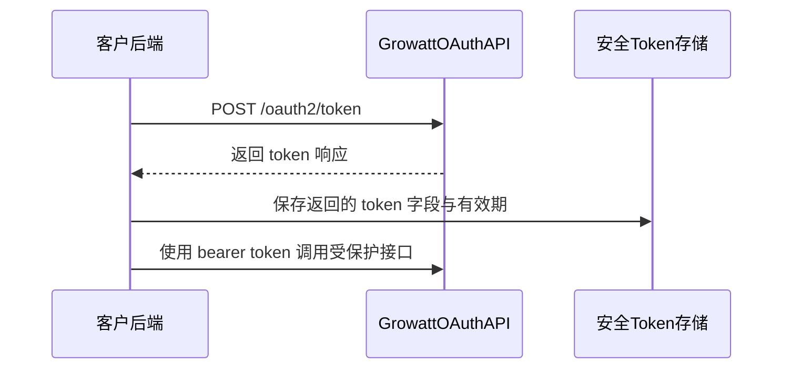

# 获取 access_token 接口

## 简要描述

通过本接口获取调用 Growatt Open API 受保护接口所需的 `access_token`。支持 `authorization_code` 与 `client_credentials` 两种授权模式。

## 请求

- URL：`/oauth2/token`
- 方法：`POST`
- 内容类型：`application/x-www-form-urlencoded`

## Token 交换时序


```mermaid
sequenceDiagram
    participant Backend as 客户后端
    participant OAuth as GrowattOAuthAPI
    participant Store as 安全Token存储

    Backend->>OAuth: POST /oauth2/token
    OAuth-->>Backend: 返回 token 响应
    Backend->>Store: 保存返回的 token 字段与有效期
    Backend->>OAuth: 使用 bearer token 调用受保护接口
```

## 请求参数

| 参数 | 是否必填 | 说明 |
| :--- | :--- | :--- |
| `grant_type` | 是 | `authorization_code` 或 `client_credentials` |
| `code` | 仅授权码模式 | 向已登记回调地址签发的临时授权码 |
| `client_id` | 是 | 向您的平台签发的客户端 ID |
| `client_secret` | 是 | 向您的平台签发的客户端密钥 |
| `redirect_uri` | 是 | 已登记的回调 URL，必须与客户端配置一致 |

## 请求示例

### `authorization_code`

```bash
curl --request POST '<api-base-url>/oauth2/token' \
  --header 'Content-Type: application/x-www-form-urlencoded' \
  --data-urlencode 'grant_type=authorization_code' \
  --data-urlencode 'code=<masked_authorization_code>' \
  --data-urlencode 'client_id=<example_client_id>' \
  --data-urlencode 'client_secret=<masked_client_secret>' \
  --data-urlencode 'redirect_uri=https://third-party.example.com/oauth/callback'
```

### `client_credentials`

```bash
curl --request POST '<api-base-url>/oauth2/token' \
  --header 'Content-Type: application/x-www-form-urlencoded' \
  --data-urlencode 'grant_type=client_credentials' \
  --data-urlencode 'client_id=<example_client_id>' \
  --data-urlencode 'client_secret=<masked_client_secret>' \
  --data-urlencode 'redirect_uri=https://third-party.example.com/oauth/callback'
```

## 返回参数

| 参数 | 出现条件 | 说明 |
| :--- | :--- | :--- |
| `access_token` | 成功时固定返回 | 调用受保护资源的 Bearer token |
| `refresh_token` | 所选模式签发时 | 用于刷新 `access_token` 的 token |
| `refresh_expires_in` | 与 `refresh_token` 同时返回 | refresh token 有效期，单位秒 |
| `token_type` | 成功时固定返回 | token 类型，值为 `Bearer` |
| `expires_in` | 成功时固定返回 | access token 有效期，单位秒 |

## 授权码模式返回示例

```json
{
    "access_token": "<masked_access_token>",
    "refresh_token": "<masked_refresh_token>",
    "refresh_expires_in": 2592000,
    "token_type": "Bearer",
    "expires_in": 7200
}
```

## 客户端凭证模式返回示例

```json
{
    "access_token": "<masked_access_token>",
    "token_type": "Bearer",
    "expires_in": 7200
}
```

## 客户端实现建议

- 按以上示例将每个参数作为表单字段发送，不要发送 JSON 请求体。
- 返回字段随授权模式变化，仅保存实际返回的字段。
- 每次从响应读取 token 有效期；以上数值只用于说明字段格式。
- 不得记录 `client_secret`、授权码、access token 或 refresh token。

## 相关文档

- [身份认证说明](./01_authentication.md)
- [OAuth2-refresh 接口](./03_api_refresh.md)
