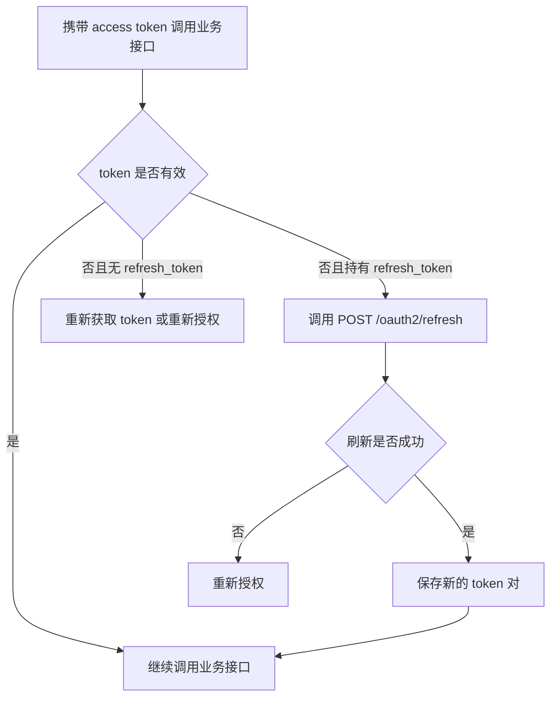

# OAuth2-refresh 接口

**简要说明**

- 使用 `refresh_token` 刷新 `access_token`。
- 本接口适用于实际 token 响应中已经包含 `refresh_token` 的场景。
- 如果某个 `client_credentials` 环境未返回 `refresh_token`，则不应调用本接口，而应重新获取 token。

**请求 URL**

- `/oauth2/refresh`

**请求方式**

- `POST`
- `Content-Type: application/x-www-form-urlencoded`

## 刷新生命周期



---

## 请求参数说明

| 参数名 | 必填 | 说明 |
| :--- | :--- | :--- |
| `grant_type` | 是 | 固定为 `refresh_token` |
| `refresh_token` | 是 | 旧的刷新令牌 |
| `client_id` | 是 | 第三方平台申请的客户端 ID |
| `client_secret` | 是 | 第三方平台申请的客户端密钥 |

---

## 请求示例

```json
{
    "grant_type": "refresh_token",
    "refresh_token": "bkabsDaCYRWVPHMPqYij1O2rEWPNc34dH97FmQsDzuaopf1RxdDofp63HL4x",
    "client_id": "client123",
    "client_secret": "secret123"
}
```

---

## 返回参数说明

| 参数名 | 说明 |
| :--- | :--- |
| `access_token` | 新签发的访问令牌 |
| `refresh_token` | 新签发的刷新令牌 |
| `refresh_expires_in` | 新刷新令牌有效期，单位：秒 |
| `token_type` | 固定为 `Bearer` |
| `expires_in` | 新访问令牌有效期，单位：秒 |

---

## 返回示例

```json
{
    "access_token": "avYDaEcmPfaphbE8oDmraKM6FOzq7nYI42iz4KTLClpvWegyREQnyiYUG2VA",
    "refresh_token": "BG6DGTZYpZPq0PHei3N4Rvb2yjM4YMZEFrvrf1A8LxI1xKbH2aEOHG3zfNy9",
    "refresh_expires_in": 2592000,
    "token_type": "Bearer",
    "expires_in": 7200
}
```

---

## 相关文档

- [获取 access_token 接口](./02_api_access_token.md)
- [设备授权 API](./04_api_device_auth.md)
