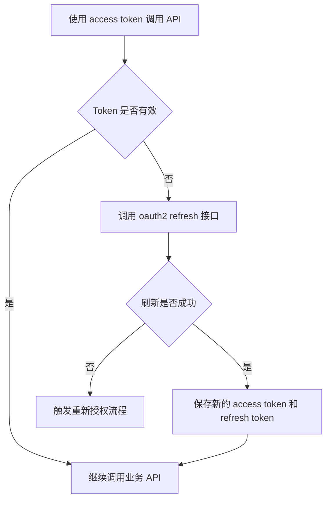
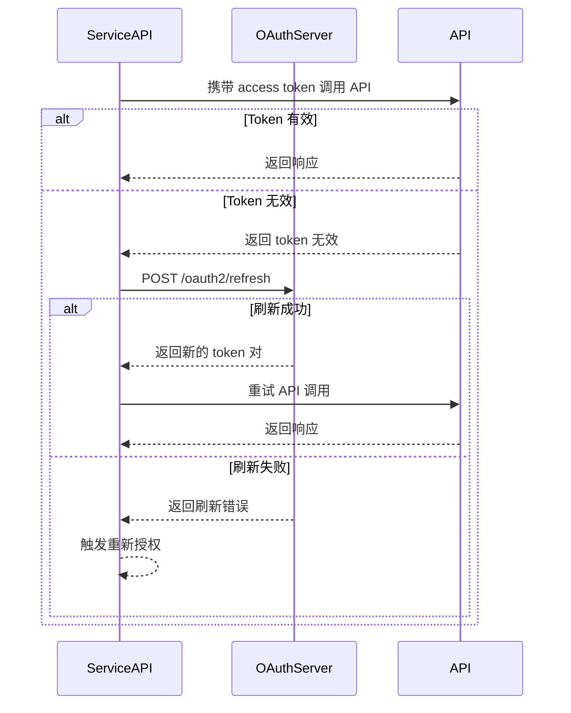

# OAuth2-refresh 接口

**简要说明**
- OAuth2，refresh
- Client 后端使用 `refresh_token` 刷新 `access_token`。

**请求 URL**
- `/oauth2/refresh`

**请求方式**
- `POST`
- 请求头中的 `ContentType` 必须为 `application/x-www-form-urlencoded;`

## 刷新生命周期（概念）



## 刷新生命周期（时序）



---

## 请求参数说明

| 参数名 | 参数说明 | 必填 | 参数值说明 |
| :--- | :--- | :--- | :--- |
| `grant_type` | 授权类型 | 是 | 必须为 `refresh_token` |
| `refresh_token` | 刷新令牌 | 是 | 旧的 `refresh_token`，用于换取新的访问令牌 |
| `client_id` | 客户端 ID | 是 | 第三方平台申请的 `client_id` |
| `client_secret` | 客户端密钥 | 是 | 第三方平台申请的 `client_secret` |

---

## 请求示例

```json
{
    "grant_type": "refresh_token",
    "refresh_token": "bkabsDaCYRWVPHMPqYij1O2rEWPNc34dH97FmQsDzuaopf1RxdDofp63HL4x",
    "client_id": "client123",
    "client_secret": "secret123"
}
```

---

## 返回参数说明

| 参数名 | 参数说明 | 参数值说明 |
| :--- | :--- | :--- |
| `access_token` | 访问令牌 | 新签发的访问令牌 |
| `refresh_token` | 刷新令牌 | 新签发的刷新令牌（旧令牌失效） |
| `refresh_expires_in` | 新 refresh token 有效期 | 单位：秒 |
| `token_type` | Token 类型 | 固定为 `Bearer` |
| `expires_in` | 新 access token 有效期 | 单位：秒 |

---

## 返回示例

```json
// 授权成功，HTTP 状态码 200
{
    "access_token": "avYDaEcmPfaphbE8oDmraKM6FOzq7nYI42iz4KTLClpvWegyREQnyiYUG2VA",
    "refresh_token": "BG6DGTZYpZPq0PHei3N4Rvb2yjM4YMZEFrvrf1A8LxI1xKbH2aEOHG3zfNy9",
    "refresh_expires_in": 2592000,
    "token_type": "Bearer",
    "expires_in": 7200
}
```

---

## 相关文档

- [获取 access_token 接口](../02_api_access_token.md)
- [设备授权 API](../04_api_device_auth.md)
