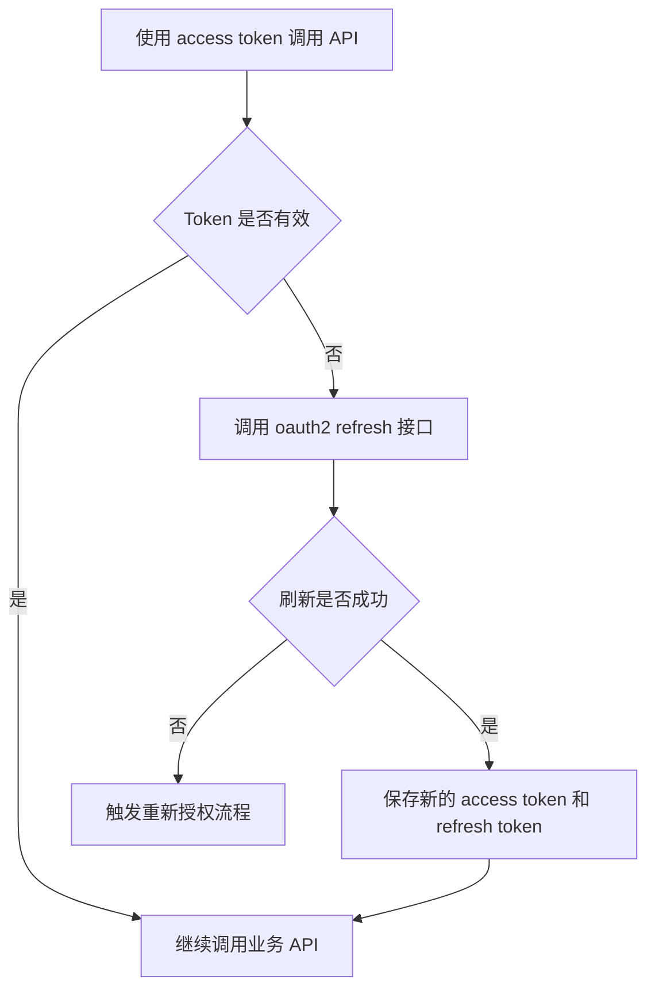
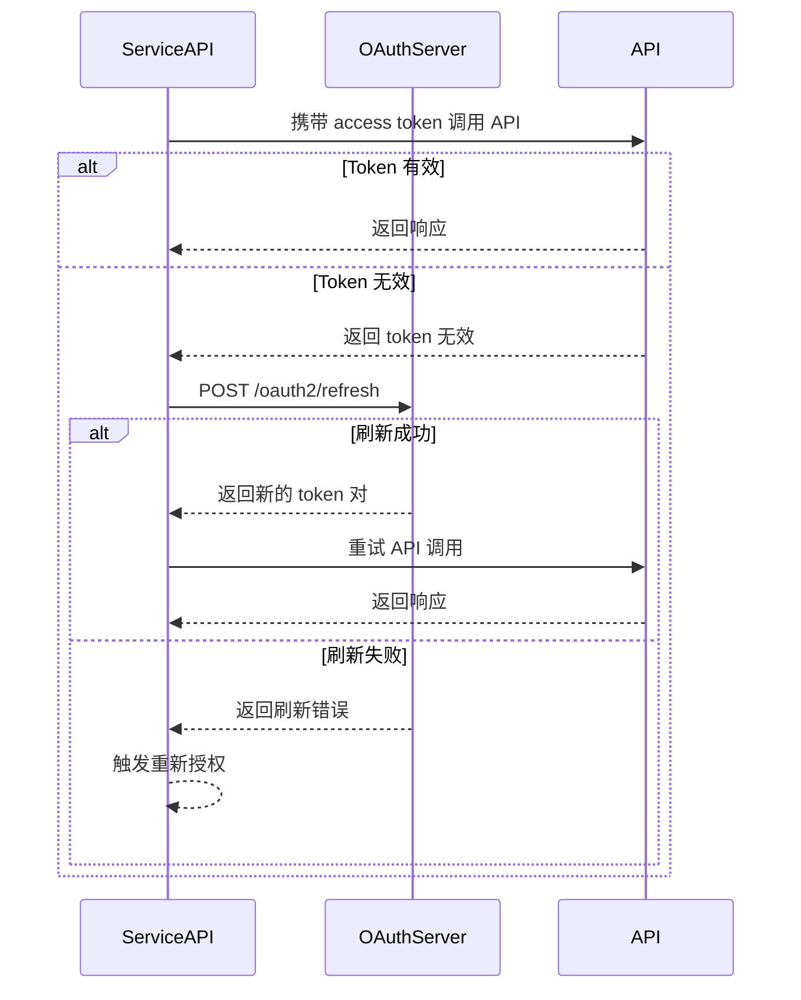

# OAuth2-refresh 接口

## 简要描述

- 使用 `refresh_token` 刷新 `access_token`。
- 文档将本接口描述为通用刷新接口，没有再按 `grant_type` 细分模式边界。

## 请求 URL

- `/oauth2/refresh`

## 请求方式

- `POST`
- `Content-Type: application/x-www-form-urlencoded`

## 刷新生命周期（概念）



## 刷新生命周期（时序）



## 请求参数说明

| 参数名 | 是否必传 | 说明 |
| :--- | :--- | :--- |
| `grant_type` | 是 | 必须为 `refresh_token` |
| `refresh_token` | 是 | 旧的 `refresh_token`，用于换取新的访问令牌 |
| `client_id` | 是 | 第三方在平台申请的 `client_id` |
| `client_secret` | 是 | 第三方在平台申请的 `client_secret` |

## 请求示例

```json
{
    "grant_type": "refresh_token",
    "refresh_token": "<masked_refresh_token>",
    "client_id": "<example_client_id>",
    "client_secret": "<masked_client_secret>"
}
```

## 返回参数说明

| 参数名 | 说明 |
| :--- | :--- |
| `access_token` | 新颁发的访问令牌 |
| `refresh_token` | 新颁发的刷新令牌，旧令牌将失效 |
| `refresh_expires_in` | 新刷新令牌有效期，单位：秒 |
| `token_type` | 固定为 `Bearer` |
| `expires_in` | 新访问令牌有效期，单位：秒 |

## 返回示例

```json
{
    "access_token": "<masked_access_token>",
    "refresh_token": "<masked_refresh_token>",
    "refresh_expires_in": 2592000,
    "token_type": "Bearer",
    "expires_in": 7200
}
```

## 实现说明

- 原始来源示例在 JSON 注释排版上有格式问题；本页仅将其改写成等价、可读的 JSON 示例，不改变字段约束。

## 相关文档

- [获取 access_token 接口](./02_api_access_token.md)
- [设备授权 API](./04_api_device_auth.md)
