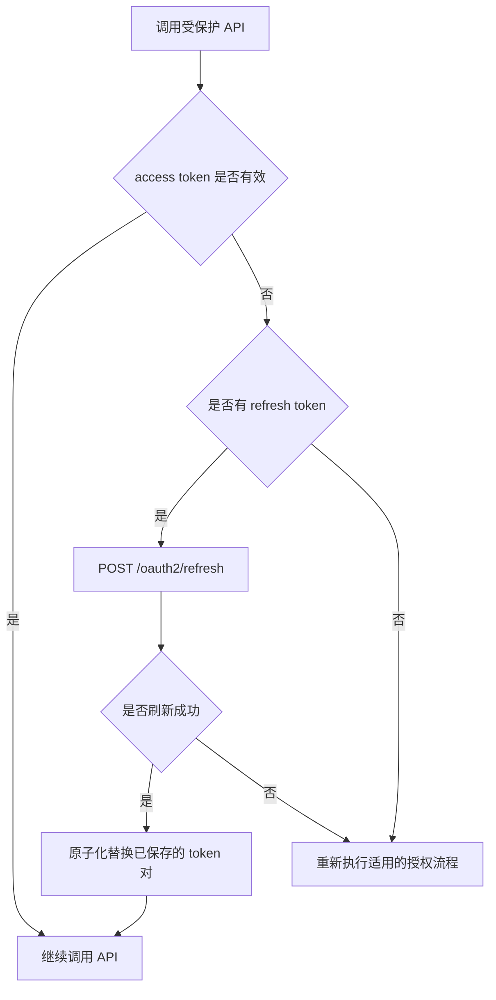
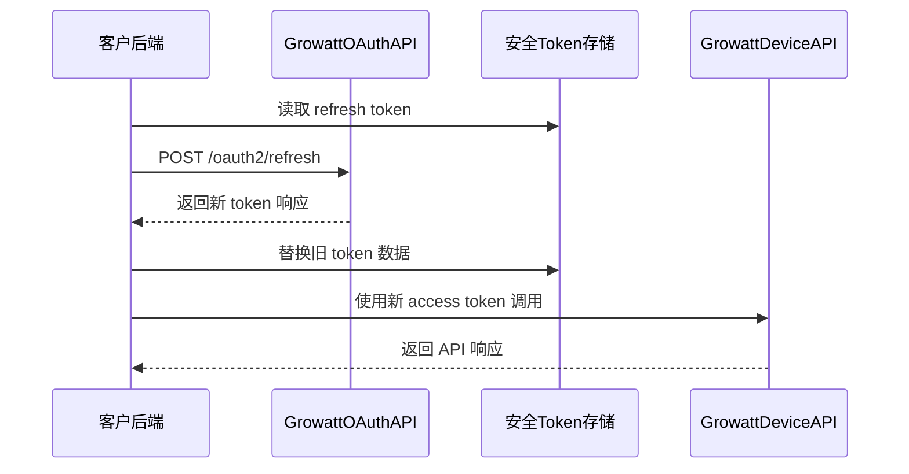

# OAuth2-refresh 接口

## 简要描述

使用之前签发的 `refresh_token` 更新 access token。如果 token 响应未包含 refresh token，请勿调用本接口。

## 请求

- URL：`/oauth2/refresh`
- 方法：`POST`
- 内容类型：`application/x-www-form-urlencoded`

## 刷新生命周期


```mermaid
flowchart TD
    A["调用受保护 API"] --> B{"access token 是否有效"}
    B -->|"是"| C["继续调用 API"]
    B -->|"否"| D{"是否有 refresh token"}
    D -->|"是"| E["POST /oauth2/refresh"]
    E --> F{"是否刷新成功"}
    F -->|"是"| G["原子化替换已保存的 token 对"]
    G --> C
    F -->|"否"| H["重新执行适用的授权流程"]
    D -->|"否"| H
```


```mermaid
sequenceDiagram
    participant Backend as 客户后端
    participant OAuth as GrowattOAuthAPI
    participant Store as 安全Token存储
    participant API as GrowattDeviceAPI

    Backend->>Store: 读取 refresh token
    Backend->>OAuth: POST /oauth2/refresh
    OAuth-->>Backend: 返回新 token 响应
    Backend->>Store: 替换旧 token 数据
    Backend->>API: 使用新 access token 调用
    API-->>Backend: 返回 API 响应
```

## 请求参数

| 参数 | 是否必填 | 说明 |
| :--- | :--- | :--- |
| `grant_type` | 是 | 必须为 `refresh_token` |
| `refresh_token` | 是 | 上一次 token 响应返回的 refresh token |
| `client_id` | 是 | 向您的平台签发的客户端 ID |
| `client_secret` | 是 | 向您的平台签发的客户端密钥 |

## 请求示例

```bash
curl --request POST '<api-base-url>/oauth2/refresh' \
  --header 'Content-Type: application/x-www-form-urlencoded' \
  --data-urlencode 'grant_type=refresh_token' \
  --data-urlencode 'refresh_token=<masked_refresh_token>' \
  --data-urlencode 'client_id=<example_client_id>' \
  --data-urlencode 'client_secret=<masked_client_secret>'
```

## 返回参数

| 参数 | 说明 |
| :--- | :--- |
| `access_token` | 新签发的 access token |
| `refresh_token` | 新签发的 refresh token；应替换旧 refresh token |
| `refresh_expires_in` | 新 refresh token 有效期，单位秒 |
| `token_type` | token 类型，值为 `Bearer` |
| `expires_in` | 新 access token 有效期，单位秒 |

## 返回示例

```json
{
    "access_token": "<masked_access_token>",
    "refresh_token": "<masked_refresh_token>",
    "refresh_expires_in": 2592000,
    "token_type": "Bearer",
    "expires_in": 7200
}
```

## 客户端实现建议

- 接口实际要求表单编码；示例仅为便于阅读而使用 JSON 展示。
- 刷新成功后立即替换已保存的两个 token，不要继续使用旧 token。
- 原子化更新 token 存储，避免并发请求用旧数据覆盖新 token 对。
- 从响应读取两个有效期，并为时钟偏差和在途请求预留提前刷新时间。
- 刷新失败时，重新执行与当前授权模式对应的授权流程。

## 相关文档

- [获取 access_token 接口](./02_api_access_token.md)
- [设备授权 API](./04_api_device_auth.md)
