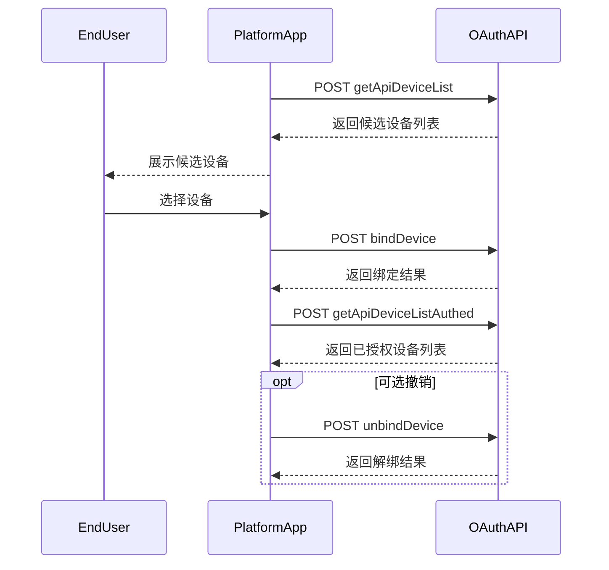

# 设备授权 API

本节说明用于管理设备授权的相关接口。

## 授权时序



---

## 3.3.1 获取可授权设备列表

**简要说明**
- 获取 Growatt 终端用户个人账号下可授权的设备列表。
- 前置条件：终端用户已注册 Growatt 账号，并在该账号下完成设备配置 / 添加。

**请求 URL**
- `/oauth2/getApiDeviceList`

**请求方式**
- `POST`
- 请求头必须携带有效 `access_token`，并放置在 `Authorization` 参数中，且需包含前缀 `Bearer `。

### 请求示例

```json
// 无参数
```

### 返回参数说明

| 参数名 | 类型 | 说明 |
| :--- | :--- | :--- |
| `code` | int | 接口返回状态码。0 表示成功，其他表示失败 |
| `data` | string | 返回数据 |
| `message` | string | 返回描述 |

### 返回示例

```json
// 成功，code=0
{
    "code": 0,
    "data": [
        {
            "deviceSn": "LPL1234567",
            "deviceTypeName": "min",
            "model": "MIN 7600TL-XH-US",
            "nominalPower": 7600,
            "datalogSn": "VC51030122122538",
            "datalogDeviceTypeName": "Shine4G-WiFi-FD",
            "dtc": 5300,
            "communicationVersion": "ZACA-0013",
            "existBattery": false,
            "batterySn": null,
            "batteryModel": null,
            "batteryCapacity": null,
            "batteryNominalPower": null,
            "authFlag": false,
            "batteryList": []
        }
    ],
    "message": "SUCCESSFUL_OPERATION"
}

// 失败，code 非 0
{
    "code": 2,
    "message": "TOKEN_IS_INVALID"
}
```

### 数据参数说明

| 参数名 | 参数说明 | 参数值说明 |
| :--- | :--- | :--- |
| `deviceSn` | 设备序列号 | 设备唯一标识 |
| `deviceTypeName` | 设备大类名称 | 设备主类型分类 |
| `model` | 设备型号 | 设备具体型号 |
| `nominalPower` | 逆变器额定功率 | 单位：W |
| `datalogSn` | 采集器序列号 | 数据采集设备序列号 |
| `datalogDeviceTypeName` | 采集器类型名称 | 数据采集设备类型 |
| `dtc` | dtc 数值编码 | 设备类型数值编码 |
| `communicationVersion` | 通讯固件版本 | 设备通讯协议版本 |
| `existBattery` | 是否带电池 | 布尔值，表示设备是否配置电池 |
| `batterySn` | 电池序列号 | 电池唯一标识 |
| `batteryModel` | 电池型号 | 电池具体型号 |
| `batteryCapacity` | 电池额定容量 | 单位：Wh |
| `batteryNominalPower` | 电池额定功率 | 单位：W |
| `authFlag` | 是否已授权 | 布尔值，表示设备是否已授权 |
| `batteryList` | 电池列表 | 包含电池信息的数组 |

---

## 3.3.2 授权设备

**简要说明**
- 将 Growatt 终端用户名下设备授权给第三方平台。

### 测试环境兼容性说明

> 已在 `https://api-test.growatt.com:9290` 实测通过。
>
> - 页面、截图或设备列表中展示的设备标识可能带有 `SPH:xxxx` 或 `SPM:xxxx` 前缀。
> - 实际调用 `bindDevice` 时，`deviceSnList[].deviceSn` 需要传纯 SN，不带设备类型前缀。
> - 该测试环境下已验证通过的请求格式：
>   - `Authorization: Bearer <access_token>`
>   - `Content-Type: application/json`
>   - JSON body 中传纯 SN
> - 示例：
>
> ```json
> {
>     "deviceSnList": [
>         {
>             "deviceSn": "RAW_DEVICE_SN",
>             "pinCode": "TEST_PIN_CODE"
>         }
>     ]
> }
> ```
>
> - 正确：`RAW_DEVICE_SN`
> - 错误：`SPH:RAW_DEVICE_SN`

**请求 URL**
- `/oauth2/bindDevice`

**请求方式**
- `POST`
- 请求 `ContentType` 必须为 `application/json;`
- 请求头必须携带有效 `access_token`，并放置在 `Authorization` 参数中，且需包含前缀 `Bearer `。

### 请求参数说明

| 参数名 | 类型 | 必填 | 说明 |
| :--- | :--- | :--- | :--- |
| `deviceSnList` | List | 是 | 非空，设备序列号及 PINCode（PINCode 仅在客户端凭证模式下需要） |
| `deviceSnList[].deviceSn` | string | 是 | 设备序列号 |
| `deviceSnList[].pinCode` | string | 客户端凭证模式下必填 | 设备 PINCode |

### 请求示例

```json
// 授权码模式
{
    "deviceSnList": [
        {
            "deviceSn": "LXG1234567"
        },
        {
            "deviceSn": "EGM1234567"
        }
    ]
}

// 客户端凭证模式
{
    "deviceSnList": [
        {
            "deviceSn": "RAW_DEVICE_SN",
            "pinCode": "TEST_PIN_CODE"
        },
        {
            "deviceSn": "RAW_DEVICE_SN_2",
            "pinCode": "TEST_PIN_CODE"
        }
    ]
}
```

### 返回参数说明

| 参数名 | 类型 | 说明 |
| :--- | :--- | :--- |
| `code` | int | 接口返回状态码。0 表示成功，其他表示失败 |
| `data` | string | 返回数据 |
| `message` | string | 返回描述 |

### 返回示例

```json
// 成功，code=0
{
    "code": 0,
    "data": null,
    "message": "SUCCESSFUL_OPERATION"
}

// 失败，code 非 0
{
    "code": 2,
    "message": "TOKEN_IS_INVALID"
}

{
    "code": 12,
    "data": [
        "WAQ1234567"
    ],
    "message": "DEVICE_SN_DOES_NOT_HAVE_PERMISSION"
}
```

### 常见失败与正确动作

| 返回 / 错误 | 含义 | 正确动作 |
| :--- | :--- | :--- |
| `TOKEN_IS_INVALID` | token 已过期或无效 | 刷新 token 或重新获取 token 后重试 |
| `DEVICE_SN_DOES_NOT_HAVE_PERMISSION` | 当前第三方尚未获得该设备权限 | 先调用 `bindDevice`，再重试下游接口 |
| `parameter error` | 常见于传了带前缀 SN 或请求体格式不匹配 | 改为 JSON body，并传不带 `SPH:` / `SPM:` 的纯 SN |

---

## 3.3.3 获取已授权设备列表

**简要说明**
- 获取 Growatt 终端用户个人账号下已经授权的设备列表。
- 前置条件：终端用户已注册 Growatt 账号，并在该账号下完成设备配置 / 添加。

**请求 URL**
- `/oauth2/getApiDeviceListAuthed`

**请求方式**
- `POST`
- 请求头必须携带有效 `access_token`，并放置在 `Authorization` 参数中，且需包含前缀 `Bearer `。

### 请求示例

```json
// 无参数
```

### 返回参数说明

| 参数名 | 类型 | 说明 |
| :--- | :--- | :--- |
| `code` | int | 接口返回状态码。0 表示成功，其他表示失败 |
| `data` | string | 返回数据 |
| `message` | string | 返回描述 |

### 返回示例

```json
// 成功，code=0
{
    "code": 0,
    "data": [
        {
            "deviceSn": "LPL1234567",
            "deviceTypeName": "min",
            "model": "MIN 7600TL-XH-US",
            "nominalPower": 7600,
            "datalogSn": "VC51030122122538",
            "datalogDeviceTypeName": "Shine4G-WiFi-FD",
            "dtc": 5300,
            "communicationVersion": "ZACA-0013",
            "existBattery": false,
            "authFlag": true,
            "batteryList": []
        }
    ],
    "message": "SUCCESSFUL_OPERATION"
}

// 失败，code 非 0
{
    "code": 2,
    "message": "TOKEN_IS_INVALID"
}
```

*（注：`data` 返回参数说明表与 3.3.1 小节相同。）*

---

## 3.3.4 取消设备授权

**简要说明**
- 撤销 Growatt 终端用户授予第三方平台的下级设备授权。

**请求 URL**
- `/oauth2/unbindDevice`

**请求方式**
- `POST`
- 请求 `ContentType`：`application/json;`
- 请求头必须携带有效 `access_token`，并放置在 `Authorization` 参数中，且需包含前缀 `Bearer `。

### 请求参数说明

| 参数名 | 类型 | 必填 | 说明 |
| :--- | :--- | :--- | :--- |
| `deviceSnList` | List | 是 | Array(string)，非空，Growatt 终端用户名下下级设备的序列号集合 |

### 请求示例

```json
{
    "deviceSnList": [
        "LXG1234567",
        "LPL1234567"
    ]
}
```

### 返回参数说明

| 参数名 | 类型 | 说明 |
| :--- | :--- | :--- |
| `code` | int | 接口返回状态码。0 表示成功，其他表示失败 |
| `data` | string | 返回数据 |
| `message` | string | 返回描述 |

### 返回示例

```json
// 成功，code=0
{
    "code": 0,
    "data": null,
    "message": "SUCCESSFUL_OPERATION"
}

// 失败，code 非 0
{
    "code": 2,
    "message": "TOKEN_IS_INVALID"
}
```

---

## 相关文档

- [获取 access_token 接口](../02_api_access_token.md)
- [设备下发 API](../05_api_device_dispatch.md)
