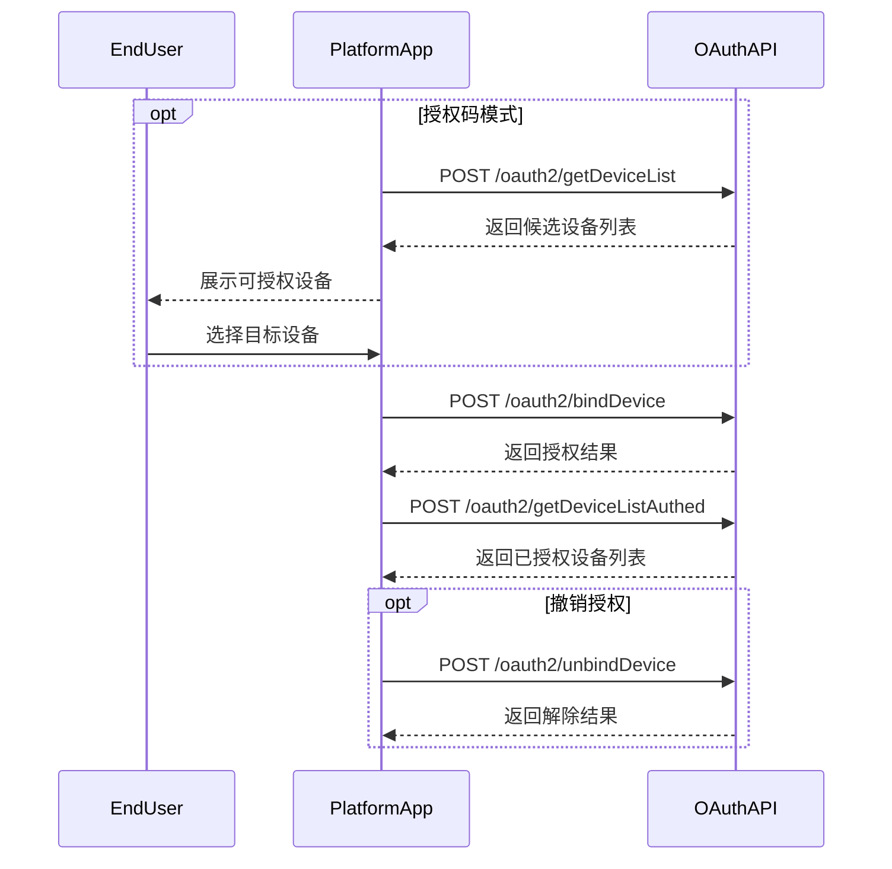

# 设备授权 API

本节说明设备发现、授权、授权结果查询与解除授权的规范接口。

## 授权流程



---

## 1 获取可授权设备列表

**简要说明**

- 获取 Growatt 终端用户账号下可授权给第三方平台的设备列表。
- 仅 `authorization_code` 模式支持。
- 前提：终端用户已在 Growatt 账号下完成设备配网与绑定。

**请求 URL**

- `/oauth2/getDeviceList`

**请求方式**

- `POST`
- Header 需携带有效 `access_token`
- `Authorization: Bearer <token>`

### 请求示例

```json
// 无参数
```

### 返回示例

```json
{
    "code": 0,
    "data": [
        {
            "deviceSn": "HCQSKJMSJ1",
            "deviceTypeName": "sph-s",
            "model": "SPH 10000TL-HU (AU)",
            "nominalPower": 15000,
            "datalogSn": "ZGQ0E8511G",
            "dtc": 21300,
            "communicationVersion": "ZCEA-0005",
            "authFlag": true
        }
    ],
    "message": "SUCCESSFUL_OPERATION"
}
```

### 设备对象字段

| 参数名 | 类型 | 说明 |
| :--- | :--- | :--- |
| `deviceSn` | string | 设备序列号 |
| `deviceTypeName` | string | 设备类型名称 |
| `model` | string | 设备型号 |
| `nominalPower` | number | 额定功率，单位：W |
| `datalogSn` | string | 采集器序列号。调用 `bindDevice` 与其他设备级接口时应使用 `deviceSn`，不要使用 `datalogSn` |
| `dtc` | number | 设备类型编码 |
| `communicationVersion` | string | 通讯版本 |
| `authFlag` | boolean | 是否已授权 |

### 模式边界说明

使用 `client_credentials` token 调用本接口超出了支持边界，可能返回如下授权模式错误：

```json
{
    "code": 103,
    "data": null,
    "message": "WRONG_GRANT_TYPE"
}
```

正确动作：

- `getDeviceList` 仅用于 `authorization_code` 模式。
- `client_credentials` 模式应直接从已知纯 SN 的 `bindDevice` 开始。

---

## 2 授权设备

**简要说明**

- 将设备授权给第三方平台。
- 请求体统一使用 JSON。
- `deviceSnList` 支持纯 SN 字符串和对象两种形态；实际可用写法可能受环境或目标设备影响。

**请求 URL**

- `/oauth2/bindDevice`

**请求方式**

- `POST`
- `Content-Type: application/json`
- `Authorization: Bearer <token>`

### 请求参数说明

| 参数名 | 必填 | 类型 | 说明 |
| :--- | :--- | :--- | :--- |
| `deviceSnList` | 是 | array | 非空数组 |
| `deviceSnList[]` | 是 | string 或 object | 使用 `getDeviceList` 返回的 `deviceSn`。部分环境接受纯 SN 字符串，部分环境要求对象项 |
| `deviceSnList[].deviceSn` | 使用对象项时必填 | string | 设备级接口实际使用的设备序列号 |
| `deviceSnList[].pinCode` | 环境或设备接入流程要求 PIN 时必填 | string | 设备 PINCode |

### 请求示例

#### 授权码模式常见纯 SN 示例

```json
{
    "deviceSnList": [
        "LXG1234567",
        "LPL1234567"
    ]
}
```

#### 授权码模式 / 兼容对象项示例

```json
{
    "deviceSnList": [
        {
            "deviceSn": "LXG1234567"
        }
    ]
}
```

#### 客户端凭证模式常见示例

```json
{
    "deviceSnList": [
        {
            "deviceSn": "LXG1234567",
            "pinCode": "123"
        },
        {
            "deviceSn": "EGM1234567",
            "pinCode": "456"
        }
    ]
}
```

### 返回示例

```json
{
    "code": 0,
    "data": null,
    "message": "SUCCESSFUL_OPERATION"
}
```

失败示例：

```json
{
    "code": 12,
    "data": [
        "WAQ1234567"
    ],
    "message": "DEVICE_SN_DOES_NOT_HAVE_PERMISSION"
}
```

### 请求格式说明

- 统一使用 `Authorization: Bearer <access_token>` 与 `Content-Type: application/json`。
- `deviceSn` 必须传纯 SN，不带 `SPH:` / `SPM:` 等展示前缀。
- 绑定目标应使用 `getDeviceList` 返回的 `deviceSn`，不要误用 `datalogSn`。
- 如果 `authorization_code` 下用字符串数组返回 `SYSTEM_ERROR`，可改为传包含 `deviceSn` 的对象数组重试。
- `client_credentials` 场景通常使用对象数组；如环境要求，还需传 `pinCode`。

参考示例：

```json
{
    "deviceSnList": [
        {
            "deviceSn": "RAW_DEVICE_SN"
        },
        {
            "deviceSn": "RAW_DEVICE_SN",
            "pinCode": "TEST_PIN_CODE"
        }
    ]
}
```

---

## 3 获取已授权的设备列表

**简要说明**

- 获取当前 token 已经授权的设备列表。

**请求 URL**

- `/oauth2/getDeviceListAuthed`

**请求方式**

- `POST`
- `Authorization: Bearer <token>`

### 请求示例

```json
// 无参数
```

### 返回示例

```json
{
    "code": 0,
    "data": [
        {
            "deviceSn": "HCQSKJMSJ1",
            "deviceTypeName": "sph-s",
            "model": "SPH 10000TL-HU (AU)",
            "nominalPower": 15000,
            "datalogSn": "ZGQ0E8511G",
            "dtc": 21300,
            "communicationVersion": "ZCEA-0005",
            "authFlag": true
        }
    ],
    "message": "SUCCESSFUL_OPERATION"
}
```

---

## 4 解除授权设备

**简要说明**

- 解除第三方平台对设备的授权关系。

**请求 URL**

- `/oauth2/unbindDevice`

**请求方式**

- `POST`
- `Content-Type: application/json`
- `Authorization: Bearer <token>`

### 请求参数说明

| 参数名 | 必填 | 类型 | 说明 |
| :--- | :--- | :--- | :--- |
| `deviceSnList` | 是 | array(string) | 待解除授权的设备 SN 列表 |

### 请求示例

```json
{
    "deviceSnList": [
        "LXG1234567",
        "LPL1234567"
    ]
}
```

### 返回示例

```json
{
    "code": 0,
    "data": null,
    "message": "SUCCESSFUL_OPERATION"
}
```

---

## 相关文档

- [身份认证说明](./01_authentication.md)
- [设备下发 API](./05_api_device_dispatch.md)
