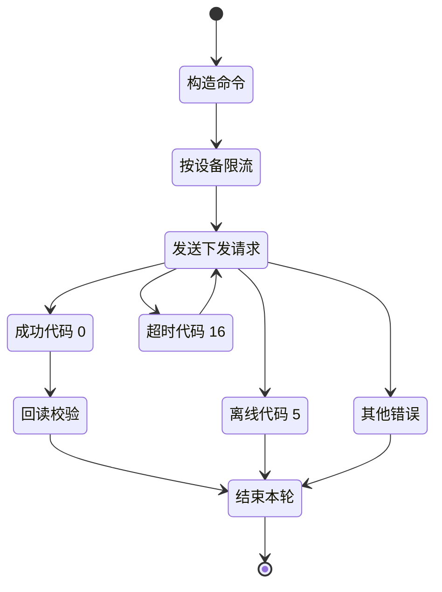

# 设备下发 API

**简要说明**
- 根据设备 SN 设置设备相关参数。该接口仅返回当前 secret token 有权限访问的设备设置结果。无权限设备不会被设置，也不会返回结果。
- 当前接口频率限制：单设备每 5 秒最多调用 1 次。

**请求 URL**
- `/oauth2/deviceDispatch`

**请求方式**
- `POST`
- 请求 `ContentType` 必须为 `application/x-www-form-urlencoded;`
- 请求头必须携带有效 `access_token`，并放置在 `Authorization` 参数中，且需包含前缀 `Bearer `。

## 下发控制状态（Mermaid）



---

## HTTP Body 参数

| 参数名 | 必填 | 类型 | 说明 |
| :--- | :--- | :--- | :--- |
| `deviceSn` | 是 | string | 设备 SN，例如：xxxxxxx |
| `setType` | 是 | string | 设置项枚举，例如：`enable_control` |
| `value` | 是 | string | 设置参数值，详见“全局参数说明” |
| `requestId` | 是 | String | 本次请求唯一标识（32 位字符串：当前时间 + 随机数，例如 `yyyyMMddHHmmssSSSxxxxxxxxxxxxxxx`） |

---

## 接口返回参数

| 参数名 | 类型 | 说明 |
| :--- | :--- | :--- |
| `code` | int | 接口返回状态码。0 表示成功，其他表示失败 |
| `data` | string | 返回数据 |
| `message` | string | 返回描述 |

---

## 请求示例

```json
{
    "deviceSn": "FDCJQ00003",
    "setType": "enable_control",
    "value": "0",
    "requestId": "32-character string (yyyyMMddHHmmssSSSxxxxxxxxxxxxxxx)"
}
```

---

## 返回示例

### 设置成功

```json
{
    "code": 0,
    "data": null,
    "message": "PARAMETER_SETTING_SUCCESSFUL"
}
```

### 设备离线

```json
{
    "code": 5,
    "data": null,
    "message": "DEVICE_OFFLINE"
}
```

### 参数设置响应超时

```json
{
    "code": 16,
    "data": null,
    "message": "PARAMETER_SETTING_RESPONSE_TIMEOUT"
}
```

### 设备类型错误

```json
{
    "code": 7,
    "data": null,
    "message": "WRONG_DEVICE_TYPE"
}
```

---

## 相关文档

- [设备授权 API](../04_api_device_auth.md)
- [读取设备下发参数 API](../06_api_read_dispatch.md)
- [全局参数](../10_global_params.md)
