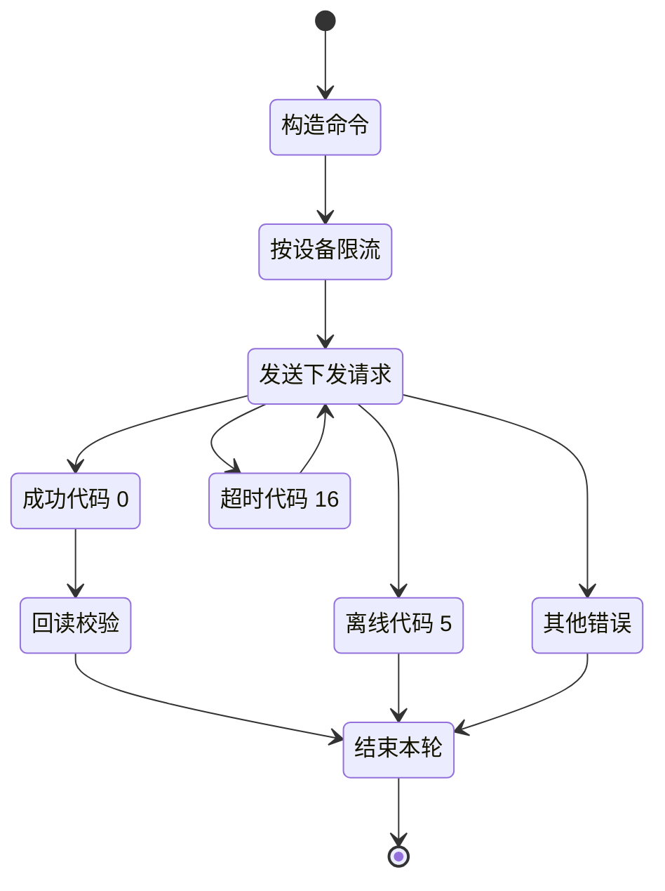

# 设备调度 API

## 简要描述

- 根据设备 SN 设置设备相关参数。
- 接口仅返回当前 token 有权限访问的设备设置结果；无权限设备会返回 `DEVICE_SN_DOES_NOT_HAVE_PERMISSION`。
- 下发请求频率上限：`1 request / 5 sec / device`（`12 RPM`）。

## 请求 URL

- `/oauth2/deviceDispatch`

## 请求方式

- `POST`
- `Content-Type: application/json`
- `Authorization: Bearer <token>`

## 调度控制状态



## 请求参数说明

| 参数名 | 厂商表格类型 | 是否必选 | 说明 |
| :--- | :--- | :--- | :--- |
| `deviceSn` | string | 是 | 设备 SN |
| `setType` | string | 是 | 设置的参数枚举，例如 `enable_control` |
| `value` | string | 是 | 设置的参数值，见 [全局参数说明](./10_global_params.md) |
| `requestId` | string | 是 | 本次调用唯一标识，32 位字符串 |

## 请求示例

```json
{
    "deviceSn": "DEVICE_SN_1",
    "value": {
        "duration": 10,
        "percentage": 20,
        "type": "dischargeCommand"
    },
    "setType": "duration_and_power_charge_discharge",
    "requestId": "20260402093000123abcdef123456789"
}
```

## 返回参数说明

| 参数名 | 厂商表格类型 | 说明 |
| :--- | :--- | :--- |
| `code` | int | 接口返回状态码，`0` 成功，其余失败 |
| `data` | string | 厂商表格原文写作 `string`，成功与失败示例均为 `null` |
| `message` | string | 返回说明 |

## 返回格式示例

```json
{
    "code": 0,
    "data": null,
    "message": "RESPONSE_MESSAGE"
}
```

## 返回场景

| 场景 | `code` | `data` | `message` |
| :--- | :--- | :--- | :--- |
| 设置成功 | `0` | `null` | `PARAMETER_SETTING_SUCCESSFUL` |
| 设备离线 | `5` | `null` | `DEVICE_OFFLINE` |
| 参数设置响应超时 | `16` | `null` | `PARAMETER_SETTING_RESPONSE_TIMEOUT` |
| 设备未回复 | `15` | `null` | `PARAMETER_SETTING_DEVICE_NOT_RESPONDING` |
| 设备回复失败 | `6` | `null` | `PARAMETER_SETTING_FAILED` |
| 请求次数限制 | `105` | `null` | `TOO_MANY_REQUEST` |

## 实现说明

- 参数表将 `value` 标为 `string`，但同页示例在 `duration_and_power_charge_discharge` 场景下传入的是 JSON 对象。
- 本页保留表格原文，同时保留对象型示例，不把这种差异扩写成新的接口规则。

## 相关文档

- [读取设备调度参数 API](./06_api_read_dispatch.md)
- [全局参数说明](./10_global_params.md)
