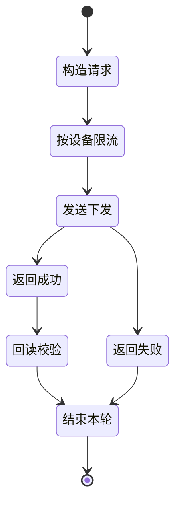

# 设备下发 API

**简要说明**

- 根据设备 SN 设置设备相关参数。
- 本接口仅返回当前 token 有权限访问的设备设置结果。
- 当前频率限制：单设备每 5 秒最多调用 1 次。
- 主规范请求体使用 JSON，并要求 `requestId` 必填。

**请求 URL**

- `/oauth2/deviceDispatch`

**请求方式**

- `POST`
- `Content-Type: application/json`
- `Authorization: Bearer <token>`

## 下发闭环



---

## 请求参数

| 参数名 | 是否必填 | 类型 | 说明 |
| :--- | :--- | :--- | :--- |
| `deviceSn` | 是 | string | 设备 SN |
| `setType` | 是 | string | 设置项枚举，例如 `enable_control` |
| `value` | 是 | string 或 object | 设置值，具体取决于 `setType` |
| `requestId` | 是 | string | 本次请求唯一标识，建议使用 32 位字符串 |

---

## 请求示例

### 简单值下发

```json
{
    "deviceSn": "FDCJQ00003",
    "setType": "enable_control",
    "value": "0",
    "requestId": "20260323153000123abcdef123456789"
}
```

### 对象值下发

```json
{
    "deviceSn": "TEST123456",
    "value": {
        "duration": 10,
        "percentage": 20,
        "type": "dischargeCommand"
    },
    "setType": "duration_and_power_charge_discharge",
    "requestId": "20260323153000123abcdef123456789"
}
```

---

## 返回参数

| 参数名 | 类型 | 说明 |
| :--- | :--- | :--- |
| `code` | int | 业务状态码，0 为成功 |
| `data` | null | 成功时通常为空 |
| `message` | string | 结果描述 |

---

## 返回示例

### 设置成功

```json
{
    "code": 0,
    "data": null,
    "message": "PARAMETER_SETTING_SUCCESSFUL"
}
```

### 设备离线

```json
{
    "code": 5,
    "data": null,
    "message": "DEVICE_OFFLINE"
}
```

### 设备未回复

```json
{
    "code": 15,
    "data": null,
    "message": "PARAMETER_SETTING_DEVICE_NOT_RESPONDING"
}
```

### 参数设置响应超时

```json
{
    "code": 16,
    "data": null,
    "message": "PARAMETER_SETTING_RESPONSE_TIMEOUT"
}
```

### 参数设置失败

```json
{
    "code": 6,
    "data": null,
    "message": "PARAMETER_SETTING_FAILED"
}
```

### 请求格式说明

- 使用 `Authorization: Bearer <access_token>`。
- 使用 `Content-Type: application/json`。
- JSON body 中携带 `deviceSn`、`setType`、`value`、`requestId`。

## 相关文档

- [设备授权 API](./04_api_device_auth.md)
- [读取设备下发参数 API](./06_api_read_dispatch.md)
- [全局参数](./10_global_params.md)
