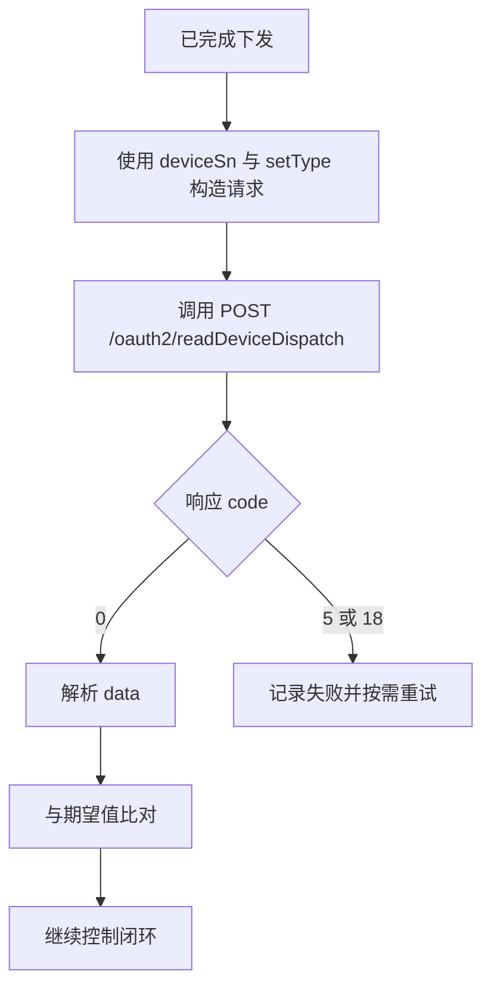

# 读取设备下发参数 API

**简要说明**

- 根据设备 SN 与 `setType` 读取当前调度参数。
- 本接口仅返回当前 token 有权限访问的设备结果。
- 当前频率限制：单设备每 5 秒最多调用 1 次。
- 主规范不要求 `requestId` 为必填参数。

**请求 URL**

- `/oauth2/readDeviceDispatch`

**请求方式**

- `POST`
- `Content-Type: application/json`
- `Authorization: Bearer <token>`

## 回读校验流程



---

## 请求参数

| 参数名 | 是否必填 | 类型 | 说明 |
| :--- | :--- | :--- | :--- |
| `deviceSn` | 是 | string | 设备 SN |
| `setType` | 是 | string | 读取项枚举，例如 `time_slot_charge_discharge` |

---

## 请求示例

```json
{
    "deviceSn": "FDCJQ00003",
    "setType": "time_slot_charge_discharge"
}
```

---

## 返回参数

| 参数名 | 类型 | 说明 |
| :--- | :--- | :--- |
| `code` | int | 业务状态码，0 为成功 |
| `data` | object 或 array | 返回结构随 `setType` 变化 |
| `message` | string | 结果描述 |

---

## 返回示例

### `time_slot_charge_discharge` 返回数组

```json
{
    "code": 0,
    "data": [
        {
            "startTime": "16:00",
            "endTime": "18:00",
            "percentage": 80
        },
        {
            "startTime": "19:00",
            "endTime": "21:00",
            "percentage": -80
        }
    ],
    "message": "success"
}
```

### 设备离线

```json
{
    "code": 5,
    "data": null,
    "message": "DEVICE_OFFLINE"
}
```

### 读取失败

```json
{
    "code": 18,
    "data": null,
    "message": "READ_PARAMETER_FAILED"
}
```

### 返回结构说明

不同 `setType` 合法返回不同结构。例如 `duration_and_power_charge_discharge` 可能返回如下对象：

```json
{
    "code": 0,
    "data": {
        "duration": 5,
        "percentage": 20,
        "acChargingEnabled": 1,
        "remotePowerControlEnable": 1
    },
    "message": "SUCCESSFUL_OPERATION"
}
```

这类差异属于 `setType` 相关的返回结构变化，不改变“`data` 可为 object 或 array”的主规范描述。

---

## 相关文档

- [设备下发 API](./05_api_device_dispatch.md)
- [设备信息查询 API](./07_api_device_info.md)
- [全局参数](./10_global_params.md)
