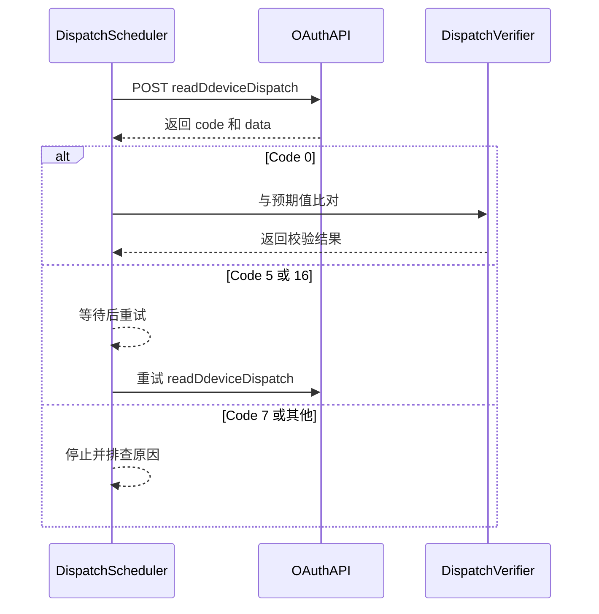

# 读取设备下发参数 API

**简要说明**
- 根据设备 SN 读取设备相关参数。该接口仅返回当前 secret token 有权限访问的设备读取结果。无权限设备不会被读取，也不会返回结果。
- 当前接口频率限制：单设备每 5 秒最多调用 1 次。

**请求 URL**
- `/oauth2/readDdeviceDispatch`

**请求方式**
- `POST`
- 请求 `ContentType` 必须为 `application/x-www-form-urlencoded;`

## 回读校验流程（概念）


## 回读校验流程（时序）



---

## HTTP Header 参数

| 参数名 | 必填 | 类型 | 说明 |
| :--- | :--- | :--- | :--- |
| `Authorization` | 是 | String | Bearer your_access_token |

---

## HTTP Body 参数

| 参数名 | 必填 | 类型 | 说明 |
| :--- | :--- | :--- | :--- |
| `deviceSn` | 是 | string | 设备 SN，例如：xxxxxxx |
| `setType` | 是 | string | 设置项枚举，例如：`time_slot_charge_discharge` |
| `requestId` | 是 | string | 本次请求唯一标识 |

---

## 接口返回参数

| 参数名 | 类型 | 说明 |
| :--- | :--- | :--- |
| `code` | int | 接口返回状态码。0 表示成功，其他表示失败 |
| `data` | string | 返回数据 |
| `message` | string | 返回描述 |

---

## 请求示例

```json
{
    "deviceSn": "FDCJQ00003",
    "setType": "time_slot_charge_discharge"
}
```

---

## 返回示例

### 读取成功

```json
{
    "code": 0,
    "data": [
        {
            "startTime": 60,
            "endTime": 420,
            "percentage": 80
        },
        {
            "startTime": 840,
            "endTime": 1020,
            "percentage": 80
        },
        {
            "startTime": 0,
            "endTime": 0,
            "percentage": 0
        }
    ],
    "message": "success"
}
```

### 设备离线

```json
{
    "code": 5,
    "data": null,
    "message": "DEVICE_OFFLINE"
}
```

### 参数设置响应超时

```json
{
    "code": 16,
    "data": null,
    "message": "PARAMETER_SETTING_RESPONSE_TIMEOUT"
}
```

### 设备类型错误

```json
{
    "code": 7,
    "data": null,
    "message": "WRONG_DEVICE_TYPE"
}
```

---

## 相关文档

- [设备下发 API](../05_api_device_dispatch.md)
- [设备信息查询 API](../07_api_device_info.md)
- [全局参数](../10_global_params.md)
