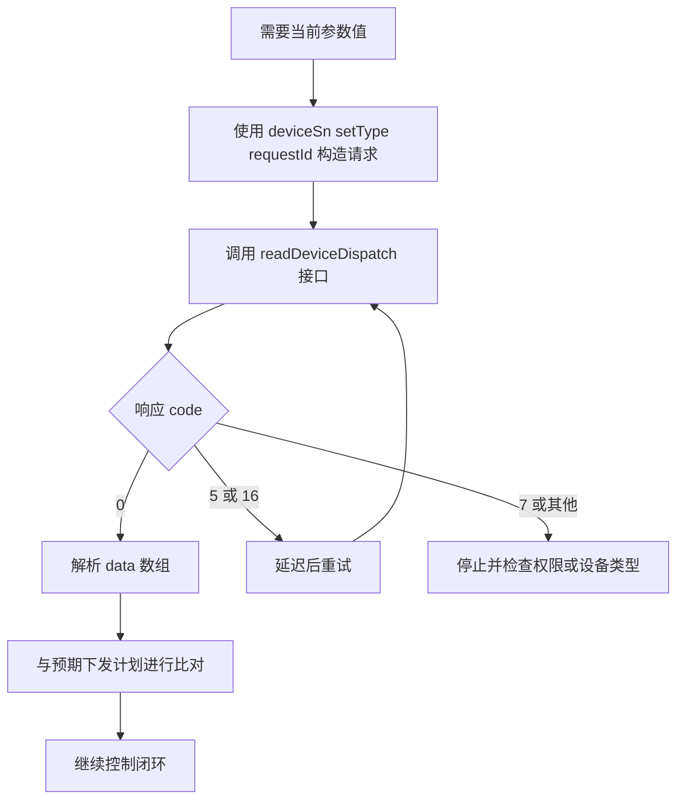

# 读取设备调度参数 API

## 简要描述

- 根据设备 SN 读取设备相关参数。
- 接口仅返回当前 token 有权限访问的设备读取结果；无权限设备会返回 `DEVICE_SN_DOES_NOT_HAVE_PERMISSION`。
- 下发回读请求频率上限：`1 request / 5 sec / device`（`12 RPM`）。

## 请求 URL

- `/oauth2/readDeviceDispatch`

## 请求方式

- `POST`
- `Content-Type: application/json`
- `Authorization: Bearer <token>`

## 回读校验流程（概念）



## 回读校验流程（时序）


## 请求参数说明

| 参数名 | 厂商表格类型 | 是否必选 | 说明 |
| :--- | :--- | :--- | :--- |
| `deviceSn` | string | 是 | 设备 SN |
| `setType` | string | 是 | 设置的参数枚举，例如 `time_slot_charge_discharge` |
| `requestId` | string | 是 | 表示本次调用唯一标识 |

## 请求示例

```json
{
    "deviceSn": "DEVICE_SN_1",
    "setType": "time_slot_charge_discharge",
    "requestId": "20260402093000123abcdef123456789"
}
```

## 返回参数说明

| 参数名 | 厂商表格类型 | 说明 |
| :--- | :--- | :--- |
| `code` | int | 接口返回状态码，`0` 成功，其余失败 |
| `data` | string | 厂商表格原文写作 `string`，成功示例为数组 |
| `message` | string | 返回说明 |

## 返回示例

### 读取成功

```json
{
    "code": 0,
    "data": [
        {
            "startTime": "16:00",
            "endTime": "18:00",
            "percentage": 80
        },
        {
            "startTime": "19:00",
            "endTime": "21:00",
            "percentage": -80
        }
    ],
    "message": "success"
}
```

### 设备离线

```json
{
    "code": 5,
    "data": null,
    "message": "DEVICE_OFFLINE"
}
```

### 读取参数失败

```json
{
    "code": 18,
    "data": null,
    "message": "READ_DEVICE_PARAM_FAIL"
}
```

### 请求次数限制

```json
{
    "code": 105,
    "data": null,
    "message": "TOO_MANY_REQUEST"
}
```

## 实现说明

- 参数表将 `requestId` 标为必填，但原始请求示例漏写了它。本页按参数表保留为必填字段。
- 返回表将 `data` 标为 `string`，但成功示例给出的是数组结构。

## 联调观察

- 现有 `test/` 目录中的部分联调记录显示，某些 `setType` 在特定环境下可能返回对象结构。
- 这类现象仅作为实现观察保留，不提升为端点规范。

## 相关文档

- [设备调度 API](./05_api_device_dispatch.md)
- [全局参数说明](./10_global_params.md)
