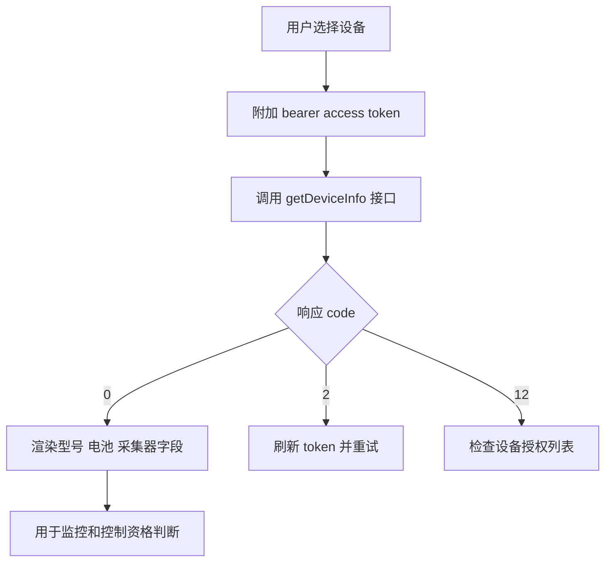
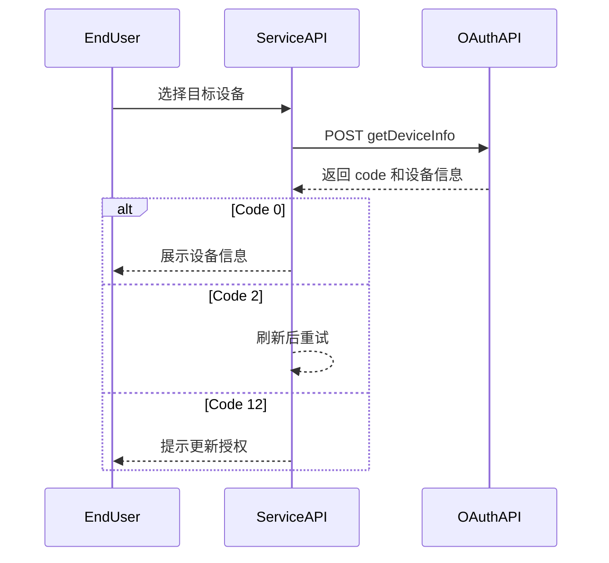

# 设备信息查询 API

**简要说明**
- 获取 Growatt 平台上已授权设备的信息。

**请求 URL**
- `/oauth2/getDeviceInfo`

**请求方式**
- `POST`
- `Content-Type`: `application/x-www-form-urlencoded`
- 请求头必须携带有效 `access_token`
- 放置在请求头的 `Authorization` 参数中，且必须包含前缀 `Bearer `

## 设备信息查询流程（概念）



## 设备信息查询流程（时序）



---

## HTTP Header 参数

| 参数名 | 必填 | 类型 | 说明 |
| :--- | :--- | :--- | :--- |
| `Authorization` | 是 | String | Secret token |

---

## HTTP Body 参数

| 参数名 | 必填 | 类型 | 说明 |
| :--- | :--- | :--- | :--- |
| `deviceSn` | 是 | String | 设备唯一序列号（SN） |

---

## 接口返回参数

| 参数名 | 类型 | 说明 |
| :--- | :--- | :--- |
| `code` | int | 接口返回状态码。0 表示成功，其他表示失败 |
| `data` | obj | 返回数据 |
| `message` | string | 返回描述 |

---

## 返回示例

```json
// 成功，code=0
{
    "code": 0,
    "data": {
        "deviceSn": "USQ1234567",
        "deviceTypeName": "min",
        "model": "BDCBAT",
        "nominalPower": 6000,
        "datalogSn": "XGD6E3P029",
        "datalogDeviceTypeName": "ShineWiFi-X",
        "dtc": 5100,
        "communicationVersion": "ZABA-0021",
        "existBattery": true,
        "batterySn": "0YXH123456789632",
        "batteryModel": "ARK 5.12-25.6XH-A1",
        "batteryCapacity": 5000,
        "batteryNominalPower": 2500,
        "authFlag": true,
        "batteryList": [
            {
                "batterySn": "0YXH123456789632",
                "batteryModel": "ARK 5.12-25.6XH-A1",
                "batteryCapacity": 5000,
                "batteryNominalPower": 2500
            }
        ]
    },
    "message": "SUCCESSFUL_OPERATION"
}

// 失败，code 非 0
{
    "code": 2,
    "message": "TOKEN_IS_INVALID"
}
```

*（注：`data` 参数说明表与 3.3.1 小节相同。）*

---

## 相关文档

- [设备授权 API](../04_api_device_auth.md)
- [设备数据查询 API](../08_api_device_data.md)
