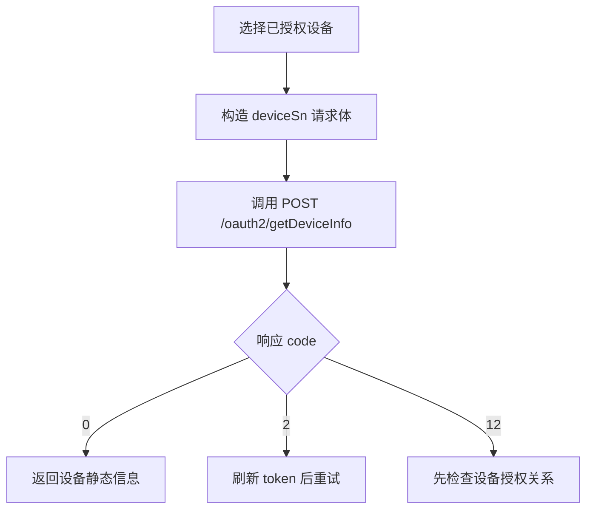

# 设备信息查询 API

**简要说明**

- 获取当前 token 已授权设备的静态信息。
- 查询对象为单个 `deviceSn`。
- 主规范请求体使用 JSON。

**请求 URL**

- `/oauth2/getDeviceInfo`

**请求方式**

- `POST`
- `Content-Type: application/json`
- `Authorization: Bearer <token>`

## 查询流程



---

## 请求参数

| 参数名 | 必填 | 类型 | 说明 |
| :--- | :--- | :--- | :--- |
| `deviceSn` | 是 | string | 设备唯一序列号 |

---

## 请求示例

```json
{
    "deviceSn": "YRP0N4S00Q"
}
```

---

## 返回示例

```json
{
    "code": 0,
    "data": {
        "deviceSn": "YRP0N4S00Q",
        "deviceTypeName": "sph",
        "model": "SPH 5000TL-HUB",
        "nominalPower": 6000,
        "datalogSn": "VWQ0F9W00L",
        "datalogDeviceTypeName": "ShineWiLan-X2",
        "dtc": 3503,
        "communicationVersion": "ZCBD-0004",
        "existBattery": true,
        "batterySn": "YRP0N4S00Q_battery",
        "batteryModel": "SPH 5000TL-HUB",
        "batteryCapacity": 9000,
        "batteryNominalPower": 6000,
        "authFlag": true,
        "batteryList": [
            {
                "batterySn": "YRP0N4S00Q_battery",
                "batteryModel": "BDCBAT",
                "batteryCapacity": 9000,
                "batteryNominalPower": 6000
            }
        ]
    },
    "message": "SUCCESSFUL_OPERATION"
}
```

### 常见失败

```json
{
    "code": 2,
    "message": "TOKEN_IS_INVALID"
}
```

```json
{
    "code": 12,
    "message": "DEVICE_SN_DOES_NOT_HAVE_PERMISSION"
}
```

### 请求格式说明

- 请求体传纯 SN，不带 `SPH:` / `SPM:` 等展示前缀。
- 使用 `Authorization: Bearer <access_token>` + `Content-Type: application/json`。

---

## 相关文档

- [设备授权 API](./04_api_device_auth.md)
- [设备数据查询 API](./08_api_device_data.md)
