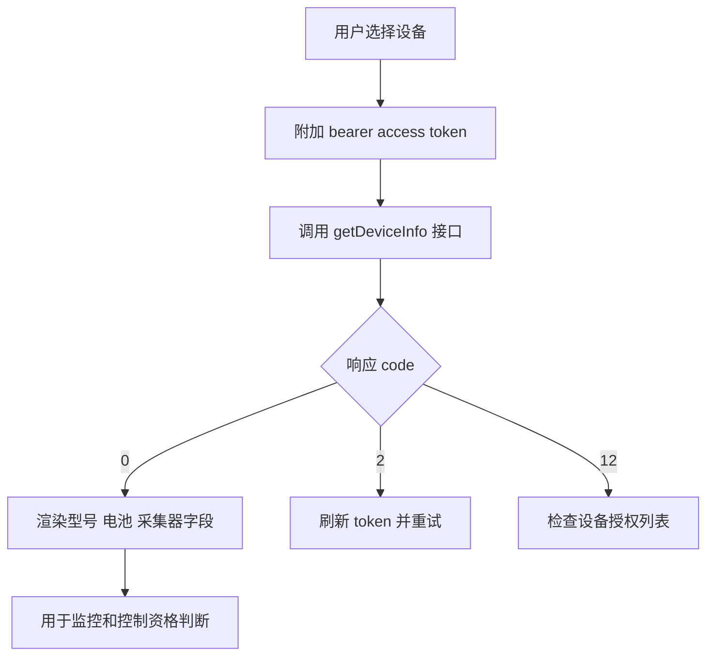
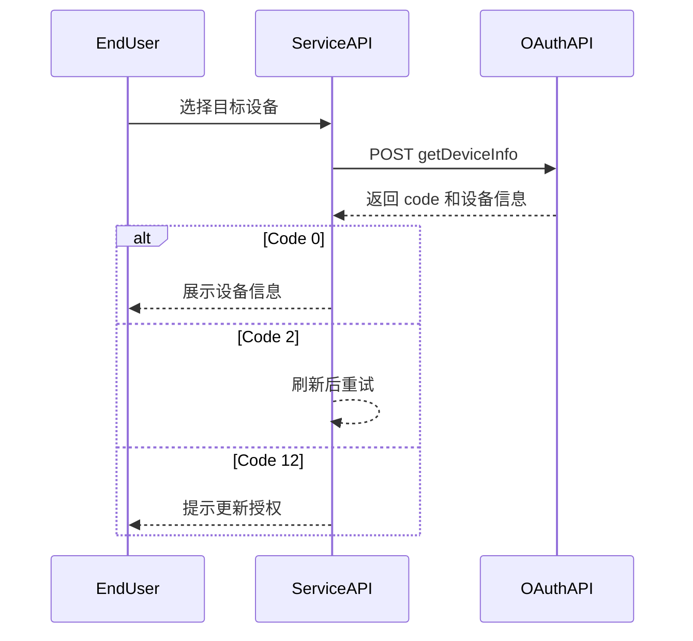

# 设备信息查询 API

## 简要描述

- 获取 Growatt 平台已授权设备的信息。
- 接口仅返回当前 token 有权限访问的设备查询结果；无权限设备会返回 `DEVICE_SN_DOES_NOT_HAVE_PERMISSION`。

## 请求 URL

- `/oauth2/getDeviceInfo`

## 请求方式

- `POST`
- `Content-Type: application/json`
- `Authorization: Bearer <token>`

## 设备信息查询流程（概念）



## 设备信息查询流程（时序）



## HTTP 头部参数及说明

| 参数名 | 必选 | 类型 | 说明 | 示例 |
| :--- | :--- | :--- | :--- | :--- |
| `Authorization` | 是 | string | 密钥令牌 | `Bearer ACCESS_TOKEN` |

## HTTP Body 参数及说明

| 参数名 | 必选 | 类型 | 说明 | 示例 |
| :--- | :--- | :--- | :--- | :--- |
| `deviceSn` | 是 | string | 设备唯一序列号（SN） | `"DEVICE_SN_1"` |

## 接口返回参数和说明

| 参数名 | 类型 | 说明 | 示例 |
| :--- | :--- | :--- | :--- |
| `code` | int | 接口返回状态码，`0` 成功，其余失败 | `0` |
| `data` | obj | 数据返回 | `{...}` |
| `message` | string | 返回说明 | `"SUCCESSFUL_OPERATION"` |

## 请求示例

```json
{
    "deviceSn": "DEVICE_SN_1"
}
```

## 返回示例

```json
{
    "code": 0,
    "data": {
        "deviceSn": "DEVICE_SN_1",
        "deviceTypeName": "min",
        "model": "BDCBAT",
        "nominalPower": 6000,
        "datalogSn": "DATALOG_SN_1",
        "datalogDeviceTypeName": "ShineWiFi-X",
        "dtc": 5100,
        "communicationVersion": "ZABA-0021",
        "unifiedAPIver": null,
        "deviceVersion": null,
        "datalogVersion": "7.6.1.9",
        "existBattery": true,
        "batterySn": "BATTERY_SN_1",
        "batteryModel": "ARK 5.12-25.6XH-A1",
        "batteryCapacity": 5000,
        "batteryNominalPower": 2500,
        "authFlag": true,
        "batteryList": [
            {
                "batterySn": "BATTERY_SN_1",
                "batteryModel": "ARK 5.12-25.6XH-A1",
                "batteryCapacity": 5000,
                "batteryNominalPower": 2500
            }
        ]
    },
    "message": "SUCCESSFUL_OPERATION"
}
```

```json
{
    "code": 2,
    "message": "TOKEN_IS_INVALID"
}
```

## `data` 参数说明

| 参数名 | 类型 | 说明 | 示例 |
| :--- | :--- | :--- | :--- |
| `deviceSn` | string | 设备序列号 | `"DEVICE_SN_1"` |
| `deviceTypeName` | string | 设备大类型名称 | `"min"` |
| `model` | string | 设备型号 | `"BDCBAT"` |
| `nominalPower` | int | 逆变器额定功率，单位 W | `6000` |
| `datalogSn` | string | 采集器序列号 | `"DATALOG_SN_1"` |
| `datalogDeviceTypeName` | string | 采集器类型名称 | `"ShineWiFi-X"` |
| `dtc` | int | 设备类型数字编码 | `5100` |
| `communicationVersion` | string | 固件通讯版本 | `"ZABA-0021"` |
| `unifiedAPIver` | string \| null | 统一 API 版本；未返回时为 `null` | `null` |
| `deviceVersion` | string \| null | 设备固件版本；未返回时为 `null` | `null` |
| `datalogVersion` | string \| null | 采集器固件版本；未返回时为 `null` | `"7.6.1.9"` |
| `existBattery` | boolean | 是否有电池 | `true` |
| `batterySn` | string | 电池序列号 | `"BATTERY_SN_1"` |
| `batteryModel` | string | 电池型号 | `"ARK 5.12-25.6XH-A1"` |
| `batteryCapacity` | int | 电池额定容量，单位 Wh | `5000` |
| `batteryNominalPower` | int | 电池额定功率，单位 W | `2500` |
| `authFlag` | boolean | 是否已授权 | `true` |
| `batteryList` | array | 电池列表 | `[{...}]` |
| `batteryList[].batterySn` | string | 电池列表中的电池序列号 | `"BATTERY_SN_1"` |
| `batteryList[].batteryModel` | string | 电池列表中的电池型号 | `"ARK 5.12-25.6XH-A1"` |
| `batteryList[].batteryCapacity` | int | 电池额定容量，单位 Wh | `5000` |
| `batteryList[].batteryNominalPower` | int | 电池额定功率，单位 W | `2500` |

## 相关文档

- [设备授权 API](./04_api_device_auth.md)
- [设备数据查询 API](./08_api_device_data.md)
