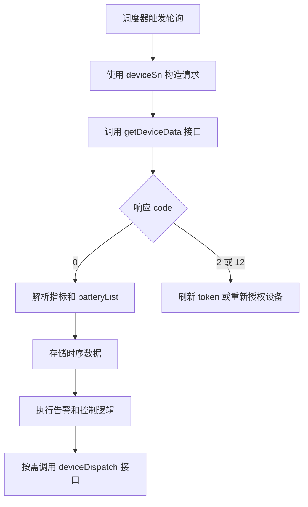
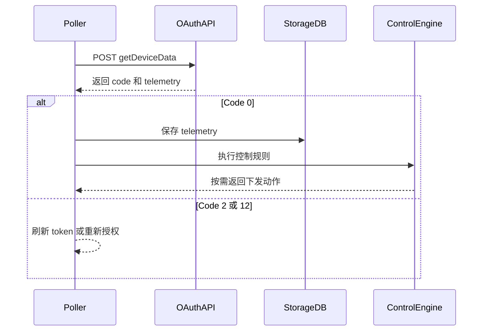

# 设备数据查询 API

**简要说明**
- 根据设备序列号查询指定设备的高频数据。该接口仅返回当前 secret token 有权限访问的设备数据；无访问权限的设备不会返回。

**请求 URL**
- `/oauth2/getDeviceData`

**请求方式**
- `POST`
- `Content-Type`: `application/x-www-form-urlencoded`

## 遥测消费流程（概念）



## 遥测消费流程（时序）



---

## HTTP Header 参数

| 参数名 | 必填 | 类型 | 说明 |
| :--- | :--- | :--- | :--- |
| `token` | 是 | String | Secret token |

---

## HTTP Body 参数

| 参数名 | 必填 | 类型 | 说明 |
| :--- | :--- | :--- | :--- |
| `deviceSn` | 是 | String | 设备唯一序列号（SN） |

---

## 接口返回参数

| 参数名 | 类型 | 说明 |
| :--- | :--- | :--- |
| `code` | int | 接口返回状态码。0 表示成功，其他表示失败 |
| `data` | string | 返回数据 |

---

## 请求示例

```json
{
    "deviceSn": "FDCJQ00003"
}
```

---

## 返回示例

```json
{
    "code": 0,
    "data": {
        "activePower": 0.00,
        "batPower": -4816.00,
        "batteryList": [
            {
                "chargePower": 0.00,
                "dischargePower": 2511.00,
                "ibat": -6.40,
                "index": 1,
                "soc": 100,
                "vbat": 376.50
            },
            {
                "chargePower": 0.00,
                "dischargePower": 2305.00,
                "ibat": -6.10,
                "index": 2,
                "soc": 100,
                "vbat": 375.80
            }
        ],
        "batteryStatus": 3,
        "pac": 4562.80,
        "payLoadPower": 365.90,
        "ppv": 0.00,
        "priority": 2,
        "reverActivePower": 4450.10,
        "deviceSn": "TEST123456",
        "soc": 100,
        "status": 6,
        "utcTime": "2026-02-25 00:10:01",
        "vac1": 234.64,
        "vac2": 235.04,
        "vac3": 234.17
    }
}
```

---

## 返回字段说明

| 参数名 | 类型 | 示例 | 说明 |
| :--- | :--- | :--- | :--- |
| `dataType` | string | dfcData | 固定值：dfcData |
| `data` | object | - | 主数据对象 |
| `data.activePower` | double | 0 | 从电网取电功率（正值），单位：W |
| `data.pac` | double | 2871.4 | 交流输出功率，单位：W |
| `data.ppv` | double | 3045.3 | 光伏发电功率，单位：W |
| `data.payLoadPower` | double | 258.4 | 总负载功率（计算值），单位：W |
| `data.reverActivePower` | double | 2781.9 | 向电网馈电功率，单位：W |
| `data.batteryStatus` | int | 3 | 电池总体状态 |
| `data.batPower` | double | 200.5 | 电池总充放电功率（正数=充电，负数=放电，0=空闲），单位：W |
| `data.priority` | int | 2 | 工作优先级 |
| `data.deviceSn` | string | TEST123456 | 设备序列号 |
| `data.status` | int | 6 | 设备运行状态码 |
| `data.utcTime` | string | 2026/2/25 0:10 | UTC 时间戳（偏移 +00:00），格式为 `yyyy-MM-dd HH:mm:ss` |
| `data.vac1` | double | 234 | A 相电压，单位：V |
| `data.vac2` | double | 233 | B 相电压，单位：V |
| `data.vac3` | double | 234.5 | C 相电压，单位：V |
| `data.soc` | int | 3 | 平均电池荷电状态（SOC） |
| `data.batteryList` | array | [...] | 电池信息列表 |
| `data.batteryList[].index` | int | 1 | 电池序号（从 1 开始） |
| `data.batteryList[].soc` | int | 22 | 电池荷电状态（百分比） |
| `data.batteryList[].chargePower` | double | 5 | 电池充电功率，单位：W |
| `data.batteryList[].dischargePower` | double | 0 | 电池放电功率，单位：W |
| `data.batteryList[].ibat` | double | 0 | 电池电流（低压侧），单位：A |
| `data.batteryList[].vbat` | double | 370.6 | 电池电压（低压侧），单位：V |

---

## 状态值定义

### 设备运行状态（`status`）
- 0：待机
- 1：自检
- 3：故障
- 4：升级
- 5：光伏在线 & 电池离线 & 并网
- 6：光伏离线（或在线） & 电池在线 & 并网
- 7：光伏在线 & 电池在线 & 离网
- 8：光伏离线 & 电池在线 & 离网
- 9：Bypass 模式

### 电池总体状态（`batteryStatus`）
- 0：电池待机
- 1：电池断开
- 2：电池充电
- 3：电池放电
- 4：故障
- 5：升级

### 工作优先级（`priority`）
- 0：负载优先
- 1：电池优先
- 2：电网优先

---

## 相关文档

- [设备信息查询 API](../07_api_device_info.md)
- [设备数据推送 API](../09_api_device_push.md)
