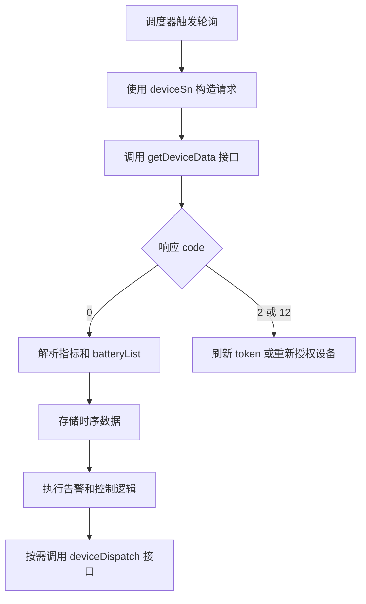
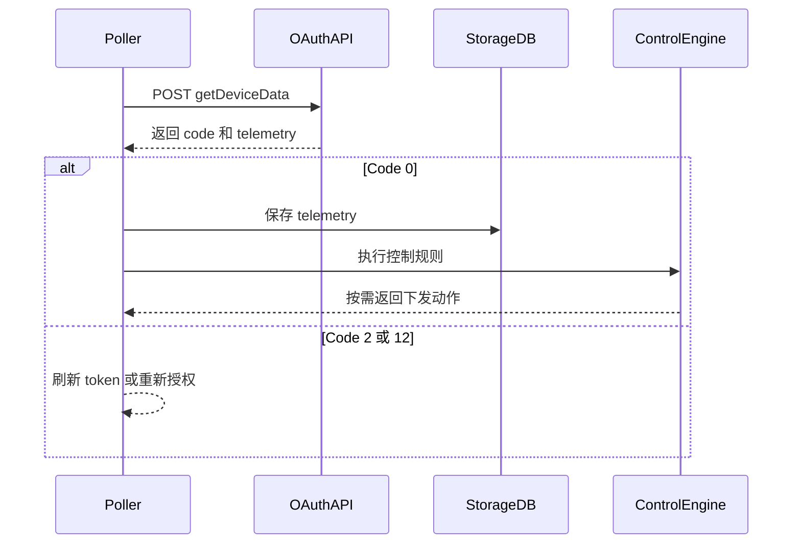

# 设备数据查询 API

## 简要描述

- 根据设备序列号查询指定设备的高频数据。
- 接口仅返回当前 token 有权限访问的设备查询结果；无权限设备会返回 `DEVICE_SN_DOES_NOT_HAVE_PERMISSION`。

## 请求 URL

- `/oauth2/getDeviceData`

## 请求方式

- `POST`
- `Content-Type: application/json`
- `Authorization: Bearer <token>`

## 遥测消费流程（概念）



## 遥测消费流程（时序）



## HTTP 头部参数及说明

| 参数名 | 必选 | 类型 | 说明 | 示例 |
| :--- | :--- | :--- | :--- | :--- |
| `Authorization` | 是 | string | 密钥令牌 | `Bearer ACCESS_TOKEN` |

## HTTP Body 参数及说明

| 参数名 | 必选 | 类型 | 说明 | 示例 |
| :--- | :--- | :--- | :--- | :--- |
| `deviceSn` | 是 | string | 设备唯一序列号（SN） | `"DEVICE_SN_1"` |

## 接口返回参数和说明

| 参数名 | 厂商表格类型 | 说明 | 示例 |
| :--- | :--- | :--- | :--- |
| `code` | int | 接口返回状态码，`0` 成功，其余失败 | `0` |
| `data` | string | 厂商表格原文写作 `string`，成功示例为对象 | `{...}` |
| `message` | string | 返回说明 | `"SUCCESSFUL_OPERATION"` |

## 请求示例

```json
{
    "deviceSn": "DEVICE_SN_1"
}
```

## 返回示例

```json
{
    "code": 0,
    "data": {
        "fac": 50.03,
        "backupPower": 0.20,
        "batPower": 0.00,
        "pac": 41.30,
        "etoUserToday": 3.10,
        "meterPower": 0.00,
        "utcTime": "2026-03-13 07:48:25",
        "etoUserTotal": 44.80,
        "pexPower": 14.30,
        "batteryList": [
            {
                "chargePower": 0.00,
                "soc": 67,
                "echargeToday": 2.90,
                "vbat": 53.30,
                "index": 1,
                "echargeTotal": 80.70,
                "dischargePower": 0.00,
                "edischargeToday": 1.90,
                "ibat": -1.00,
                "soh": 100,
                "edischargeTotal": 57.60,
                "status": 0
            }
        ],
        "protectCode": 0,
        "reactivePower": 174.90,
        "deviceSn": "DEVICE_SN_1",
        "etoGridTotal": 270.70,
        "genPower": 0.00,
        "priority": 0,
        "vac3": 236.90,
        "etoGridToday": 1.50,
        "protectSubCode": 0,
        "vac2": 236.90,
        "vac1": 236.90,
        "payLoadPower": 14.50,
        "faultCode": 0,
        "faultSubCode": 0,
        "batteryStatus": 0,
        "ppv": 14.30,
        "epvTotal": 0.00,
        "smartLoadPower": 0.00,
        "status": 6
    },
    "message": "SUCCESSFUL_OPERATION"
}
```

## 返回参数说明

| 参数名 | 类型 | 说明 | 示例 |
| :--- | :--- | :--- | :--- |
| `code` | int | API 状态码，`0` 表示成功 | `0` |
| `data` | object | 主数据对象 | `{...}` |
| `data.deviceSn` | string | 设备序列号 | `"DEVICE_SN_1"` |
| `data.meterPower` | double | 电表功率（正值取电，负值馈电），单位 W | `0.00` |
| `data.reactivePower` | double | 无功功率（正值：容性，负值：感性） | `174.90` |
| `data.fac` | double | 电网频率，单位 Hz | `50.03` |
| `data.etoUserToday` | double | 今日取电电量，单位 kWh | `3.10` |
| `data.etoUserTotal` | double | 总取电电量，单位 kWh | `44.80` |
| `data.etoGridToday` | double | 今日馈电电量，单位 kWh | `1.50` |
| `data.etoGridTotal` | double | 总馈电电量，单位 kWh | `270.70` |
| `data.faultCode` | int | 故障主码 | `0` |
| `data.faultSubCode` | int | 故障子码 | `0` |
| `data.protectCode` | int | 保护主码 | `0` |
| `data.protectSubCode` | int | 保护子码 | `0` |
| `data.pac` | double | 交流输出功率，单位 W | `41.30` |
| `data.pexPower` | double | 第三方电表 / Solar Inverter 的外部发电功率，单位 W；应按非负的外部发电量值解释，不表示并网取电/馈电方向 | `14.30` |
| `data.genPower` | double | 离网模式下的发电机功率，单位 W；有发电机源时按非负功率量值解释，它不是 AC-Couple 外部发电边界信号 | `0.00` |
| `data.ppv` | double | 设备本地 PV 功率，单位 W；在 Hybrid 拓扑中为核心 PV 信号，在 AC-Couple 拓扑中如与 `pexPower` 同时上报则作为辅助遥测 | `14.30` |
| `data.epvTotal` | double | PV 总发电能量，单位 kWh | `0.00` |
| `data.payLoadPower` | double | 总负载功率（计算值），单位 W | `14.50` |
| `data.smartLoadPower` | double | 设备具备独立 smart load 通道时上报的负载功率，单位 W | `0.00` |
| `data.batteryStatus` | int | 电池总体状态 | `0` |
| `data.batPower` | double | 电池总充/放电功率（正值充电，负值放电，0 为空闲），单位 W | `0.00` |
| `data.priority` | int | 工作优先级 | `0` |
| `data.status` | int | 设备运行状态码 | `6` |
| `data.utcTime` | string | UTC 时间戳，格式 `yyyy-MM-dd HH:mm:ss` | `"2026-03-13 07:48:25"` |
| `data.vac1` | double | 线电压 1，单位 V | `236.90` |
| `data.vac2` | double | 线电压 2，单位 V | `236.90` |
| `data.vac3` | double | 线电压 3，单位 V | `236.90` |
| `data.batteryList` | array | 电池信息列表 | `[{...}]` |
| `data.batteryList[].index` | int | 电池索引（从 1 开始） | `1` |
| `data.batteryList[].soc` | int | 电池荷电状态（百分比） | `67` |
| `data.batteryList[].chargePower` | double | 电池充电功率，单位 W | `0.00` |
| `data.batteryList[].dischargePower` | double | 电池放电功率，单位 W | `0.00` |
| `data.batteryList[].ibat` | double | 电池电流（低压侧），单位 A | `-1.00` |
| `data.batteryList[].vbat` | double | 电池电压（低压侧），单位 V | `53.30` |
| `data.batteryList[].soh` | int | 电池健康状态 `[0,100]` | `100` |
| `data.batteryList[].status` | int | 单个电池包状态码（出现时返回） | `0` |
| `data.batteryList[].echargeToday` | double | 电池今日充电量，单位 kWh | `2.90` |
| `data.batteryList[].echargeTotal` | double | 电池总充电量，单位 kWh | `80.70` |
| `data.batteryList[].edischargeToday` | double | 电池今日放电量，单位 kWh | `1.90` |
| `data.batteryList[].edischargeTotal` | double | 电池总放电量，单位 kWh | `57.60` |

## 状态值定义

### 设备运行状态（`status`）

- `0`: 待机
- `1`: 自检
- `3`: 故障
- `4`: 升级
- `5`: 光伏在线 & 电池离线 & 并网
- `6`: 光伏离线（或在线） & 电池在线 & 并网
- `7`: 光伏在线 & 电池在线 & 离网
- `8`: 光伏离线 & 电池在线 & 离网
- `9`: 旁路模式

### 电池总体状态（`batteryStatus`）

- `0`: 电池待机
- `1`: 电池断开
- `2`: 电池充电
- `3`: 电池放电
- `4`: 故障
- `5`: 升级

### 工作优先级（`priority`）

- `0`: 负载优先
- `1`: 电池优先
- `2`: 电网优先

## 实现说明

- 本节局部 HTTP 头部表写作 `token`，但全局参数章节明确要求 `Authorization: Bearer xxxxxxx`。本页采用全局章节的统一写法。
- 返回表将顶层 `data` 标为 `string`，但成功示例明确给出对象结构。

## 相关文档

- [设备信息查询 API](./07_api_device_info.md)
- [设备数据推送 API](./09_api_device_push.md)
