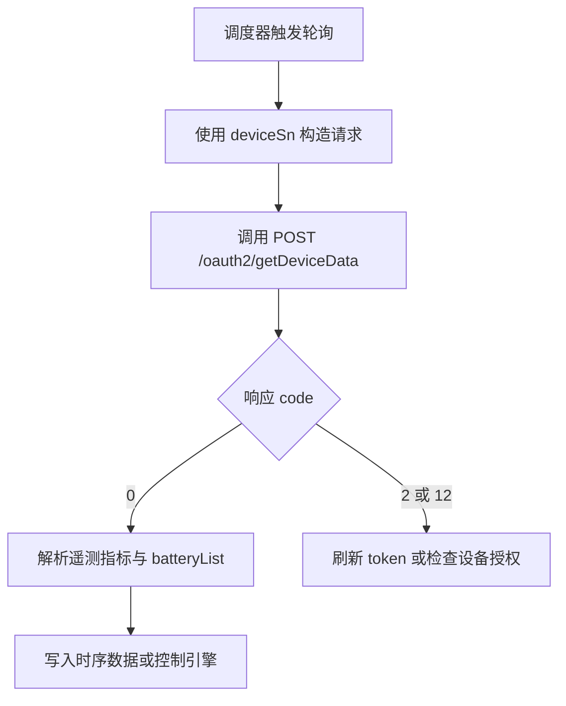

# 设备数据查询 API

**简要说明**

- 根据设备 SN 查询已授权设备的高频运行数据。
- 主规范字段以 `meterPower`、`reactivePower`、`serialNum`、`batteryList[]` 为中心建模。
- 历史测试材料中出现的 `activePower`、`reverActivePower`、外层 `soc` 仅视为环境兼容字段，不作为主定义。

**请求 URL**

- `/oauth2/getDeviceData`

**请求方式**

- `POST`
- `Content-Type: application/json`
- `Authorization: Bearer <token>`

## 遥测消费流程



---

## 请求参数

| 参数名 | 必填 | 类型 | 说明 |
| :--- | :--- | :--- | :--- |
| `deviceSn` | 是 | string | 设备唯一序列号 |

---

## 请求示例

```json
{
    "deviceSn": "YRP0N4S00Q"
}
```

---

## 返回示例（主规范字段）

```json
{
    "code": 0,
    "data": {
        "fac": 50.03,
        "backupPower": 0.20,
        "batPower": 0.00,
        "pac": 41.30,
        "etoUserToday": 3.10,
        "meterPower": 0.00,
        "utcTime": "2026-03-13 07:48:25",
        "etoUserTotal": 44.80,
        "pexPower": 14.30,
        "batteryList": [
            {
                "chargePower": 0.00,
                "soc": 67,
                "echargeToday": 2.90,
                "vbat": 53.30,
                "index": 1,
                "echargeTotal": 80.70,
                "dischargePower": 0.00,
                "edischargeToday": 1.90,
                "ibat": -1.00,
                "soh": 100,
                "edischargeTotal": 57.60,
                "status": 0
            }
        ],
        "protectCode": 0,
        "reactivePower": 174.90,
        "serialNum": "YRP0N4S00Q",
        "etoGridTotal": 270.70,
        "genPower": 0.00,
        "priority": 0,
        "vac3": 236.90,
        "etoGridToday": 1.50,
        "protectSubCode": 0,
        "vac2": 236.90,
        "vac1": 236.90,
        "payLoadPower": 14.50,
        "faultCode": 0,
        "faultSubCode": 0,
        "batteryStatus": 0,
        "ppv": 14.30,
        "smartLoadPower": 0.00,
        "status": 6
    },
    "message": "SUCCESSFUL_OPERATION"
}
```

---

## 主规范字段说明

| 参数名 | 类型 | 说明 |
| :--- | :--- | :--- |
| `data.meterPower` | double | 电表功率。正值表示从电网取电，负值表示向电网馈电，单位：W |
| `data.reactivePower` | double | 无功功率 |
| `data.fac` | double | 电网频率 |
| `data.etoUserToday` | double | 今日取电量，单位：kWh |
| `data.etoUserTotal` | double | 总取电量，单位：kWh |
| `data.etoGridToday` | double | 今日馈电量，单位：kWh |
| `data.etoGridTotal` | double | 总馈电量，单位：kWh |
| `data.pac` | double | 交流输出功率，单位：W |
| `data.ppv` | double | 本机采集到的 PV 功率，单位：W |
| `data.payLoadPower` | double | 总负载功率，单位：W |
| `data.batPower` | double | 电池总充放电功率。正充负放，单位：W |
| `data.serialNum` | string | 遥测报文中的设备序列号主字段 |
| `data.status` | int | 设备运行状态码 |
| `data.utcTime` | string | UTC 时间戳 |
| `data.batteryList` | array | 电池对象列表 |
| `data.batteryList[].soc` | int | 单电池荷电状态 |
| `data.batteryList[].soh` | int | 单电池健康度 |
| `data.batteryList[].chargePower` | double | 单电池充电功率 |
| `data.batteryList[].dischargePower` | double | 单电池放电功率 |
| `data.batteryList[].status` | int | 单电池状态 |

---

## 9290 与历史材料兼容说明

在 `https://api-test.growatt.com:9290` 与历史测试报告中，曾观察到以下差异：

- 遥测体可能额外返回 `activePower`，并在部分环境或设备上返回 `reverActivePower`；这些字段可能与 `meterPower` 并存，也可能只出现其中一部分。
- 部分返回中使用 `deviceSn` 或外层 `soc` 作为兼容字段。
- 请求体仍然传纯 SN，且使用 `Authorization: Bearer <access_token>` + JSON body。

处理建议：

- 以本页的主规范字段作为对外语义定义。
- 如果环境实际返回 `activePower` / `reverActivePower`，可作为兼容字段接入，但不要把它们写成新的主语义。

---

## 相关文档

- [设备信息查询 API](./07_api_device_info.md)
- [设备数据推送 API](./09_api_device_push.md)
