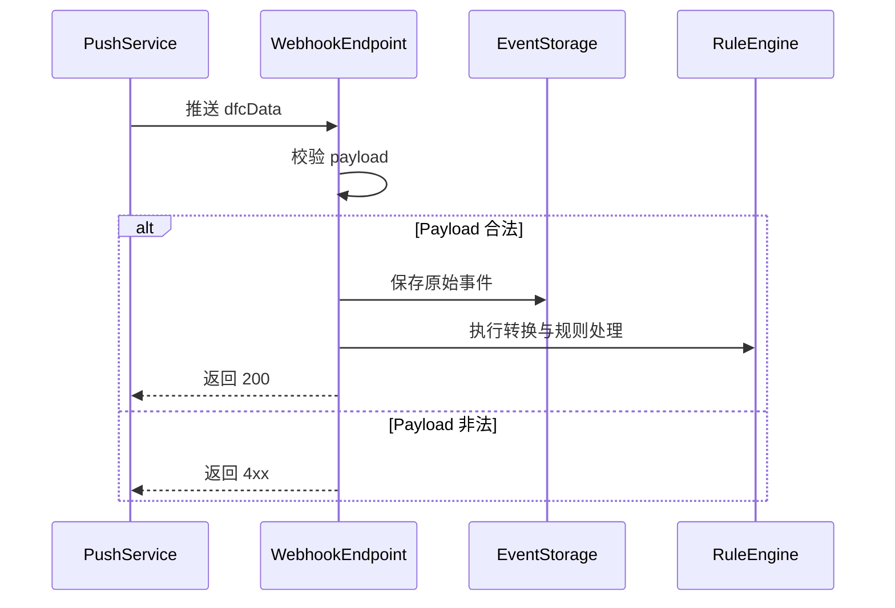

# 设备数据推送 API

**简要说明**
- 第三方平台需要自行开发可用的接收接口，并将对应 URL 提供给 Growatt。
- 归属于第三方平台的设备会按周期将指定的高频更新数据推送到提供给 Growatt 的 URL。

## Webhook 处理时序（Mermaid）



---

## 推送示例

```json
{
    "data": {
        "activePower": 0.00,
        "batPower": -4816.00,
        "batteryList": [
            {
                "chargePower": 0.00,
                "dischargePower": 2511.00,
                "ibat": -6.40,
                "index": 1,
                "soc": 100,
                "vbat": 376.50
            },
            {
                "chargePower": 0.00,
                "dischargePower": 2305.00,
                "ibat": -6.10,
                "index": 2,
                "soc": 100,
                "vbat": 375.80
            }
        ],
        "batteryStatus": 3,
        "pac": 4562.80,
        "payLoadPower": 365.90,
        "ppv": 0.00,
        "priority": 2,
        "reverActivePower": 4450.10,
        "deviceSn": "TEST123456",
        "soc": 100,
        "status": 6,
        "utcTime": "2026-02-25 00:10:01",
        "vac1": 234.64,
        "vac2": 235.04,
        "vac3": 234.17
    },
    "dataType": "dfcData"
}
```

*（注：参数说明和状态值定义与 3.7 设备数据查询章节相同。）*

---

## 相关文档

- [设备数据查询 API](../08_api_device_data.md)
- [全局参数](../10_global_params.md)
