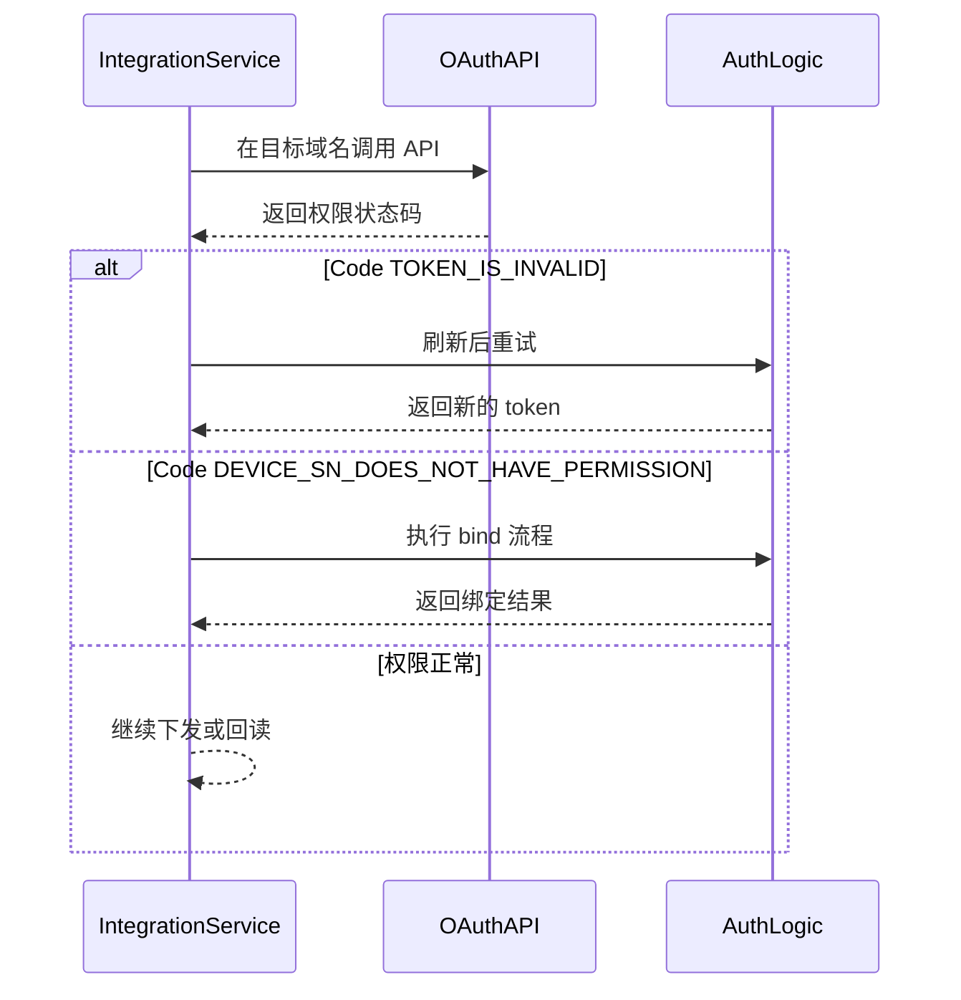

# 全局参数说明

## 域名

### 正式环境

- `https://opencloud.growatt.com`
- `https://opencloud-au.growatt.com`

### 测试环境

- `https://opencloud-test.growatt.com`
- `https://opencloud-test-au.growatt.com`

## 环境与参数决策流程（概念）


## 环境与权限处理（时序）



## HTTP 请求头说明

- 调用 API 时需要 `access_token`。

| 参数名 | 参数说明 | 参数值说明 |
| :--- | :--- | :--- |
| `Authorization` | token 标识 | `Bearer xxxxxxx` |

## 返回码说明

### 返回格式示例

```json
{
    "code": 0,
    "data": "<endpoint-dependent>",
    "message": "RESPONSE_MESSAGE"
}
```

| 场景 | `code` | `data` | `message` |
| :--- | :--- | :--- | :--- |
| 操作成功 | `0` | 随接口而定：可能是对象、数组、数字、`null` 或空数组 | `"SUCCESSFUL_OPERATION"` |
| 设备 SN 无权限 | `12` | `["DEVICE_SN_1"]` | `"DEVICE_SN_DOES_NOT_HAVE_PERMISSION"` |
| Token 无效 | `2` | 未返回 | `"TOKEN_IS_INVALID"` |
| 设备离线 | `5` | `null` | `"DEVICE_OFFLINE"` |
| 读取设备参数失败 | `18` | `null` | `"READ_DEVICE_PARAM_FAIL"` |
| 授权模式错误 | `103` | 未返回 | `"WRONG_GRANT_TYPE"` |
| 参数设置响应超时 | `16` | `null` | `"PARAMETER_SETTING_RESPONSE_TIMEOUT"` |
| 参数设置设备无响应 | `15` | `null` | `"PARAMETER_SETTING_DEVICE_NOT_RESPONDING"` |
| 参数设置失败 | `6` | `null` | `"PARAMETER_SETTING_FAILED"` |
| 请求过多 | `105` | `null` | `"TOO_MANY_REQUEST"` |

## 设备参数说明

- 下表仅保留本页公开发布的 7 个 `setType`。

| 参数名 | 参数说明 | 参数值说明 |
| :--- | :--- | :--- |
| `time_slot_charge_discharge` | 分时段充放电。`percentage` 范围 `[-100,100]`；`percentage > 0` 充电，`percentage < 0` 放电；`startTime` / `endTime` 为 UTC 时间；最多可配置 16 段时间 | `[{ "percentage": 100, "startTime": "00:00", "endTime": "23:59" }]` |
| `duration_and_power_charge_discharge` | 充放电时长和功率百分比。`percentage` 范围 `[0,100]`；支持 `selfConsumptionCommand`、`chargeOnlySelfConsumptionCommand`、`chargeCommand`、`dischargeCommand` | `{ "duration": 10, "percentage": 20, "type": "dischargeCommand" }` |
| `export_limit` | 防逆流设置。`exportLimitEnabled` 为启用开关；`percentage` 范围 `[-100,100]`；正值表示逆流控制，负值表示顺流控制 | `{ "exportLimitEnabled": 1, "percentage": 20 }` |
| `enable_control` | 是否启用 VPP 控制 | `1` 表示启用，`0` 表示关闭 |
| `active_power_derating_percentage` | 有功功率百分比降额 | 数值范围 `[0,100]`，例如 `50` |
| `active_power_percentage` | 有功功率百分比 | 数值范围 `[0,100]`，例如 `60` |
| `remote_charge_discharge_power` | 远程充放电功率 | 数值范围 `[-100,100]`；正值表示充电，负值表示放电 |

## 按 `setType` 区分的回读示例

| `setType` | 请求示例 | `readDeviceDispatch.data` 示例 | 返回形态 |
| :--- | :--- | :--- | :--- |
| `time_slot_charge_discharge` | `{ "deviceSn": "TEST123456", "requestId": "12345678901234567890123456789012", "setType": "time_slot_charge_discharge" }` | `[{ "startTime": "16:00", "endTime": "18:00", "percentage": 80 }]` | 数组 |
| `duration_and_power_charge_discharge` | `{ "deviceSn": "TEST123456", "requestId": "12345678901234567890123456789012", "setType": "duration_and_power_charge_discharge" }` | `{ "remotePowerControlEnable": 1, "duration": 10, "percentage": 80, "acChargingEnabled": 1 }` | 对象 |
| `export_limit` | `{ "deviceSn": "TEST123456", "requestId": "12345678901234567890123456789012", "setType": "export_limit" }` | `{ "exportLimitEnabled": 1, "percentage": 20 }` | 对象 |
| `enable_control` | `{ "deviceSn": "TEST123456", "requestId": "12345678901234567890123456789012", "setType": "enable_control" }` | `1` | 数值 |
| `active_power_derating_percentage` | `{ "deviceSn": "TEST123456", "requestId": "12345678901234567890123456789012", "setType": "active_power_derating_percentage" }` | `50` | 数值 |
| `active_power_percentage` | `{ "deviceSn": "TEST123456", "requestId": "12345678901234567890123456789012", "setType": "active_power_percentage" }` | `60` | 数值 |
| `remote_charge_discharge_power` | `{ "deviceSn": "TEST123456", "requestId": "12345678901234567890123456789012", "setType": "remote_charge_discharge_power" }` | `-30` | 数值 |

## 相关文档

- [设备调度 API](./05_api_device_dispatch.md)
- [读取设备调度参数 API](./06_api_read_dispatch.md)
- [储能术语表](./12_ess_terminology.md)
