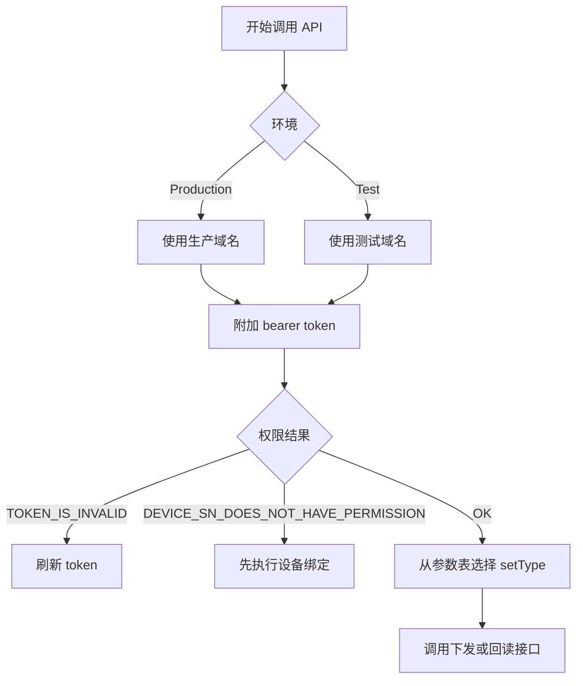
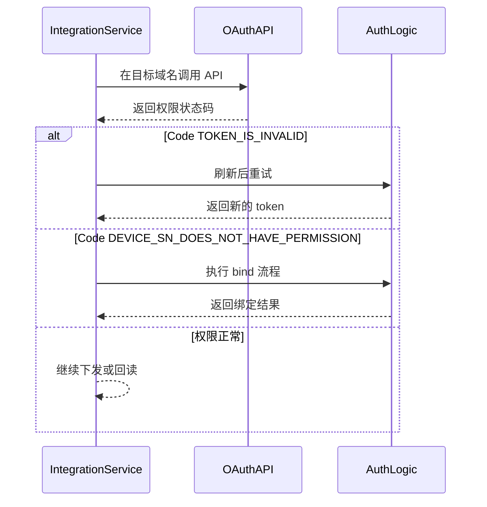

# 全局参数说明

## 域名

### 生产环境
- `https://opencloud.growatt.com`
- `https://opencloud-au.growatt.com`

### 测试环境
- `https://opencloud-test.growatt.com`

## 环境与参数决策流程（概念）



## 环境与权限处理（时序）



---

## 权限参数说明

### 设备未授权

```json
{
    "code": 12,
    "data": [
        "WAQ1234567"
    ],
    "message": "DEVICE_SN_DOES_NOT_HAVE_PERMISSION"
}
```

### `access_token` 已过期

```json
{
    "code": 2,
    "message": "TOKEN_IS_INVALID"
}
```

---

## 设备参数说明

**简要说明：**
- 列出各设置参数的参数枚举、参数含义以及参数值定义。

| 参数名 | 参数说明 | 参数值说明 |
| :--- | :--- | :--- |
| `enable_control` | 控制权限 | 0：关闭<br>1：开启<br>默认：关闭 |
| `power_on_off_command` | 开关机指令 | 0：关机<br>1：开机<br>默认：开机<br>不存储<br>使用该协议控制逆变器时需要先开启此寄存器 |
| `system_time_setting` | 系统时间设置 | 示例：2024-10-10 13:14:14 |
| `syn_enable` | SYN 使能 | 离网箱使能<br>0：关闭<br>1：开启<br>默认：0 |
| `active_power_derating_percentage` | 有功降额百分比 | 降额范围：[0, 100]<br>默认值：100 |
| `active_power_percentage` | 有功功率百分比 | 降额范围：[0, 100]<br>默认值：100<br>有功功率百分比与有功降额百分比中较小者（1%）作为实际值<br>不存储 |
| `eps_enable` | EPS 离网使能 | 0：关闭<br>1：开启<br>默认：0 |
| `eps_frequency` | EPS 离网频率 | 0：50Hz<br>1：60Hz<br>默认：0 |
| `eps_voltage` | EPS 离网电压 | 0：230V<br>1：208V<br>2：240V<br>3：220V<br>4：127V<br>5：277V<br>6：254V<br>默认：0 |
| `reactive_power_percentage` | 无功功率百分比 | 降额范围：[0, 60]<br>默认值：60 |
| `reactive_power_mode` | 无功功率模式 | 0：PF=1<br>1：PF 值设置<br>2：默认 PF 曲线（预留）<br>3：用户自定义 PF 曲线（预留）<br>4：滞后无功（+）<br>5：超前无功（-）<br>默认值：0<br>放电时，+ 表示滞后（感性），- 表示超前（容性）；充电时，+ 表示超前（容性），- 表示滞后（感性） |
| `power_factor` | 功率因数 | [0, 20000]<br>实际功率因数 = (10000 - 设定值) * 0.0001<br>默认值：10000 |
| `anti_backfeed_enable` | 防逆流使能 | 0：关闭<br>1：单机防逆流开启<br>默认值：0 |
| `anti_backfeed_power_percentage` | 防逆流功率百分比 | [-100, 100]<br>默认值：0<br>正值表示正向电流控制，负值表示反向电流控制 |
| `anti_backfeed_limit_invalid_value` | 防逆流限值无效值 | [0, 100]<br>默认值：0<br>当实际回流到电网的反向电流超过设置值时，该寄存器用于限制反向电流功率，仅支持反向电流控制，且 ≥0 |
| `anti_backfeed_invalid_duration` | 防逆流失效时长 / EMS 通讯故障时长 | [1, 300]<br>默认值：30 |
| `ems_comm_failure_enable` | EMS 通讯故障功能使能 | 0：关闭<br>1：开启<br>默认值：0 |
| `over_backfeed_enable` | 过逆流使能 | 0：关闭<br>1：开启<br>默认值：0 |
| `anti_backfeed_power_change_rate` | 防逆流馈电功率变化速率 | [1, 20000]<br>默认值：27 |
| `single_phase_anti_backfeed_enable` | 单相防逆流控制使能 | 0：关闭<br>1：开启<br>默认值：0 |
| `anti_backfeed_protection_mode` | 防逆流保护模式 | 0：默认模式<br>1：软硬件联合控制模式<br>2：软件控制模式<br>3：硬件控制模式<br>默认值：0 |
| `charge_cutoff_soc` | 充电截止 SOC | [70, 100]<br>默认值：100 |
| `grid_discharge_cutoff_soc` | 并网放电截止 SOC | [10, 30]<br>默认值：10 |
| `load_priority_discharge_cutoff_soc` | 负载优先放电截止 SOC | [10, 20]<br>默认值：10 |
| `remote_power_control_enable` | 远程功率控制使能 | 0：关闭<br>1：开启<br>默认：0<br>不存储 |
| `remote_power_control_charge_duration` | 远程功率控制充电持续时长 | 0：不限时<br>1~1440min：按照设定时间控制功率持续时长<br>默认：0<br>不存储 |
| `remote_charge_discharge_power` | 远程充放电功率 | [-100, 100]<br>正值：充电<br>负值：放电<br>默认：0<br>不存储 |
| `ac_charge_enable` | AC 充电使能 | 0：关闭<br>1：开启<br>默认：0 |
| `time_slot_charge_discharge` | 分时充放电 | 设置时间段（json 格式：`[{percentage: power, startTime: start time, endTime: end time}]`，时间范围：0-1440，例如：<br>`[{ "percentage" :95," startTime" :0," endTime" :300}, { "percentage" :-60," startTime" :301," endTime" :720}]` |
| `off_grid_discharge_cutoff_soc` | 离网放电截止 SOC | [10, 30]<br>默认值：10 |
| `battery_charge_cutoff_voltage` | 电池充电截止电压 | 用于铅酸电池<br>[0, 15000]<br>默认值按电压等级划分：<br>127V：6500；<br>227V：10000；<br>其他电压等级默认值：8000 |
| `battery_discharge_cutoff_voltage` | 电池放电截止电压 | 用于铅酸电池<br>[0, 15000]<br>默认值按电压等级划分：<br>127V：3800；<br>227V：7500；<br>其他电压等级默认值：6500 |
| `battery_max_charge_current` | 电池最大充电电流 | 用于铅酸电池<br>[0, 2000]<br>默认值：1500 |
| `battery_max_discharge_current` | 电池最大放电电流 | 用于铅酸电池<br>[0, 2000]<br>默认值：1500 |

---

## 相关文档

- [身份认证说明](../01_authentication.md)
- [设备下发 API](../05_api_device_dispatch.md)
- [读取设备下发参数 API](../06_api_read_dispatch.md)
