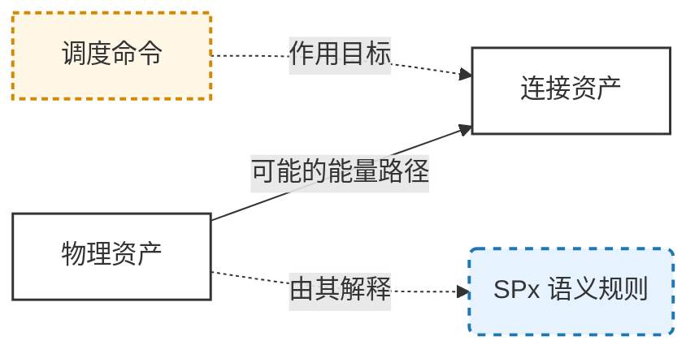
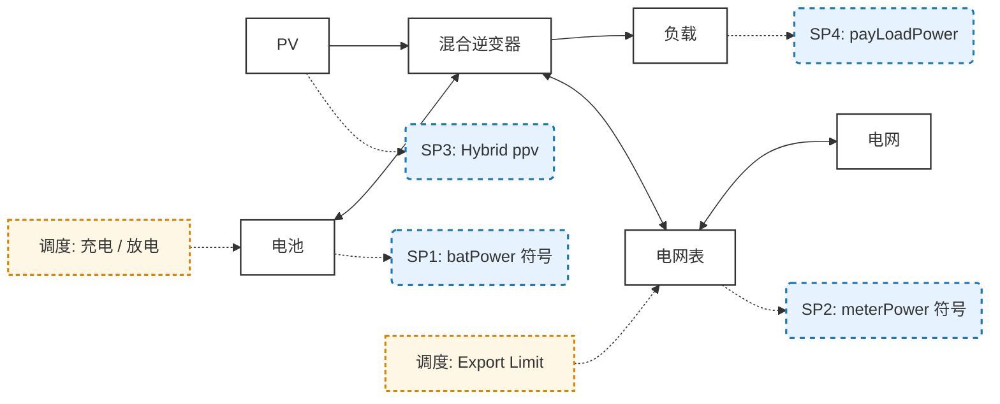
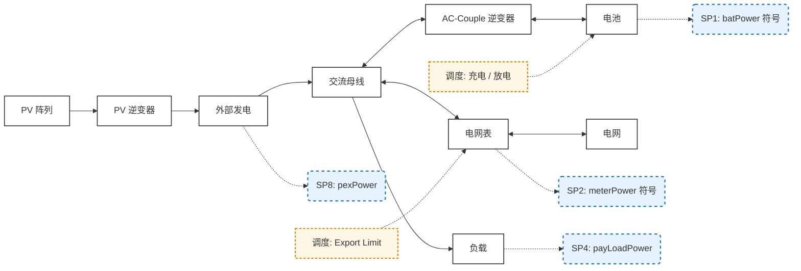
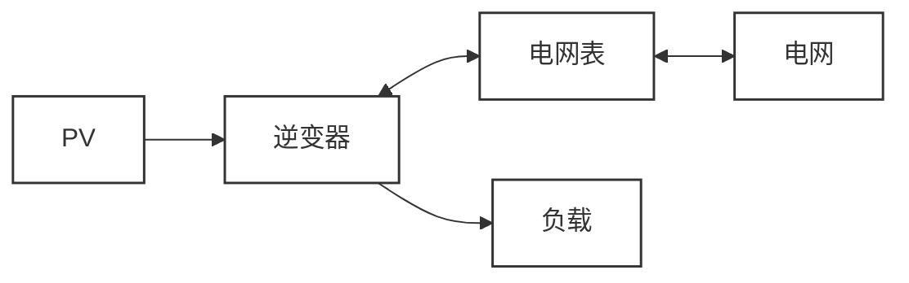
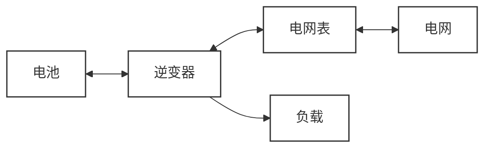
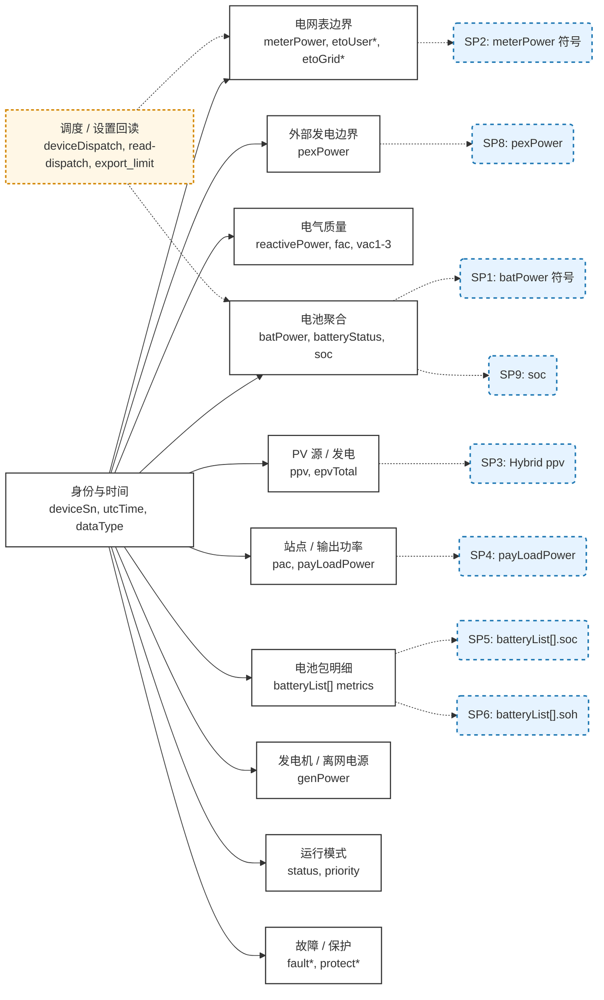
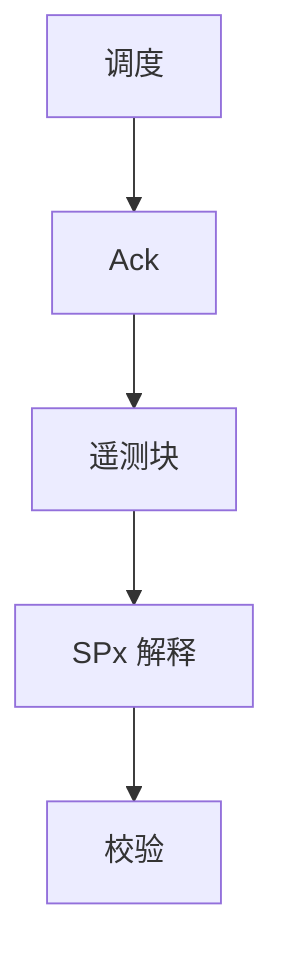
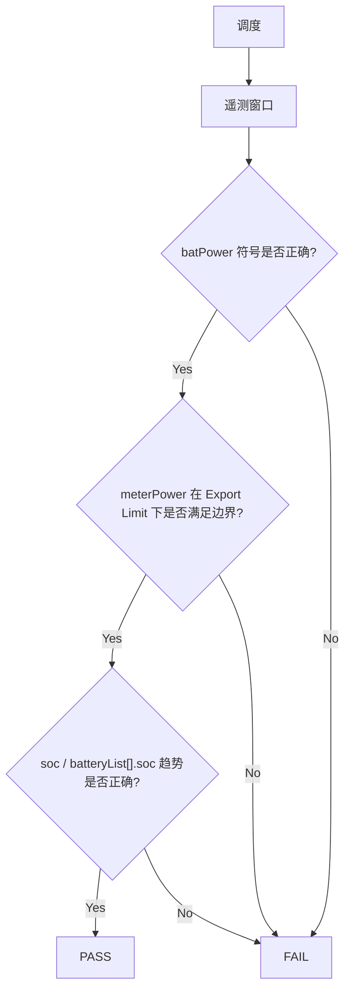

# Growatt ESS 语义模型与调度规范

**版本**: v1.1
**状态**: Public Standard  
**范围**: Growatt Unified OpenAPI / EMS 中与 VPP 相关的运行时遥测语义与调度校验  
**面向对象**: 集成方、方案架构师、校验团队与实施团队

---

# 1. 概述

本规范定义了面向 VPP 的公开运行时语义模型，将以下几个层面绑定在一起：

* **拓扑（能量流路径）**
* **遥测（公开运行时 payload 字段）**
* **语义解释（SPx）**
* **调度命令**
* **校验标准**

本附录中的遥测范围聚焦于当前已发布 payload 中与 VPP 相关的子集，来源如下：

* `08_api_device_data.md`
* `09_api_device_push.md`

`07_api_device_info.md` 中的静态能力元数据不属于本运行时遥测目录。

本次修订展示 4 类公开拓扑参考图：`Hybrid`、`AC-Couple`、`PV Only` 与 `Battery Only`。后续“运行时语义 / 遥测 / 调度校验”章节的规范化覆盖仍仅限于 `Hybrid` 与 `AC-Couple`。

v1.1 新增顶层 `soc` 作为整个 ESS 电池系统的系统级 SOC，并保留 `batteryList[].soc` 作为单个电池包的 SOC 信号。

---

# 2. 核心原则

## 2.1 分层

| 层 | 说明 |
| --- | --- |
| Topology | 物理能量路径 |
| Telemetry | 与 VPP 相关的公开运行时 payload 字段 |
| Semantic | 核心信号的解释规则 |
| Dispatch | 控制命令与约束 |
| Validation | Pass/Fail 判定逻辑 |

---

## 2.2 关键规则

> 图中的能量箭头表示“可能存在的功率路径”，而不是实时方向。  
> 实际方向由运行时遥测值结合 SPx 规则解释得出。

---

# 3. 可视化标准（Mermaid SSOT）



---

# 4. 拓扑 + 语义 + 调度模型

本章补充 4 类公开拓扑参考图：`Hybrid`、`AC-Couple`、`PV Only` 与 `Battery Only`。其中只有 `Hybrid` 与 `AC-Couple` 被纳入后续语义、遥测与调度校验章节的规范化运行时模型。

## 4.1 `Hybrid` 拓扑



在 `Hybrid` 拓扑中，`ppv` 仍是公开的核心 PV 源信号，`meterPower` 则是电网表边界上的可观测功率信号。`export_limit` 是作用在同一边界上的 Export Limit 设置值，应通过 dispatch / read-dispatch 链路回读，而不是当作运行时遥测字段。

## 4.2 `AC-Couple` 拓扑



在 `AC-Couple` 拓扑中，需要区分两个公开功率边界：

* `Grid Meter`（电网表）：绑定 `meterPower`、`etoUser*` 与 `etoGrid*`
* `External Generation`（外部发电边界）：绑定 `pexPower`

如果 `AC-Couple` payload 中上报了 `ppv`，它仍然只是设备本地 PV 遥测的辅助信号，不能替代 `External Generation` 边界信号 `pexPower`。

`export_limit` 在 `AC-Couple` 中不是边界遥测信号，而是 Export Limit 设置值。其配置值应通过 dispatch / read-dispatch 链路回读；实际并网送电行为仍通过电网表边界上的 `meterPower` 符号来观测。

`genPower` 在上报时表示离网场景下的 `generator power`（发电机功率），不属于本附录中的 AC-couple 外部发电边界模型。

## 4.3 `PV Only` 拓扑



`PV Only` 在此仅作为物理拓扑参考图展示。本次修订未为该拓扑新增公开运行时语义、SPx 定义或调度映射。

## 4.4 `Battery Only` 拓扑



`Battery Only` 在此仅作为物理拓扑参考图展示。本次修订未为该拓扑新增公开运行时语义、SPx 定义或调度映射。

---

# 5. 语义系统（SPx）

## 5.1 定义

| SPx | 名称 | 字段 | 目标 | 拓扑 |
| --- | --- | --- | --- | --- |
| SP1 | 电池功率符号 | `batPower` | Battery | Hybrid, AC Couple |
| SP2 | 电网表交换符号 | `meterPower` | Grid Meter | Hybrid, AC Couple |
| SP3 | Hybrid PV 源功率 | `ppv` | PV Source | Hybrid core; AC Couple optional |
| SP4 | 负载功率 | `payLoadPower` | Load | Hybrid, AC Couple |
| SP5 | 电池包 SOC | `batteryList[].soc` | Battery Pack | Hybrid, AC Couple |
| SP6 | 电池包 SOH | `batteryList[].soh` | Battery Pack | Hybrid, AC Couple |
| SP7 | Export Limit 设置值 | `export_limit` (dispatch readback setting) | Grid Meter | Hybrid, AC Couple |
| SP8 | 外部发电功率 | `pexPower` | External Generation | AC Couple only |
| SP9 | 系统级 SOC | `soc` | Battery Aggregate | Hybrid, AC Couple |

---

## 5.2 符号约定

### SP1 - 电池功率

| 值 | 含义 |
| --- | --- |
| >0 | 充电 |
| <0 | 放电 |

---

### SP2 - 电网表交换功率

| 值 | 含义 |
| --- | --- |
| >0 | 电网取电 |
| <0 | 向电网送电 |

`meterPower` 在站点交流侧与公用电网之间的电网表边界上解释。

---

### SP3 / SP4 / SP8

| 字段 | 规则 |
| --- | --- |
| `ppv` | `>= 0`；在 `Hybrid` 中是核心 PV 源信号，在 `AC-Couple` 中若与 `pexPower` 同时上报则为可选辅助遥测 |
| `payLoadPower` | `>= 0` |
| `pexPower` | 上报时应满足 `>= 0`；表示第三方电表 / Solar Inverter 的外部发电功率，不带取电/送电方向语义 |

本附录中的 `pexPower` 仅作为观测遥测使用，不定义公开调度目标，也不承担送电方向符号语义。

`genPower` 在上报时表示离网发电机功率。它仅保留为辅助运行时遥测，不映射为本附录中的公开边界 SPx 或调度目标。

---

### SP5 / SP6 / SP9

| 字段 | 规则 |
| --- | --- |
| `soc` | `[0,100]`；整个 ESS 电池系统的系统级 SOC |
| `batteryList[].soc` | `[0,100]`；单 pack SOC |
| `batteryList[].soh` | `[0,100]`；单 pack SOH |

---

### SP7

`export_limit` 是调度设置值，不是运行时遥测。其配置值通过 dispatch / read-dispatch 链路回读。实际并网取电/送电行为仍通过电网表边界上的 SP2（`meterPower`）来观测，其中 `>0` 表示取电，`<0` 表示送电。

---

# 6. 运行时遥测模型

## 6.1 核心语义信号映射

| 公开信号 | 字段 | 规则 | 单位 | Payload | 拓扑 |
| --- | --- | --- | --- | --- | --- |
| 电池功率 | `batPower` | >0 充电，<0 放电 | `W` | Query, Push | Hybrid, AC Couple |
| 电网表交换功率 | `meterPower` | 在电网表边界，>0 取电，<0 送电 | `W` | Query, Push | Hybrid, AC Couple |
| Hybrid PV 源功率 | `ppv` | >= 0；在 `Hybrid` 中为核心信号，在 `AC-Couple` 中若与 `pexPower` 同时上报则为辅助信号 | `W` | Query, Push | Hybrid core; AC Couple optional |
| 外部发电功率 | `pexPower` | 在外部发电边界上报时应满足 >= 0 | `W` | Query, Push | AC Couple |
| 发电机功率 | `genPower` | 上报时应满足 >= 0；用于离网发电机运行场景，不是 AC-Couple 边界信号 | `W` | Query, Push | Off-grid runtime only |
| 负载功率 | `payLoadPower` | 站点计算负载 | `W` | Query, Push | Hybrid, AC Couple |
| 系统级 SOC | `soc` | 整个 ESS 电池系统的总 SOC | `%` | Query, Push | Hybrid, AC Couple |
| 电池包 SOC | `batteryList[].soc` | 单 pack SOC | `%` | Query, Push | Hybrid, AC Couple |
| 电池包 SOH | `batteryList[].soh` | 单 pack SOH | `%` | Query, Push | Hybrid, AC Couple |

---

`export_limit` 有意不纳入本表的运行时遥测映射。它是一个通过 dispatch / read-dispatch 链路回读的 Export Limit 设置值，而不是运行时遥测字段。实际送电行为应通过 `meterPower` 的符号以及电网表电量计数（`etoGrid*`、`etoUser*`）来观测。

## 6.2 遥测块关系



`External Generation Boundary` 仅适用于 `AC-Couple`。`Generator / Off-grid Source` 是面向带发电机离网模式的辅助运行时遥测，在本次修订中不映射到公开边界 SPx。`PV Source / Generation` 在 `Hybrid` 中仍是核心语义块，在 `AC-Couple` 中则是 `ppv` 上报时才启用的可选辅助块。

---

## 6.3 单位归一化

| 类别 | 字段 | 单位 |
| --- | --- | --- |
| 功率 | `meterPower`, `pexPower`, `genPower`, `batPower`, `ppv`, `pac`, `payLoadPower`, `batteryList[].chargePower`, `batteryList[].dischargePower` | `W` |
| 电量 | `etoUserToday`, `etoUserTotal`, `etoGridToday`, `etoGridTotal`, `epvTotal`, `batteryList[].echargeToday`, `batteryList[].echargeTotal`, `batteryList[].edischargeToday`, `batteryList[].edischargeTotal` | `kWh` |
| 电压 | `vac1`, `vac2`, `vac3`, `batteryList[].vbat` | `V` |
| 频率 | `fac` | `Hz` |
| 百分比 | `soc`, `batteryList[].soc`, `batteryList[].soh` | `%` |
| 电流 | `batteryList[].ibat` | `A` |
| 代码 / 枚举 | `status`, `priority`, `batteryStatus`, `batteryList[].status`, `faultCode`, `faultSubCode`, `protectCode`, `protectSubCode`, `dataType` | Code / enum |

`reactivePower` 继续保持 vendor payload 的现有形式与公开符号说明；本附录不重新定义其单位。

---

## 6.4 遥测块目录

### 身份与时间

| 字段 | Payload | 说明 |
| --- | --- | --- |
| `deviceSn` | Query, Push | 设备序列号 |
| `utcTime` | Query, Push | UTC 时间戳，格式为 `yyyy-MM-dd HH:mm:ss` |
| `dataType` | Push | 推送包络类型，公开固定值为 `dfcData` |

### 电网表边界

| 字段 | Payload | 说明 |
| --- | --- | --- |
| `meterPower` | Query, Push | 电网表边界上的电网表功率。正值表示电网取电，负值表示向电网送电 |
| `etoUserToday` | Query, Push | 当日电网表边界取电电量 |
| `etoUserTotal` | Query, Push | 累计电网表边界取电电量 |
| `etoGridToday` | Query, Push | 当日电网表边界送电电量 |
| `etoGridTotal` | Query, Push | 累计电网表边界送电电量 |

### 外部发电边界

| 字段 | Payload | 说明 |
| --- | --- | --- |
| `pexPower` | Query, Push | `AC-Couple` 拓扑下的外部发电功率，通常来源于第三方电表或 Solar Inverter。应视为非负的外部发电功率量值，而不是电网取电/送电符号字段 |

### 发电机 / 离网电源

| 字段 | Payload | 说明 |
| --- | --- | --- |
| `genPower` | Query, Push | 离网运行场景下的发电机功率。应视为非负的发电机功率量值，而不是 AC-Couple 外部发电边界信号 |

### 电气质量

| 字段 | Payload | 说明 |
| --- | --- | --- |
| `reactivePower` | Query, Push | 保留当前文档中关于容性/感性符号说明的无功功率值 |
| `fac` | Query, Push | 电网频率 |
| `vac1` | Query, Push | 线电压 1 |
| `vac2` | Query, Push | 线电压 2 |
| `vac3` | Query, Push | 线电压 3 |

### PV 源 / 发电

| 字段 | Payload | 说明 |
| --- | --- | --- |
| `ppv` | Query, Push | 设备本地 PV 源功率。在 `Hybrid` 中为核心信号；在 `AC-Couple` 中若与 `pexPower` 同时上报则为辅助信号 |
| `epvTotal` | Query, Push | PV 累计发电量 |

### 站点 / 输出功率

| 字段 | Payload | 说明 |
| --- | --- | --- |
| `pac` | Query, Push | 交流输出功率 |
| `payLoadPower` | Query, Push | 计算得到的总负载功率 |

### 电池聚合

| 字段 | Payload | 说明 |
| --- | --- | --- |
| `batPower` | Query, Push | 聚合电池充放电功率。正值表示充电，负值表示放电 |
| `soc` | Query, Push | 整个 ESS 电池系统的系统级电池荷电状态 |
| `batteryStatus` | Query, Push | 电池总体状态码 |

### 电池包明细

| 字段 | Payload | 说明 |
| --- | --- | --- |
| `batteryList[].index` | Query, Push | 电池包索引，从 1 开始 |
| `batteryList[].soc` | Query, Push | 单 pack 电池 SOC |
| `batteryList[].chargePower` | Query, Push | 单 pack 充电功率 |
| `batteryList[].dischargePower` | Query, Push | 单 pack 放电功率 |
| `batteryList[].ibat` | Query, Push | 低压侧电池电流 |
| `batteryList[].vbat` | Query, Push | 低压侧电池电压 |
| `batteryList[].soh` | Query, Push | 单 pack 电池 SOH |
| `batteryList[].status` | Query, Push | 上报时的单 pack 状态码 |
| `batteryList[].echargeToday` | Query, Push | 当日充电电量 |
| `batteryList[].echargeTotal` | Query, Push | 累计充电电量 |
| `batteryList[].edischargeToday` | Query, Push | 当日放电电量 |
| `batteryList[].edischargeTotal` | Query, Push | 累计放电电量 |

### 运行模式

| 字段 | Payload | 说明 |
| --- | --- | --- |
| `status` | Query, Push | 设备运行状态码 |
| `priority` | Query, Push | 运行优先级代码 |

### 故障 / 保护

| 字段 | Payload | 说明 |
| --- | --- | --- |
| `faultCode` | Query, Push | 故障主码 |
| `faultSubCode` | Query, Push | 故障子码 |
| `protectCode` | Query, Push | 保护主码 |
| `protectSubCode` | Query, Push | 保护子码 |

---

# 7. 调度模型

## 7.1 类型

| 调度 | 目标 |
| --- | --- |
| Charge | Battery |
| Discharge | Battery |
| Export Limit | Grid Meter |
| Control | Inverter |

---

## 7.2 映射

| 调度 | 观测运行时字段 | 控制字段 |
| --- | --- | --- |
| Charge | `batPower`, `soc`, `batteryList[].soc` | `time_slot_charge_discharge`, `duration_and_power_charge_discharge`, `remote_charge_discharge_power` |
| Discharge | `batPower`, `soc`, `batteryList[].soc` | `time_slot_charge_discharge`, `duration_and_power_charge_discharge`, `remote_charge_discharge_power` |
| Export Limit | `meterPower`, `etoGridToday`, `etoGridTotal` | `export_limit`（dispatch setting；通过 read-dispatch 回读） |
| Control | `status`, `priority`, power blocks | `enable_control`, `active_power_derating_percentage`, `active_power_percentage` |

在本次修订中，`pexPower` 仅用于 `AC-Couple` 外部发电边界校验观测，不映射到公开调度/控制字段。

`genPower` 仍保留为离网发电机运行的辅助遥测，也不映射到公开调度/控制字段。

`export_limit` 是通过 dispatch / read-dispatch 链路回读的 Export Limit 设置值。实际送电方向与幅值仍通过 `meterPower`（负值表示送电）以及 `etoGrid*` / `etoUser*` 来观测。

`enable_control`、`active_power_derating_percentage`、`active_power_percentage` 和 `remote_charge_discharge_power` 都属于通过 dispatch / read-dispatch 回读的控制型参数，不纳入本附录的运行时遥测映射。

---

# 8. 运行时覆盖矩阵

## 8.1 按拓扑划分的运行时覆盖

| 块 | Hybrid | AC Couple |
| --- | --- | --- |
| 身份与时间 | Core | Core |
| 电网表边界 | Core | Core |
| 外部发电边界 | N/A | Core |
| 电气质量 | Core | Core |
| PV 源 / 发电 | Core | Optional |
| 站点 / 输出功率 | Core | Core |
| 电池聚合 | Core | Core |
| 电池包明细 | Core | Core |
| 运行模式 | Core | Core |
| 故障 / 保护 | Core | Core |

---

## 8.2 说明

* `payLoadPower` 是本附录中唯一建模的公开负载语义信号。
* `ppv` 在 `Hybrid` 中仍是核心 PV 源语义信号。
* 在 `AC-Couple` 中，`pexPower` 是首要的公开外部发电边界信号，而 `ppv` 在出现时仍然只是辅助信号。
* `genPower` 被记录为离网发电机辅助遥测，仍不属于本次修订的规范化 Hybrid / AC-Couple 边界覆盖范围。
* `PV Only` 与 `Battery Only` 已补充为物理拓扑参考图，但不属于本次修订的规范化运行时覆盖范围。

---

# 9. 调度校验框架

## 9.1 校验层

| 层 | 检查点 |
| --- | --- |
| Command | accepted |
| Telemetry | changed |
| Semantic | sign / boundary 正确 |
| Behavior | 在观测窗口内保持一致 |

---

# 10. 校验规则

## 10.1 充电

**期望**

* `batPower` > 0
* `soc` 在上报时应在观测窗口内单调不减
* `batteryList[].soc` 在电池包明细上报时应按 pack 单调不减

**Pass**

```text
batPower remains positive and SOC does not trend downward
```

---

## 10.2 放电

**期望**

* `batPower` < 0
* `soc` 在上报时应在观测窗口内单调不增
* `batteryList[].soc` 在电池包明细上报时应按 pack 单调不增

---

## 10.3 Export Limit

**期望**

* 配置后的 `export_limit` 设置值可通过 dispatch / read-dispatch 链路读回，并与目标 Export Limit 一致
* 实际送电行为通过 `meterPower` 观测，其中负值表示送电
* `meterPower` 在送电方向上保持在已配置的导出边界以内
* 在 Export Limit 生效时，`meterPower` 在电网表边界上不应比配置的导出限制更负

---

# 11. 验收标准

## 11.1 通用

| 项目 | 要求 |
| --- | --- |
| Ack | < 5s |
| First response | <= 1 cycle |
| Stable window | 2-5 cycles |

---

## 11.2 容差

| 指标 | 值 |
| --- | --- |
| 功率容差 | +/-3% |
| 稳定时间 | 30-120s |

---

## 11.3 结果

| 结果 | 条件 |
| --- | --- |
| Pass | 所有必需层均满足 |
| Fail | 存在不匹配 |
| Pending | 数据不足 |

---

# 12. 失败码

| 代码 | 含义 |
| --- | --- |
| V001 | No ack |
| V002 | No telemetry |
| V003 | Wrong sign |
| V004 | Unstable |
| V005 | Limit not enforced |
| V006 | Insufficient window |
| V007 | Conflicting conditions |

---

# 13. 校验流程



---

# 14. 调度校验逻辑



---

# 15. 执行摘要

本规范将公开 ESS 拓扑参考、运行时语义、调度与遥测整理为一个统一模型，并补充了 `Hybrid`、`AC-Couple`、`PV Only` 与 `Battery Only` 4 类拓扑参考图。  
本次修订的规范化运行时语义、遥测与调度校验覆盖仍聚焦于 `Hybrid` 与 `AC-Couple`，其中 `pexPower` 被定义为 AC-couple 的外部发电边界信号，而 `genPower` 仅保留为离网发电机辅助遥测。`PV Only` 与 `Battery Only` 仍仅作为物理拓扑参考展示。
系统级 `soc` 是公开的整体 ESS 电池 SOC 信号，`batteryList[].soc` 仍表示单个电池包 SOC 明细。
