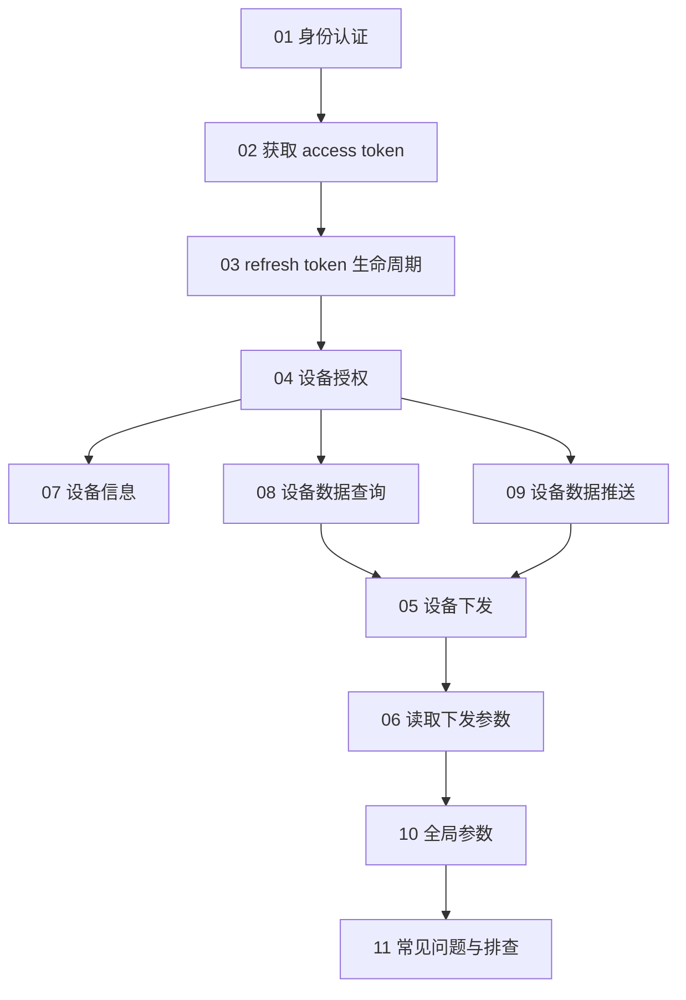
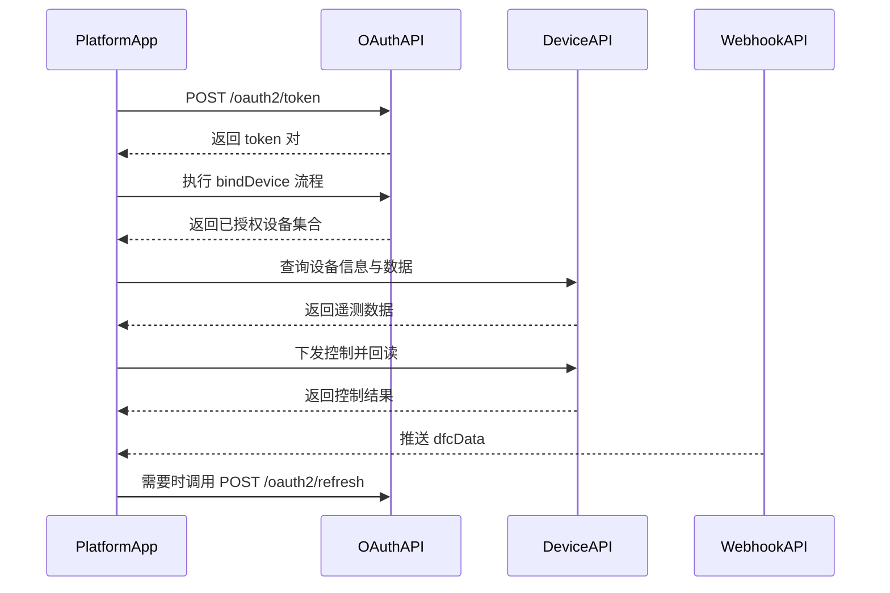

# Growatt Open API 文档

版本：V1.0 | 发布日期：2026 年 3 月 4 日

本文件夹包含 Growatt Open API 的结构化文档。

## 集成路线图（概念）

## 集成路线图（请求顺序）

## 文档结构

| 文件 | 说明 |
| :--- | :--- |
| [01_authentication.md](./01_authentication.md) | OAuth2.0 授权模式与流程总览 |
| [02_api_access_token.md](./02_api_access_token.md) | 获取 access_token 接口 |
| [03_api_refresh.md](./03_api_refresh.md) | OAuth2 刷新令牌接口 |
| [04_api_device_auth.md](./04_api_device_auth.md) | 设备授权接口（绑定 / 解绑设备） |
| [05_api_device_dispatch.md](./05_api_device_dispatch.md) | 设备参数下发接口 |
| [06_api_read_dispatch.md](./06_api_read_dispatch.md) | 设备下发参数回读接口 |
| [07_api_device_info.md](./07_api_device_info.md) | 设备信息查询 API |
| [08_api_device_data.md](./08_api_device_data.md) | 设备高频数据查询接口 |
| [09_api_device_push.md](./09_api_device_push.md) | 设备数据推送接口 |
| [10_global_params.md](./10_global_params.md) | 全局参数（域名、权限、设备参数） |
| [11_api_troubleshooting.md](./11_api_troubleshooting.md) | 面向测试环境联调的常见问题与排查 FAQ |

## 快速开始

### 1. 身份认证

首先通过理解 [身份认证说明](./01_authentication.md) 来了解以下内容：
- 授权码模式
- 客户端凭证模式
- OAuth2.0 授权流程概览

### 2. 获取访问令牌

通过 [获取 access_token 接口](./02_api_access_token.md) 获取访问令牌。

### 3. 刷新令牌

当访问令牌过期后，使用 [OAuth2 刷新令牌接口](./03_api_refresh.md) 刷新令牌。

### 4. 设备管理

- [获取可授权设备列表](./04_api_device_auth.md#331-获取可授权设备列表)
- [授权设备](./04_api_device_auth.md#332-授权设备)
- [获取已授权设备列表](./04_api_device_auth.md#333-获取已授权设备列表)
- [取消设备授权](./04_api_device_auth.md#334-取消设备授权)

### 5. 设备操作

- [设备下发](./05_api_device_dispatch.md) - 设置设备参数
- [读取下发参数](./06_api_read_dispatch.md) - 读取设备参数
- [设备信息](./07_api_device_info.md) - 查询设备信息
- [设备数据](./08_api_device_data.md) - 查询设备高频数据
- [设备数据推送](./09_api_device_push.md) - 接收设备推送数据

### 6. 常见问题与排查

- [常见问题与排查 FAQ](./11_api_troubleshooting.md) - 汇总 `api-test.growatt.com:9290` 联调中已验证的坑点与正确动作

## API 端点摘要

| Endpoint | Method | 说明 |
| :--- | :--- | :--- |
| `/oauth2/token` | POST | 获取 access_token |
| `/oauth2/refresh` | POST | 刷新 access_token |
| `/oauth2/getApiDeviceList` | POST | 获取可授权设备列表 |
| `/oauth2/bindDevice` | POST | 授权设备 |
| `/oauth2/getApiDeviceListAuthed` | POST | 获取已授权设备列表 |
| `/oauth2/unbindDevice` | POST | 取消设备授权 |
| `/oauth2/getDeviceInfo` | POST | 获取设备信息 |
| `/oauth2/deviceDispatch` | POST | 设置设备参数 |
| `/oauth2/readDdeviceDispatch` | POST | 读取设备参数 |
| `/oauth2/getDeviceData` | POST | 查询设备数据 |

## 域名

### 生产环境
- `https://opencloud.growatt.com`
- `https://opencloud-au.growatt.com`

### 测试环境
- `https://opencloud-test.growatt.com`

## Token 有效期

- `access_token`：2 小时（7200 秒）
- `refresh_token`：30 天（2592000 秒）

## 快速指南

如需包含更简单示例的快速开始指南，请参阅：[/growatt-openapi/quick-guide](/growatt-openapi/quick-guide)

## 原始汇总文档

完整统一版文档可参考：[../Growatt Unified API.md](../Growatt Unified API.md)
