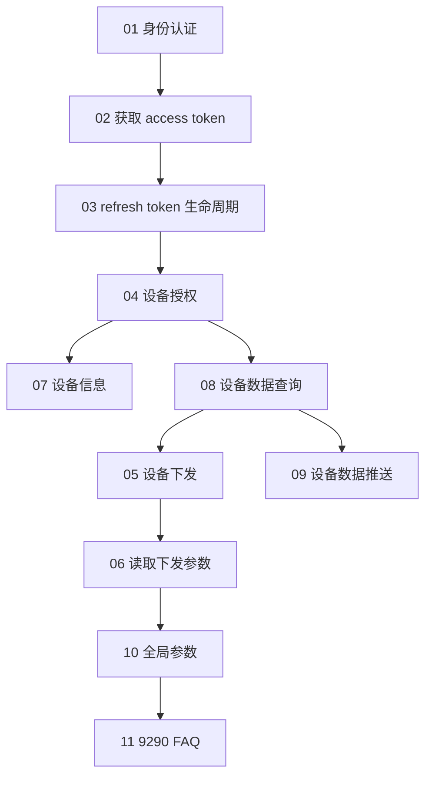

# Growatt Open API 文档

版本：V1.0 | 发布日期：2026 年 3 月 4 日

本目录为 Growatt Open API 的中文主规范文档集合。端点级文档为中文 SSOT；`11_api_troubleshooting.md` 仅记录 9290 测试环境兼容事实。

## 集成路线图（概念）

## 文档结构

| 文件 | 说明 |
| :--- | :--- |
| [01_authentication.md](./01_authentication.md) | OAuth2 模式与能力边界 |
| [02_api_access_token.md](./02_api_access_token.md) | 获取 access token |
| [03_api_refresh.md](./03_api_refresh.md) | 刷新 access token |
| [04_api_device_auth.md](./04_api_device_auth.md) | 设备发现、授权与解除授权 |
| [05_api_device_dispatch.md](./05_api_device_dispatch.md) | 设备下发 |
| [06_api_read_dispatch.md](./06_api_read_dispatch.md) | 调度参数回读 |
| [07_api_device_info.md](./07_api_device_info.md) | 设备静态信息查询 |
| [08_api_device_data.md](./08_api_device_data.md) | 设备遥测查询 |
| [09_api_device_push.md](./09_api_device_push.md) | 设备数据推送 |
| [10_global_params.md](./10_global_params.md) | 全局参数、响应码与 setType 索引 |
| [11_api_troubleshooting.md](./11_api_troubleshooting.md) | 9290 测试环境 FAQ |

## 快速开始

### 1. 认证与 token

- [身份认证说明](./01_authentication.md)
- [获取 access_token 接口](./02_api_access_token.md)
- [OAuth2-refresh 接口](./03_api_refresh.md)

### 2. 设备授权

- `authorization_code` 模式：先读 [设备授权 API](./04_api_device_auth.md) 中的 `getDeviceList` 与 `bindDevice`
- `client_credentials` 模式：通常从 `bindDevice` 开始

### 3. 设备查询与调度

- [设备信息查询 API](./07_api_device_info.md)
- [设备数据查询 API](./08_api_device_data.md)
- [设备下发 API](./05_api_device_dispatch.md)
- [读取设备下发参数 API](./06_api_read_dispatch.md)
- [设备数据推送 API](./09_api_device_push.md)

### 4. 全局规则与兼容说明

- [全局参数说明](./10_global_params.md)
- [常见问题与排查 FAQ](./11_api_troubleshooting.md)

## API 端点摘要

| Endpoint | Method | 说明 |
| :--- | :--- | :--- |
| `/oauth2/token` | POST | 获取 access token |
| `/oauth2/refresh` | POST | 刷新 access token |
| `/oauth2/getDeviceList` | POST | 获取可授权设备列表，仅 `authorization_code` 模式支持 |
| `/oauth2/bindDevice` | POST | 授权设备 |
| `/oauth2/getDeviceListAuthed` | POST | 获取已授权设备列表 |
| `/oauth2/unbindDevice` | POST | 解除设备授权 |
| `/oauth2/getDeviceInfo` | POST | 获取设备信息 |
| `/oauth2/getDeviceData` | POST | 获取设备遥测 |
| `/oauth2/deviceDispatch` | POST | 设置设备参数 |
| `/oauth2/readDeviceDispatch` | POST | 读取设备参数 |

## 域名

### 生产环境

- `https://opencloud.growatt.com`
- `https://opencloud-au.growatt.com`

### 测试环境

- `https://opencloud-test.growatt.com`

## Token 生命周期

- 文档中的 TTL 数值仅代表示例响应，不应视为固定常量。
- `authorization_code` 与 `client_credentials` 的实际有效期都应以实时返回的 `expires_in` / `refresh_expires_in` 为准。

## 快速指南

如需面向方案与集成的整合说明，请参阅：

- [../Growatt Open API Professional Integration Guide.zh-CN.md](../Growatt Open API Professional Integration Guide.zh-CN.md)

## 附录

- [Growatt Codes](/growatt-openapi/growatt-codes)
