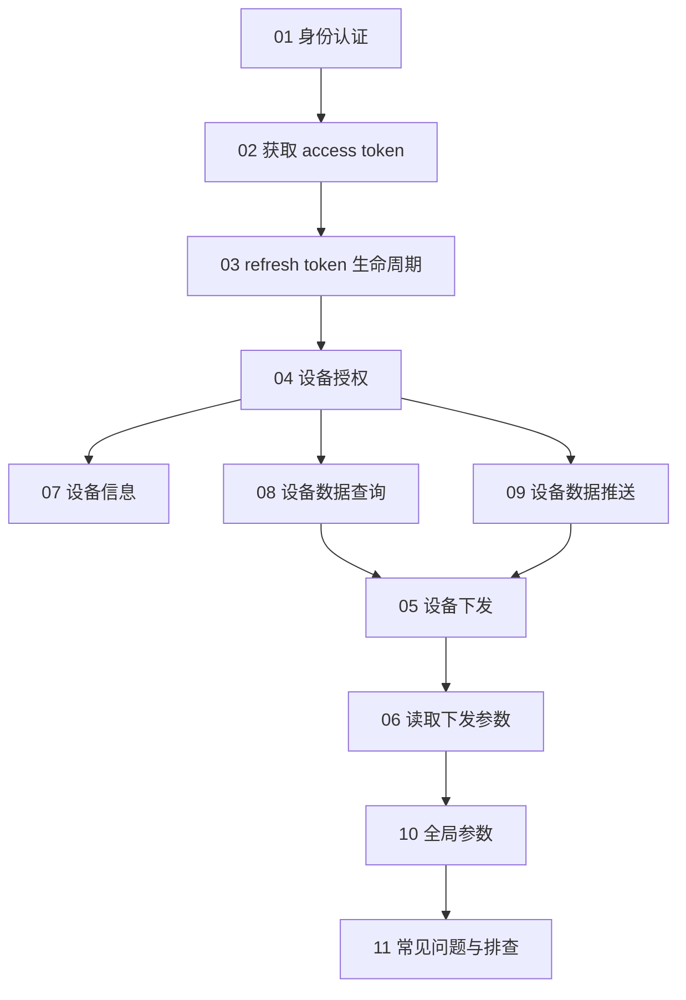
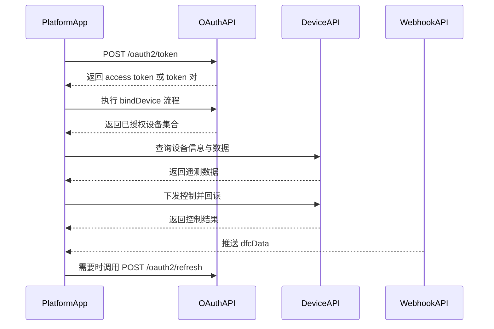

# Growatt Open API 文档

本目录是面向站点发布的中文拆分文档，负责按端点组织说明、补足交叉引用，并将联调观察与主要 API 描述分开展示。

## 集成路线图（概念）

## 集成路线图（请求顺序）

## 文档结构

| 文件 | 说明 |
| :--- | :--- |
| [01_authentication.md](./01_authentication.md) | 身份认证说明 |
| [02_api_access_token.md](./02_api_access_token.md) | 获取 `access_token` |
| [03_api_refresh.md](./03_api_refresh.md) | 刷新 `access_token` |
| [04_api_device_auth.md](./04_api_device_auth.md) | 设备授权与解除授权 |
| [05_api_device_dispatch.md](./05_api_device_dispatch.md) | 设备调度 |
| [06_api_read_dispatch.md](./06_api_read_dispatch.md) | 读取设备调度参数 |
| [07_api_device_info.md](./07_api_device_info.md) | 设备信息查询 |
| [08_api_device_data.md](./08_api_device_data.md) | 设备数据查询 |
| [09_api_device_push.md](./09_api_device_push.md) | 设备数据推送 |
| [10_global_params.md](./10_global_params.md) | 全局参数说明 |
| [11_api_troubleshooting.md](./11_api_troubleshooting.md) | 常见问题与排查 FAQ |

## 快速导航

- [身份认证说明](./01_authentication.md)
- [获取 access_token 接口](./02_api_access_token.md)
- [OAuth2-refresh 接口](./03_api_refresh.md)
- [设备授权 API](./04_api_device_auth.md)
- [设备调度 API](./05_api_device_dispatch.md)
- [读取设备调度参数 API](./06_api_read_dispatch.md)
- [设备信息查询 API](./07_api_device_info.md)
- [设备数据查询 API](./08_api_device_data.md)
- [设备数据推送 API](./09_api_device_push.md)
- [全局参数说明](./10_global_params.md)
- [常见问题与排查 FAQ](./11_api_troubleshooting.md)

## 关键说明

- `authorization_code` token 请求要求 `redirect_uri`，并返回可刷新的 token 集。
- `client_credentials` token 请求可不携带 `redirect_uri`；2026-04-23 AU 实测返回 access-token-only 字段。
- `POST /oauth2/getDeviceList` 仅在 `authorization_code` 模式下支持。
- `POST /oauth2/bindDevice` 中，`deviceSnList[].pinCode` 在客户端模式下必填。
- `POST /oauth2/readDeviceDispatch` 的参数表将 `requestId` 标为必填。
- 测试环境域名包含 `https://opencloud-test-au.growatt.com`。

## 入口指南

如需阅读整合型说明，请参阅：

- [../Growatt Open API Professional Integration Guide.zh-CN.md](../Growatt Open API Professional Integration Guide.zh-CN.md)

## 附录

- [附录A Growatt Codes](/growatt-openapi/growatt-codes)
- [附录B 术语表](./12_ess_terminology.md)
- [附录C 语义模型](./13_ess_semantic_model.md)
