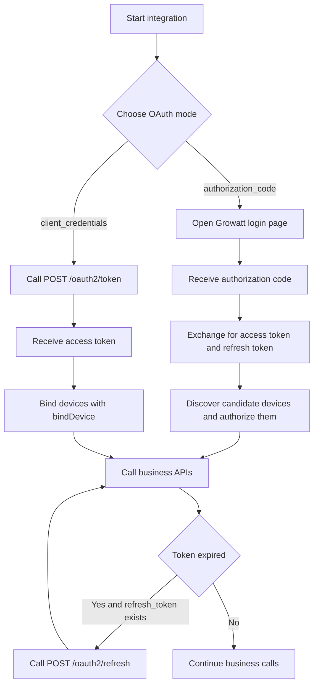
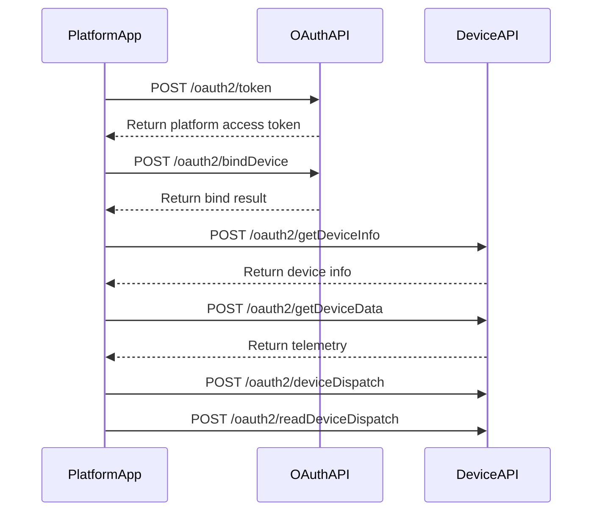

# Growatt Open API - Authentication Guide

Version: V1.0 | Release Date: March 4, 2026

This document explains the two OAuth2.0 integration modes used by the current Growatt Open API documentation set, together with the API capability boundary of each mode.

## Recommended Integration Flow



---

## 1 OAuth2.0 Authorization Modes

> **Prerequisites**
> - The third-party platform must obtain `client_id` and `client_secret` from Growatt.
> - If the platform needs pushed device data, it must provide its own functional webhook URL.

### 1.1 `authorization_code` mode

This mode is for integrations where a Growatt end-user logs in and grants access inside the third-party platform.

Typical characteristics:

- The Growatt end-user completes the Growatt login and consent flow.
- The third-party platform exchanges a `code` for a user-scoped `access_token`.
- The token response includes a `refresh_token`.
- The candidate-device discovery API `POST /oauth2/getDeviceList` is supported only in this mode.

### 1.2 `client_credentials` mode

This mode is for platform-to-platform integrations where the third-party service connects directly to Growatt.

Typical characteristics:

- The third-party platform directly calls `POST /oauth2/token` with `client_id` and `client_secret`.
- Clients must not assume that a `refresh_token` is always returned.
- Device onboarding typically starts from `bindDevice` with a known `deviceSn`; when required, `pinCode` must be included.
- `POST /oauth2/getDeviceList` is not part of the standard discovery flow for this mode.

### 1.3 Capability Boundary

| Capability | `authorization_code` | `client_credentials` |
| :--- | :--- | :--- |
| Get access token | Supported | Supported |
| Receive refresh token | Supported | Depends on actual response; not guaranteed |
| Refresh access token | Supported | Only when the actual token response includes `refresh_token` |
| Get candidate device list `getDeviceList` | Supported | Not supported |
| Bind device `bindDevice` | Supported | Supported; `pinCode` is commonly required |
| Get authorized device list `getDeviceListAuthed` | Supported | Supported |
| Query device info / data | Supported | Supported |
| Dispatch / read back parameters | Supported | Supported |

---

## 2 OAuth2.0 Flow Overview

### 2.1 `authorization_code` mode

1. The third-party platform opens the Growatt login page.
2. The Growatt end-user logs in and approves authorization.
3. Growatt returns an `authorization_code` to the configured `redirect_uri`.
4. The third-party platform exchanges the code by calling `POST /oauth2/token`.
5. The third-party platform stores the user-scoped `access_token` and `refresh_token`, and maps them to the platform user.
6. The platform calls `POST /oauth2/getDeviceList`, `POST /oauth2/bindDevice`, and other business APIs.
7. When the `access_token` expires, the platform calls `POST /oauth2/refresh`. When the `refresh_token` also expires, the user must authorize again.

Authorization-code token example:

```json
{
    "access_token": "lyoAlLQaRr9y5pMFsEmh7gyUAaVuBCQo1V7FlwNeA22o7vAH2DJSVqEKkGh4",
    "refresh_token": "wx71QkaF7vceFg9UwjUtum498XeYhXZiCu7iQvAeXQ1AMslXXe2SELJ8cd3a",
    "refresh_expires_in": 2592000,
    "token_type": "Bearer",
    "expires_in": 7200
}
```

> The `expires_in` / `refresh_expires_in` values above are example values only. The real token lifetime must always follow the live response from the target environment.

### 2.2 `client_credentials` mode

1. The third-party platform calls `POST /oauth2/token` and receives a platform-scoped `access_token`.
2. The platform binds devices using `POST /oauth2/bindDevice`; when the device requires `pinCode`, it must be sent together with the raw `deviceSn`.
3. The platform calls `POST /oauth2/getDeviceListAuthed`, `POST /oauth2/getDeviceInfo`, `POST /oauth2/getDeviceData`, and other business APIs.
4. If control is needed, the platform uses `POST /oauth2/deviceDispatch` together with `POST /oauth2/readDeviceDispatch`.
5. Token lifecycle handling must follow the actual response. If the response does not include `refresh_token`, obtain a new token after expiry instead of calling the refresh API.



### 2.3 9290 Test-Environment Compatibility Note

In the verified `https://api-test.growatt.com:9290` environment:

- The `client_credentials` token response typically contains only `access_token`, `token_type`, and `expires_in`.
- The `expires_in` / `refresh_expires_in` values for both grant types may vary by environment and over time, so example TTLs must not be treated as fixed constants.
- Calling `POST /oauth2/getDeviceList` with a `client_credentials` token returns `WRONG_GRANT_TYPE` (`code=103`).
- Business APIs are typically called with `Authorization: Bearer <access_token>`.

These are environment-specific compatibility facts and do not change the normative endpoint descriptions in this directory.

---

## Related Documentation

- [Get access_token API](./02_api_access_token.md)
- [OAuth2-refresh API](./03_api_refresh.md)
- [Device Authorization API](./04_api_device_auth.md)
