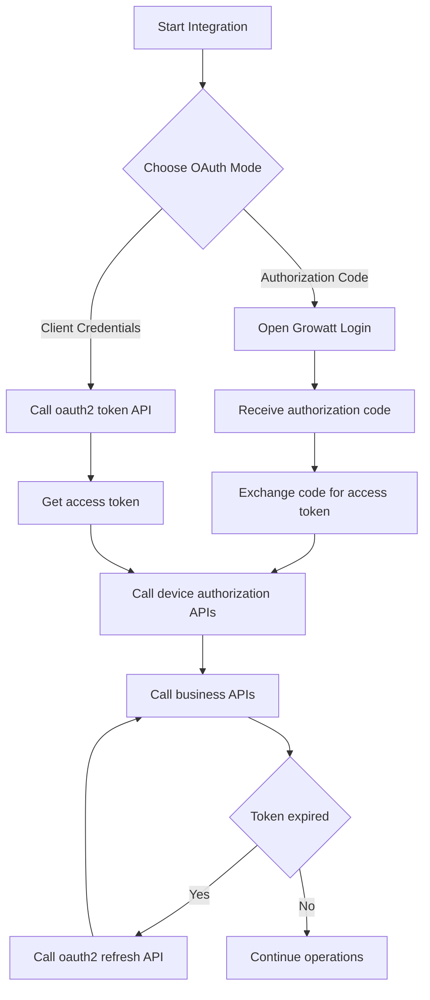
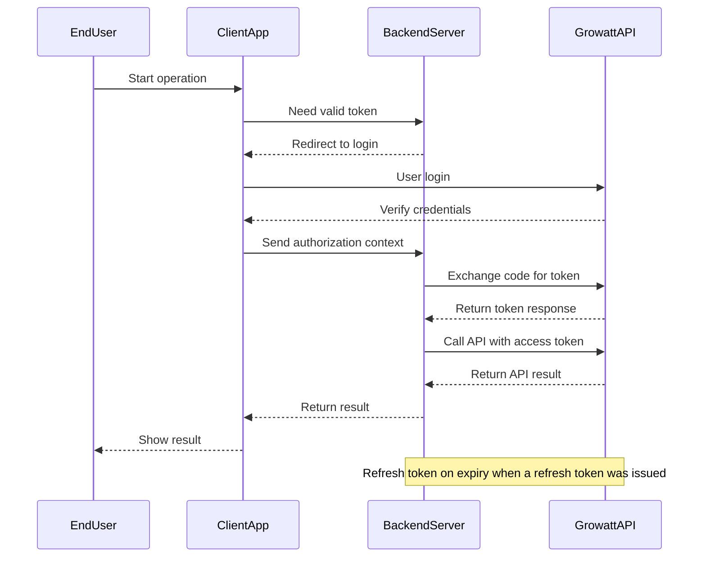

# Growatt Open API - Authentication Guide

This page summarizes the supported authentication modes and capability boundaries for Growatt Open API. If later environment testing behaves differently, treat that behavior as an observation rather than as a replacement for the endpoint descriptions documented here.

## Recommended Integration Flow

## Supported Grant Types

| `grant_type` | Meaning | Capability boundary |
| :--- | :--- | :--- |
| `authorization_code` | End-user authorization code exchanged for `access_token` | Supports `POST /oauth2/getDeviceList` |
| `client_credentials` | Platform obtains `access_token` with `client_id` / `client_secret` | `POST /oauth2/bindDevice` requires `pinCode` in client mode |

## Token Rules

- Both grant types use `POST /oauth2/token` to obtain `access_token`.
- In `authorization_code` mode, `redirect_uri` is required and the token response returns `access_token`, `refresh_token`, `refresh_expires_in`, `token_type`, and `expires_in`.
- In `client_credentials` mode, `redirect_uri` is optional / compatibility-accepted. The 2026-04-23 AU full run accepted requests both with and without `redirect_uri` and returned only `access_token`, `token_type`, and `expires_in`.
- `POST /oauth2/refresh` applies only when the previous token response issued a `refresh_token`; do not assume a `client_credentials` token can be refreshed unless its response explicitly includes `refresh_token`.

## Capability Matrix

| Capability | `authorization_code` | `client_credentials` |
| :--- | :--- | :--- |
| Get access token | Supported | Supported |
| Refresh access token | Supported when a `refresh_token` was issued | Not available in the 2026-04-23 AU `client_credentials` response because no `refresh_token` was issued |
| Get candidate devices `getDeviceList` | Supported | Not supported |
| Bind devices `bindDevice` | Supported | Supported, and `pinCode` is required in client mode |
| Get authorized devices `getDeviceListAuthed` | Supported | Supported |

## OAuth2.0 Flow Overview

## Implementation Pointers

- For endpoint parameters and examples, continue with [Get access_token API](./02_api_access_token.md) and [Device Authorization API](./04_api_device_auth.md).
- For environment-specific findings, use the explicitly labeled observation section in [Troubleshooting FAQ](./11_api_troubleshooting.md).
