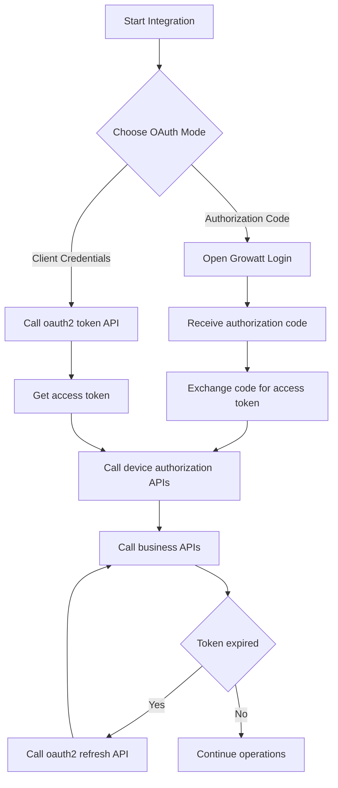
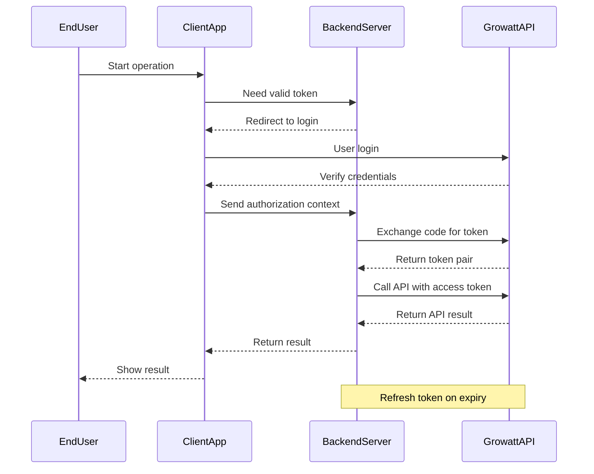

# Growatt Open API - Authentication Guide

Version: V1.0 | Release Date: March 4, 2026

## Table of Contents

- [Recommended Integration Flow](#recommended-integration-flow)
- [OAuth2.0 Authorization Mode Description](#1-oauth20-authorization-mode-description)
- [OAuth2.0 Authorization Flow Overview](#2-oauth20-authorization-flow-overview)

## Recommended Integration Flow



---

## 1 OAuth2.0 Authorization Mode Description

> **Prerequisites:**
> - **Third-party platforms** should contact Growatt staff to apply for a `clientId`/`clientSecret`, which is used to connect to the Growatt OAuth2 server.
> - **URL for receiving real-time device data pushed by Growatt**: The third-party platform needs to develop this independently and provide the URL with corresponding functionality to Growatt.

### Authorization Code Mode

This mode is for scenarios where Growatt users have personal accounts.

1.  Growatt provides a customized embedded login page (HTML5). The third-party platform integrates this login page into its own application.
2.  The third-party platform develops client-side features related to the OAuth2.0 flow.
3.  With the help of the embedded Growatt login page, the Growatt end-user completes the OAuth2.0 flow. Thus, the third-party platform obtains the authorization information of the Growatt end-user, which is used for subsequent API calls.
4.  One OAuth2.0 authorization record corresponds to one Growatt end-user and one third-party platform they have specifically authorized. The authorization information has a limited validity period and will expire after a certain time.
5.  After obtaining the OAuth2.0 authorization information of the Growatt end-user, the third-party platform needs to develop the following features:
    - *Establish the mapping relationship between the Growatt end-user account and the third-party platform account.*
    - *Self-maintain the validity period of the authorization information and refresh it after it expires.*
    - *If the refresh token also expires, the Growatt end-user will need to go through the OAuth2.0 steps again to re-authorize.*
6.  The third-party platform develops features corresponding to the API provided in this document. In the third-party platform application, when the user of the third-party platform operates the authorized devices under their corresponding Growatt end-user account, the relevant functions are realized by calling the Growatt API.

### Client Credentials Mode

This mode is for scenarios where the third-party platform directly connects to the Growatt platform.

1.  Growatt provides an interface to obtain tokens based on the standard Client Credentials flow.
2.  The third-party platform develops client-side features related to the OAuth2.0 flow.
3.  The third-party platform calls the authorization interface to obtain an `access_token` (which has a limited validity period and will expire after a certain time).
4.  After obtaining the OAuth2.0 authorization information of the Growatt end-user, the third-party platform needs to develop the following features:
    - *Self-maintain the validity period of the authorization information and refresh it after it expires.*
    - *If the refresh token also expires, the Growatt end-user will need to go through the OAuth2.0 steps again to re-authorize.*
5.  The third-party platform develops features corresponding to the API provided in this document to achieve operations such as device authorization, device dispatching, and device data querying.

---

## 2 OAuth2.0 Authorization Flow Overview

### Authorization Code Mode

- **[Initial Authorization / Re-authorization after token expiration]** When a Growatt end-user needs to authorize their personal account, the third-party platform opens the Growatt login page, and the user logs into their Growatt personal account.
- After the end-user successfully logs in and confirms authorization, an OAuth2.0 authorization code is generated and carried along as the page redirects from Growatt to the redirect URL specified by the third-party platform.
- After receiving the OAuth2.0 authorization code via the redirect URL, the third-party platform exchanges the authorization code for the Growatt end-user's authorization information:
  `access_token` (access credential), `refresh_token` (refresh credential), `expire_time` (validity period of the access credential, in seconds), `refresh_expires_in` (validity period of the refresh credential, in seconds).
- Example:
  
```json
  {
      "access_token": "lyoAlLQaRr9y5pMFsEmh7gyUAaVuBCQo1V7FlwNeA22o7vAH2DJSVqEKkGh4",
      "refresh_token": "wx71QkaF7vceFg9UwjUtum498XeYhXZiCu7iQvAeXQ1AMslXXe2SELJ8cd3a",
      "refresh_expires_in": 2592000,
      "token_type": "Bearer",
      "expires_in": 7200
  }
  
```
- The third-party platform independently develops features to save and maintain the OAuth2.0 authorization information of the Growatt end-user. It establishes a mapping between the third-party platform user and the Growatt end-user's authorization information.
- When calling this API, the third-party platform includes the Growatt end-user's authorization information in the request header. If the authorization information is correct and within its validity period, the call will be successful.
- The Growatt end-user's authorization information has a limited validity period and will expire after a certain time. The third-party platform needs to self-maintain the validity period of the authorization information.
  - *After the `access_token` expires, you can use the `refresh_token` to request the `OAuth2.0--refresh` interface to refresh the `access_token`.*
  - *When the `refresh_token` also expires and the `access_token` cannot be refreshed, the Growatt end-user needs to go through the OAuth2.0 steps again to re-authorize.*
  - *The `access_token` is valid for 2 hours (7200 seconds), and the `refresh_token` is valid for 30 days.*
- For device-related operations, the [Device Authorization](../04_api_device_auth.md) related interfaces need to be called to allow the Growatt end-user to manage their authorized subordinate devices.
- Only authorized devices can be operated via the API and have their data pushed to the URL specified by the third-party platform.

### Client Credentials Mode Flowchart



### Client Credentials Mode

- The third-party platform calls the authorization interface using `client_id` and `client_secret` to obtain the `access_token`. The server returns the following:
  `access_token` (access credential), `refresh_token` (refresh credential), `expire_time` (validity period of the access credential, in seconds), `refresh_expires_in` (validity period of the refresh credential, in seconds).
- Example:
  
```json
  {
      "access_token": "lyoAlLQaRr9y5pMFsEmh7gyUAaVuBCQo1V7FlwNeA22o7vAH2DJSVqEKkGh4",
      "refresh_token": "wx71QkaF7vceFg9UwjUtum498XeYhXZiCu7iQvAeXQ1AMslXXe2SELJ8cd3a",
      "refresh_expires_in": 2592000,
      "token_type": "Bearer",
      "expires_in": 7200
  }
  
```
- When calling the API, the third-party platform includes the authorization information in the request header. If the authorization information is correct and within its validity period, the call will be successful.
- The Growatt end-user's authorization information has a limited validity period and will expire after a certain time. The third-party platform needs to self-maintain the validity period of the authorization information.
  - *After the `access_token` expires, you can use the `refresh_token` to request the `OAuth2.0--refresh` interface to refresh the `access_token`.*
  - *When the `refresh_token` also expires and the `access_token` cannot be refreshed, the Growatt end-user needs to go through the OAuth2.0 steps again to re-authorize.*
  - *The `access_token` is valid for 2 hours (7200 seconds), and the `refresh_token` is valid for 30 days.*
- For device-related operations, the [Device Authorization](../04_api_device_auth.md) related interfaces need to be called to manage authorized subordinate devices.
- Only authorized devices can be operated via the API and have their data pushed to the URL specified by the third-party platform.

---

## Related Documentation

- [API List - Get access_token](../02_api_access_token.md)
- [API List - OAuth2-refresh](../03_api_refresh.md)
- [Device Authorization API](../04_api_device_auth.md)
