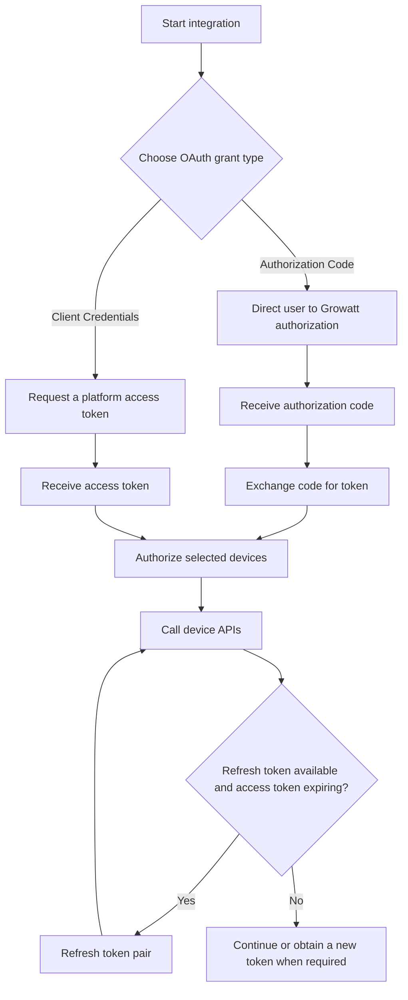
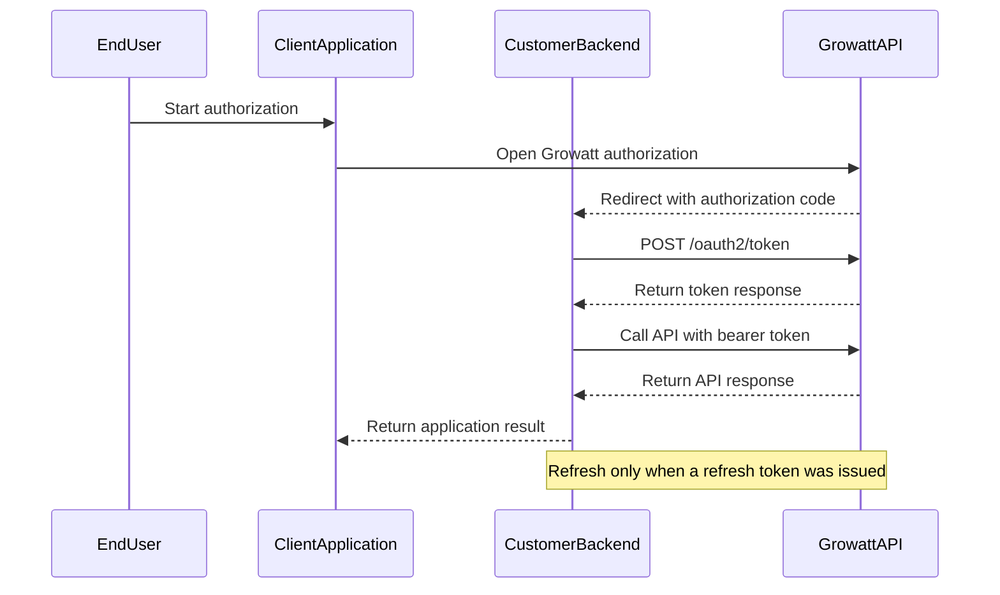

# Growatt Open API - Authentication Guide

Growatt Open API supports OAuth 2.0 authorization-code and client-credentials integrations. Choose the grant type that matches how your customers authorize devices.

## Recommended Integration Flow


```mermaid
flowchart TD
    A["Start integration"] --> B{"Choose OAuth grant type"}
    B -->|"Authorization Code"| C["Direct user to Growatt authorization"]
    B -->|"Client Credentials"| D["Request a platform access token"]
    C --> E["Receive authorization code"]
    E --> F["Exchange code for token"]
    D --> G["Receive access token"]
    F --> H["Authorize selected devices"]
    G --> H
    H --> I["Call device APIs"]
    I --> J{"Refresh token available and access token expiring?"}
    J -->|"Yes"| K["Refresh token pair"]
    K --> I
    J -->|"No"| L["Continue or obtain a new token when required"]
```

## Supported Grant Types

| `grant_type` | Use case | Capability boundary |
| :--- | :--- | :--- |
| `authorization_code` | A Growatt end user grants your application access to devices | Supports `POST /oauth2/getDeviceList` |
| `client_credentials` | A platform backend authenticates with its issued `client_id` and `client_secret` | Device binding requires `pinCode` |

## Authorization Code Prerequisites

To use the `authorization_code` grant type, you must provide a **redirectURL** when registering your application with Growatt. This is the HTTPS endpoint where Growatt will redirect the page with authorization information after the end user completes the authorization flow.

**redirectURL format requirements:**
- Must use HTTPS in production
- Must be a fully qualified URL including protocol, domain, and path
- The exact URL must match what you send in the `redirect_uri` parameter during token exchange

**Example redirectURL:**
```
https://your-domain.com/oauth/redirect
https://api.your-service.com/integrations/growatt/auth
```

Without a registered redirectURL, the authorization code flow cannot be initiated.

## Token Rules

- Both grant types use `POST /oauth2/token`.
- Supply the exact `redirect_uri` registered for your client.
- In authorization-code mode, include the authorization `code` returned to your redirectURL.
- A token response always includes the fields documented for that response. Store a `refresh_token` only when one is returned.
- Call `POST /oauth2/refresh` only when the previous token response included a `refresh_token`.
- Read `expires_in` and `refresh_expires_in` from every response; do not hard-code example values.

## Capability Matrix

| Capability | `authorization_code` | `client_credentials` |
| :--- | :--- | :--- |
| Get access token | Supported | Supported |
| Refresh access token | Supported when a `refresh_token` is issued | Use only when the token response includes a `refresh_token` |
| Get candidate devices with `getDeviceList` | Supported | Not supported |
| Bind devices with `bindDevice` | Supported | Supported; `pinCode` is required |
| Get authorized devices with `getDeviceListAuthed` | Supported | Supported |

## OAuth 2.0 Sequence


```mermaid
sequenceDiagram
    participant User as EndUser
    participant App as ClientApplication
    participant Backend as CustomerBackend
    participant Growatt as GrowattAPI

    User->>App: Start authorization
    App->>Growatt: Open Growatt authorization
    Growatt-->>Backend: Redirect with authorization code
    Backend->>Growatt: POST /oauth2/token
    Growatt-->>Backend: Return token response
    Backend->>Growatt: Call API with bearer token
    Growatt-->>Backend: Return API response
    Backend-->>App: Return application result

    Note over Backend,Growatt: Refresh only when a refresh token was issued
```

## Security Requirements

- Keep `client_secret`, access tokens, and refresh tokens on a trusted backend.
- Do not place credentials or tokens in URLs, client-side code, screenshots, or application logs.
- Validate the OAuth `state` value and bind it to the initiating user session.
- Allow only pre-registered HTTPS redirect URLs in production.

## Next Steps

- [Get access_token API](./02_api_access_token.md)
- [Device Authorization API](./04_api_device_auth.md)
- [Troubleshooting FAQ](./11_api_troubleshooting.md)
