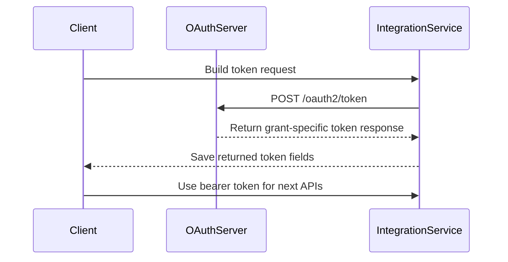

# Get access_token API

## Brief Description

- Use `POST /oauth2/token` to obtain the `access_token` required to call Growatt Open API.
- The published documentation supports two `grant_type` values: `authorization_code` and `client_credentials`.
- Token request and response fields are grant-specific: `authorization_code` returns a refreshable token set, while the 2026-04-23 AU `client_credentials` run returned access-token-only fields.

## Request URL

- `/oauth2/token`

## Request Method

- `POST`
- `Content-Type: application/x-www-form-urlencoded`

## Token Exchange Sequence



## Request Parameters

| Parameter | Required | Description |
| :--- | :--- | :--- |
| `grant_type` | Yes | `authorization_code` or `client_credentials` |
| `code` | Required in authorization-code mode | Temporary authorization code issued by the authorization server |
| `client_id` | Yes | The `client_id` issued to the third-party platform |
| `client_secret` | Yes | The `client_secret` issued to the third-party platform |
| `redirect_uri` | Required in authorization-code mode; optional / compatibility-accepted in client-credentials mode | Redirect URL used after authorization. The 2026-04-23 AU run accepted `client_credentials` requests both with and without this field |

## Request Examples

### `authorization_code` Mode

```json
{
    "grant_type": "authorization_code",
    "code": "<masked_authorization_code>",
    "client_id": "<example_client_id>",
    "client_secret": "<masked_client_secret>",
    "redirect_uri": "https://third-party.example.com/oauth/callback"
}
```

### `client_credentials` Mode

```json
{
    "grant_type": "client_credentials",
    "client_id": "<example_client_id>",
    "client_secret": "<masked_client_secret>"
}
```

### `client_credentials` Mode With Compatibility `redirect_uri`

```json
{
    "grant_type": "client_credentials",
    "client_id": "<example_client_id>",
    "client_secret": "<masked_client_secret>",
    "redirect_uri": "https://third-party.example.com/oauth/callback"
}
```

## `authorization_code` Mode Response Parameters

| Parameter | Description |
| :--- | :--- |
| `access_token` | Access token used to call protected resources |
| `refresh_token` | Refresh token used to refresh `access_token` |
| `refresh_expires_in` | Refresh-token TTL in seconds |
| `token_type` | Fixed as `Bearer` |
| `expires_in` | Access-token TTL in seconds |

## `authorization_code` Mode Response Example

```json
{
    "access_token": "<masked_access_token>",
    "refresh_token": "<masked_refresh_token>",
    "refresh_expires_in": 2585309,
    "token_type": "Bearer",
    "expires_in": 604733
}
```

## `client_credentials` Mode Response Parameters

| Parameter | Description |
| :--- | :--- |
| `access_token` | Access token used to call protected resources |
| `token_type` | Fixed as `Bearer` |
| `expires_in` | Access-token TTL in seconds |

## `client_credentials` Mode Response Example

```json
{
    "access_token": "<masked_access_token>",
    "token_type": "Bearer",
    "expires_in": 604800
}
```

## Implementation Note

- The 2026-04-23 AU full run observed `authorization_code` returning `access_token`, `refresh_token`, `refresh_expires_in`, `token_type`, and `expires_in`.
- The same AU run observed `client_credentials` returning only `access_token`, `token_type`, and `expires_in`, both without `redirect_uri` and with compatibility `redirect_uri`.
- Earlier global authorization-code testing on 2026-03-27 observed `expires_in=604733` and `refresh_expires_in=2585309`.
- TTL values should be read from the live response instead of being hard-coded from sample numbers.

## Related Documentation

- [Authentication Guide](./01_authentication.md)
- [OAuth2-refresh API](./03_api_refresh.md)
