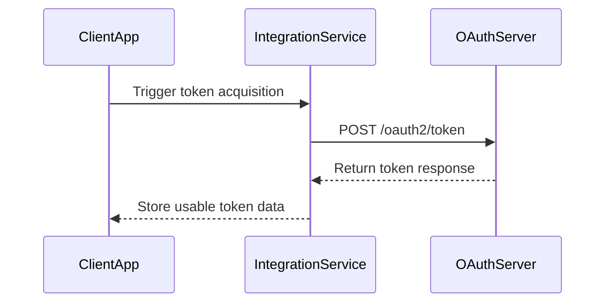

# Get access_token API

**Brief Description**

- `POST /oauth2/token` returns the `access_token` required for Growatt Open API calls.
- Both `authorization_code` and `client_credentials` are supported.
- The response shape depends on the grant type and deployment; clients must follow the actual response body instead of assuming extra fields.

**Request URL**

- `/oauth2/token`

**Request Method**

- `POST`
- `Content-Type: application/x-www-form-urlencoded`

## Token Exchange Sequence



---

## Request Parameters

| Parameter | Required | Applies To | Description |
| :--- | :--- | :--- | :--- |
| `grant_type` | Yes | All | `authorization_code` or `client_credentials` |
| `code` | Required in authorization-code mode | `authorization_code` | Authorization code returned by Growatt |
| `client_id` | Yes | All | Client ID issued to the third-party platform |
| `client_secret` | Yes | All | Client secret issued to the third-party platform |
| `redirect_uri` | Required in authorization-code mode | `authorization_code` | Redirect URI configured for the OAuth flow |

---

## Request Examples

### `authorization_code` mode

```json
{
    "grant_type": "authorization_code",
    "code": "by1c6oH8lLpllkczRFxuKnMWTEQPO8GmpqkcnDhOcRjLFF4BU5hBvt6whdmd",
    "client_id": "client123",
    "client_secret": "secret123",
    "redirect_uri": "http://localhost:9290/hello"
}
```

> The TTL values in the example are illustrative only. In production or test environments, always trust the returned `expires_in` / `refresh_expires_in` values.

### `client_credentials` mode

```json
{
    "grant_type": "client_credentials",
    "client_id": "client123",
    "client_secret": "secret123"
}
```

---

## Response Parameters

| Parameter | Returned When | Description |
| :--- | :--- | :--- |
| `access_token` | All | Access token used to call protected APIs |
| `token_type` | All | Fixed value `Bearer` |
| `expires_in` | All | Access-token lifetime in seconds |
| `refresh_token` | Authorization-code response | Refresh token used to obtain a new access token |
| `refresh_expires_in` | Authorization-code response | Refresh-token lifetime in seconds |

> Do not assume that `client_credentials` always returns `refresh_token`. If a deployment adds extra fields, trust the real response from that environment.

---

## Response Examples

### `authorization_code` mode

```json
{
    "access_token": "avYDaEcmPfaphbE8oDmraKM6FOzq7nYI42iz4KTLClpvWegyREQnyiYUG2VA",
    "refresh_token": "BG6DGTZYpZPq0PHei3N4Rvb2yjM4YMZEFrvrf1A8LxI1xKbH2aEOHG3zfNy9",
    "refresh_expires_in": 2592000,
    "token_type": "Bearer",
    "expires_in": 7200
}
```

### `client_credentials` mode

```json
{
    "access_token": "3s91d7ErRkTczOHkQronnfT3oc9jckXefj6Kp0HMaMkCbiHUpIhGtrf9a90P",
    "token_type": "Bearer",
    "expires_in": 604800
}
```

### 9290 Compatibility Note

`https://api-test.growatt.com:9290` has been verified to return the compact `client_credentials` response shown above, without a default `refresh_token`.

---

## Related Documentation

- [Authentication Guide](./01_authentication.md)
- [OAuth2-refresh API](./03_api_refresh.md)
