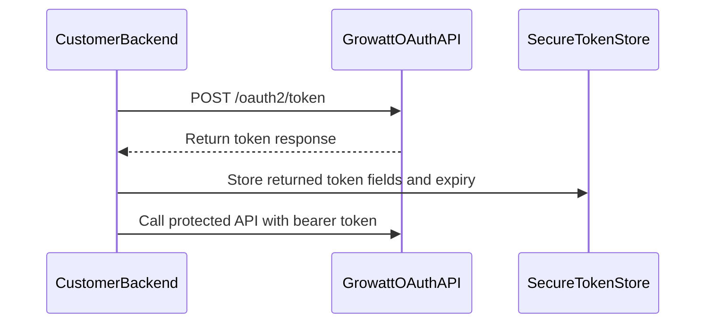

# Get access_token API

## Brief Description

Use this endpoint to obtain the `access_token` required by protected Growatt Open API endpoints. It supports `authorization_code` and `client_credentials` grant types.

## Request

- URL: `/oauth2/token`
- Method: `POST`
- Content type: `application/x-www-form-urlencoded`

## Token Exchange Sequence


```mermaid
sequenceDiagram
    participant Backend as CustomerBackend
    participant OAuth as GrowattOAuthAPI
    participant Store as SecureTokenStore

    Backend->>OAuth: POST /oauth2/token
    OAuth-->>Backend: Return token response
    Backend->>Store: Store returned token fields and expiry
    Backend->>OAuth: Call protected API with bearer token
```

## Request Parameters

| Parameter | Required | Description |
| :--- | :--- | :--- |
| `grant_type` | Yes | `authorization_code` or `client_credentials` |
| `code` | Authorization-code mode only | Temporary authorization code issued to the registered callback |
| `client_id` | Yes | Client ID issued to your platform |
| `client_secret` | Yes | Client secret issued to your platform |
| `redirect_uri` | Yes | Registered callback URL; it must match the client configuration |

## Request Examples

### `authorization_code`

```bash
curl --request POST '<api-base-url>/oauth2/token' \
  --header 'Content-Type: application/x-www-form-urlencoded' \
  --data-urlencode 'grant_type=authorization_code' \
  --data-urlencode 'code=<masked_authorization_code>' \
  --data-urlencode 'client_id=<example_client_id>' \
  --data-urlencode 'client_secret=<masked_client_secret>' \
  --data-urlencode 'redirect_uri=https://third-party.example.com/oauth/callback'
```

### `client_credentials`

```bash
curl --request POST '<api-base-url>/oauth2/token' \
  --header 'Content-Type: application/x-www-form-urlencoded' \
  --data-urlencode 'grant_type=client_credentials' \
  --data-urlencode 'client_id=<example_client_id>' \
  --data-urlencode 'client_secret=<masked_client_secret>' \
  --data-urlencode 'redirect_uri=https://third-party.example.com/oauth/callback'
```

## Response Parameters

| Parameter | Presence | Description |
| :--- | :--- | :--- |
| `access_token` | Always on success | Bearer token used to call protected resources |
| `refresh_token` | When issued for the selected grant | Token used to refresh `access_token` |
| `refresh_expires_in` | With `refresh_token` | Refresh-token lifetime in seconds |
| `token_type` | Always on success | Token type; `Bearer` |
| `expires_in` | Always on success | Access-token lifetime in seconds |

## Authorization-Code Response Example

```json
{
    "access_token": "<masked_access_token>",
    "refresh_token": "<masked_refresh_token>",
    "refresh_expires_in": 2592000,
    "token_type": "Bearer",
    "expires_in": 7200
}
```

## Client-Credentials Response Example

```json
{
    "access_token": "<masked_access_token>",
    "token_type": "Bearer",
    "expires_in": 7200
}
```

## Customer Implementation Guidance

- Send every parameter as a form field as shown above; do not send a JSON request body.
- Treat the response as grant-dependent and store only the fields that are returned.
- Read token lifetime values from every response; the values above illustrate the field format only.
- Never log `client_secret`, authorization codes, access tokens, or refresh tokens.

## Related Documentation

- [Authentication Guide](./01_authentication.md)
- [OAuth2-refresh API](./03_api_refresh.md)
